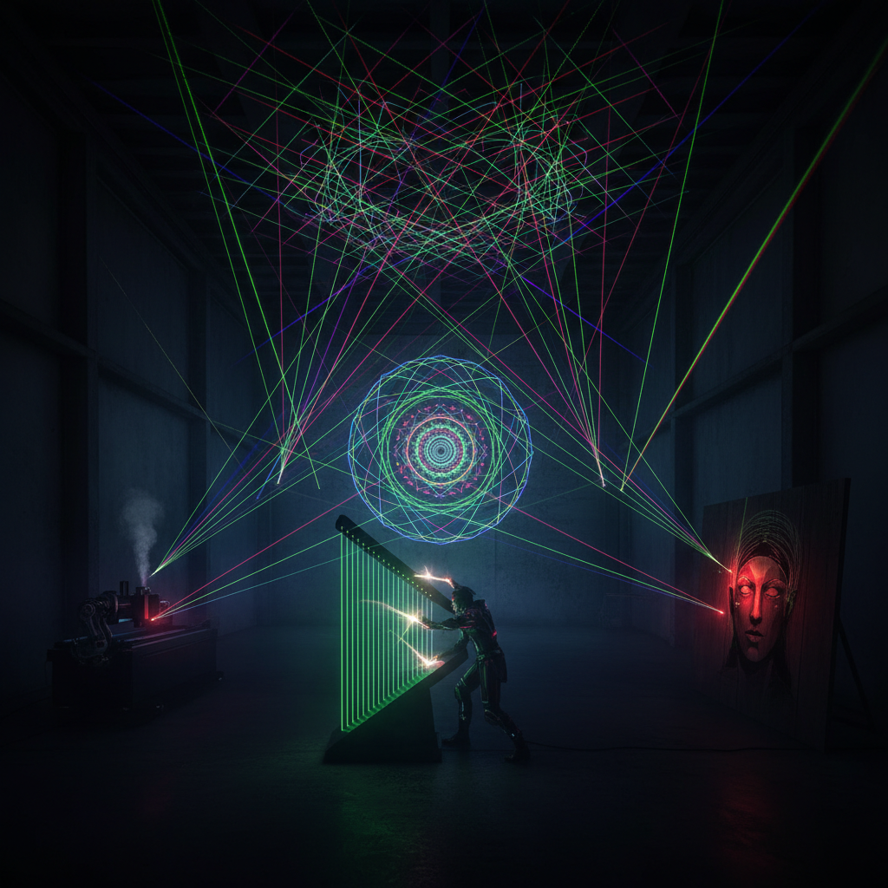

# Laser Art 激光艺术

> "A laser beam is light distilled to its purest essence — a single wavelength, perfectly coherent, traveling in a line so straight it could reach the moon. When an artist takes this instrument of precision and uses it to paint the sky, fill a room with geometric light, or etch patterns into material with photon-level accuracy, they are working with the most controlled form of energy humans have ever harnessed." — Unknown

## 概述

激光艺术（Laser Art）是以激光为主要媒介进行艺术创作的实践——利用激光的高度相干性、单色性、方向性和高亮度创造光的雕塑、投影和表演。激光艺术是科技与艺术结合的典范。

激光艺术的实践包括：1）激光表演——用多色激光在空间中创造动态图案；2）激光雕塑——用激光束在烟雾或雾中创造三维光形；3）激光投影——将激光图案投射到建筑或自然表面；4）激光雕刻——用激光在材料表面精确雕刻图案；5）激光全息——用激光创造全息图像；6）激光装置——用激光创造的沉浸式空间装置；7）激光音乐可视化——将音乐转化为激光图案。

## 核心特征

| 特征 | 描述 |
|------|------|
| 精确 | 极致的精确性 |
| 纯色 | 纯净的单色光 |
| 动态 | 可快速运动 |
| 科技 | 高科技媒介 |
| 沉浸 | 沉浸式体验 |
| 壮观 | 视觉上的壮观 |

## 视觉特征

- **纯色**：纯净的红、绿、蓝激光色
- **线条**：锐利的光线线条
- **几何**：精确的几何图案
- **动态**：快速运动的光束
- **烟雾**：在烟雾中可见的光路
- **壮观**：大规模的视觉冲击

## 代表作品

| 作品 | 艺术家 | 年代 | 意义 |
|------|--------|------|------|
| *Laser shows* | Various | 1970年代至今 | 激光表演 |
| *Laser installations* | Various | 当代 | 激光装置 |
| *Speed of Light* | United Visual Artists | 2010 | 激光装置艺术 |
| *Laser harp* | Jean-Michel Jarre | 1981 | 激光乐器 |
| *Laser mapping* | Various | 当代 | 激光建筑投影 |

## 历史时间线

| 时期 | 事件 |
|------|------|
| 1960 | 激光的发明 |
| 1970年代 | 激光表演的兴起 |
| 1980年代 | 激光在音乐会中的应用 |
| 2000年代 | 激光装置艺术的发展 |
| 当代 | 激光与AI和互动技术结合 |

## 中国语境

激光艺术在中国有快速的发展。中国是世界上最大的激光设备生产国之一，这为激光艺术提供了技术基础。中国的大型活动和节庆（如国庆庆典、春晚、各种灯光节）大量使用激光表演——中国的激光表演在规模和技术上处于世界领先水平。中国的一些当代艺术家将激光作为创作媒介——用激光创造沉浸式装置、将激光与中国传统美学元素结合、以及用激光技术进行精密的材料雕刻。中国的激光灯光秀（如G20杭州峰会的灯光表演）展示了激光艺术在大型公共活动中的应用。中国的激光雕刻技术也被广泛应用于工艺品制作——如水晶内雕。

## AI生成概念图

## 与其他风格的关系

- **Light Art** → 光艺术
- **Hologram Art** → 全息艺术
- **Performance Art** → 表演艺术
- **Installation Art** → 装置艺术
- **Digital Art** → 数字艺术
- **Kinetic Art** → 动态艺术

---

*浮光艺志 | Chronicle of Artistry*
