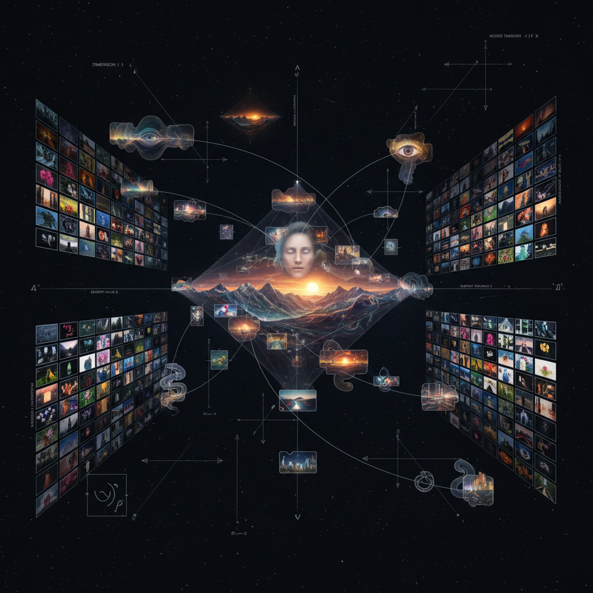

# Latent Space Art 潜在空间艺术

> "Latent space art is the cartography of imagination made mathematical — it maps the territory between all possible images, all possible sounds, all possible forms, revealing that creativity is not the production of something from nothing but navigation through an infinite landscape of latent possibilities, where every point is a potential artwork and every path between points is a potential transformation, and the artist's role shifts from maker to explorer, from creator to navigator of spaces too vast for any human mind to comprehend alone." — Unknown

## 概述

潜在空间艺术（Latent Space Art）是探索和利用机器学习模型的"潜在空间"（latent space）进行创作的艺术实践。在深度学习中，潜在空间是模型学习到的高维表示空间——每个点对应一个可能的输出（图像、声音、文本），点之间的距离和方向对应着语义上的相似性和变化。

潜在空间艺术的实践包括：1）潜在空间的遍历——在潜在空间中"行走"，观察输出如何连续变化（如从一张脸平滑变形为另一张脸）；2）潜在空间的探索——寻找潜在空间中有趣的区域和结构；3）潜在空间的操纵——通过向量运算在潜在空间中进行语义操作（如"国王-男人+女人=女王"）；4）潜在空间的可视化——将高维潜在空间降维并可视化，揭示其结构。

## 核心特征

| 特征 | 描述 |
|------|------|
| 空间 | 高维空间 |
| 连续 | 连续的变化 |
| 导航 | 空间导航 |
| 插值 | 点之间的插值 |
| 语义 | 语义结构 |
| 涌现 | 涌现的形式 |

## 视觉特征

- **渐变**：平滑的形态渐变
- **网格**：潜在空间的网格采样
- **变形**：连续的变形序列
- **模糊**：空间边界的模糊
- **梦幻**：梦境般的图像
- **混合**：概念的混合

## 代表作品

| 作品 | 艺术家 | 年代 | 意义 |
|------|--------|------|------|
| *Latent space walks* | Various | 2016至今 | 潜在空间漫步 |
| *StyleGAN explorations* | Various | 2019至今 | StyleGAN探索 |
| *Interpolation art* | Various | 2017至今 | 插值艺术 |
| *Latent space music* | Various | 2020年代 | 潜在空间音乐 |
| *Diffusion explorations* | Various | 2022至今 | 扩散模型探索 |

## 历史时间线

| 时期 | 事件 |
|------|------|
| 2014 | VAE和GAN的发明 |
| 2016 | 潜在空间漫步的艺术化 |
| 2019 | StyleGAN的突破 |
| 2022 | 扩散模型的潜在空间 |
| 当代 | 多模态潜在空间 |

## 中国语境

潜在空间艺术在中国有活跃的实践者群体。中国的AI研究社区和艺术社区都在探索潜在空间的创作可能性。中国传统美学中的"意在笔先"——在下笔之前先在心中形成完整的意象——与潜在空间的概念有有趣的对应：潜在空间可以被理解为一个"意象空间"，所有可能的作品都以潜在的形式存在其中。中国的一些AI艺术家在探索：用潜在空间来连接中国传统美学与当代AI技术、在潜在空间中寻找"东方美学"的区域、以及用潜在空间的插值来创造传统与现代之间的连续过渡。

## AI生成概念图

## 与其他风格的关系

- **AI Art** → 人工智能艺术
- **Generative Art** → 生成艺术
- **Computational Art** → 计算艺术
- **Abstract Art** → 抽象艺术
- **Morphing Art** → 变形艺术
- **Data Art** → 数据艺术

---

*浮光艺志 | Chronicle of Artistry*
