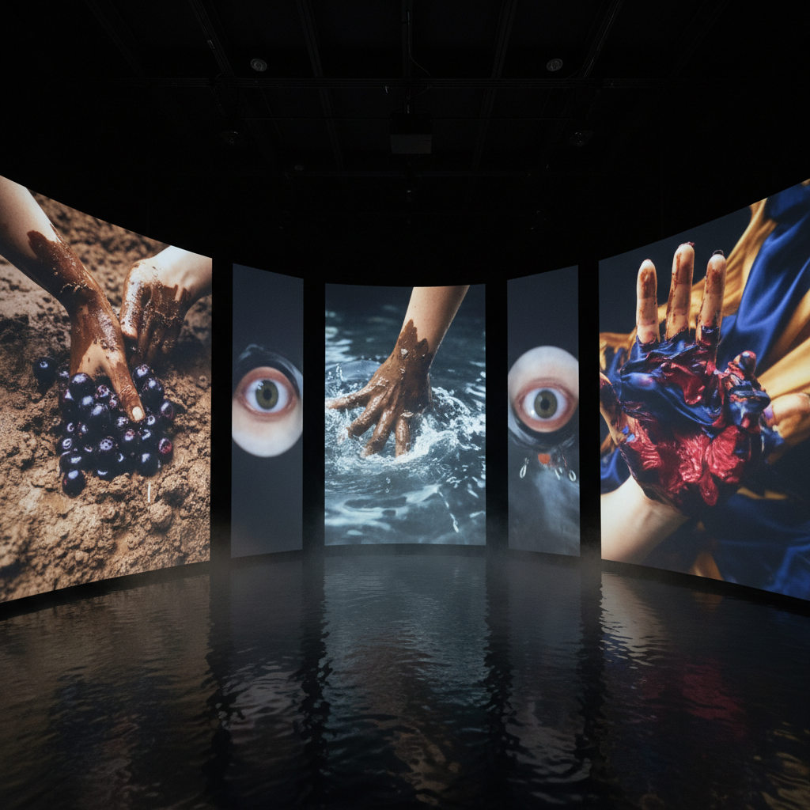

# Laure Prouvost 劳尔·普鲁沃

> **时期：** 1978–至今  
> **关键词：** 感官沉浸、语言游戏、祖父叙事、触觉影像

## 概述

Laure Prouvost 是法国艺术家，以创造多感官的沉浸式视频装置闻名。她的作品混合了虚构的家族叙事、破碎的英语、触觉特写和直接对观众说话的亲密语调——如同一个热情过度的导游带你进入一个不断偏离主题的梦境。

## 风格特征

- **直接称呼**：视频中直接对"你"说话，打破第四面墙
- **感官特写**：水果、泥土、皮肤、液体的极近距离拍摄
- **语言错位**：英法混杂、拼写错误、字幕与画面不匹配
- **虚构家谱**：关于祖父的不可靠叙事贯穿多件作品
- **环境装置**：观众需要穿过帘子、踩过沙地进入作品

## 代表作品

- *Wantee*（2013，特纳奖）
- *Deep See Blue Surrounding You*（2019，威尼斯双年展法国馆）
- *Ring, Sing and Drink for Trespassing*（2018）
- *They Are Waiting for You*（2022）

## 概念图

