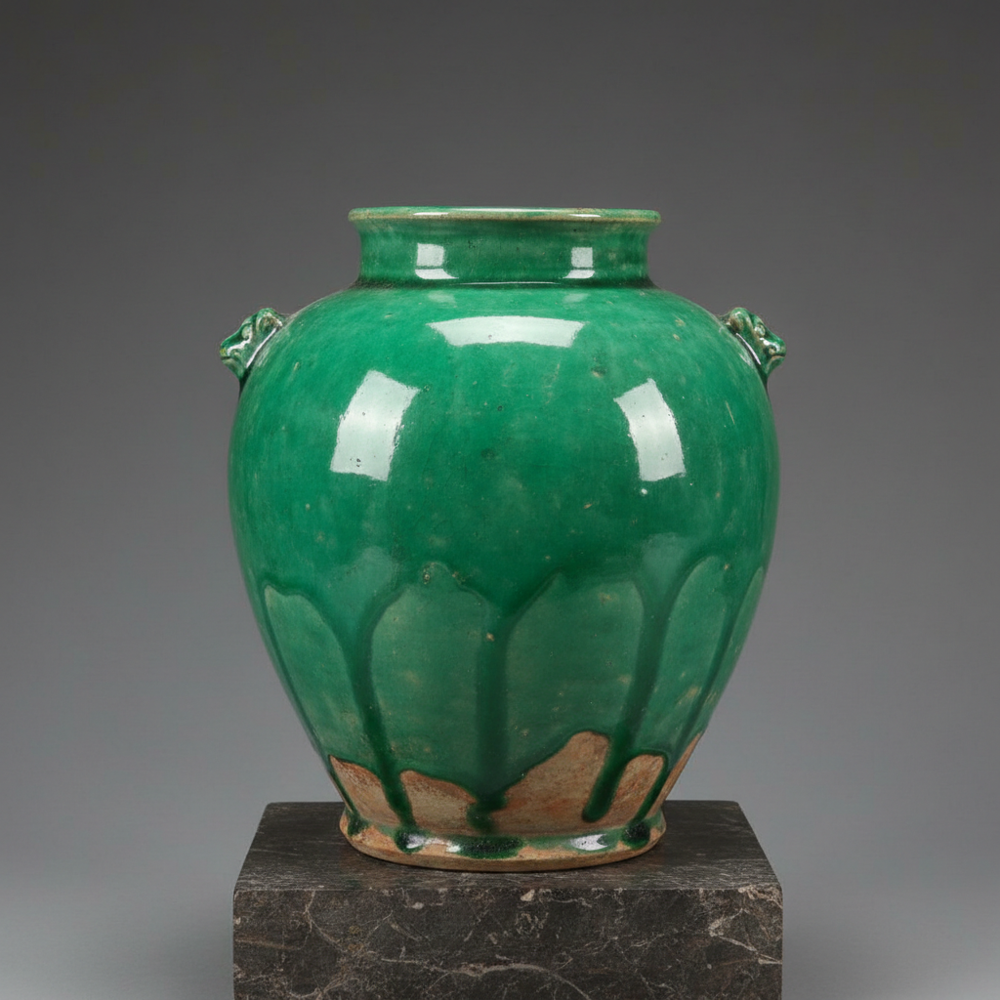

# Lead Glaze Art 铅釉艺术

> "Lead glaze is the oldest of ceramic glass — galena or litharge melted at low temperatures into a transparent coating that gives earthenware a shine and impermeability it cannot achieve alone, the first glaze humans learned to control, its brilliant transparency revealing the clay beneath like water over stone, a technology so fundamental it underpins two thousand years of decorative ceramics from Han China to Victorian England." — Unknown

## 概述

铅釉艺术（Lead Glaze Art）是一种以氧化铅为主要助熔剂的低温釉料技术和装饰艺术。铅釉是人类最早掌握的釉料技术之一——其熔点低（约700-1000°C），流动性好，透明度高，色彩鲜艳，是低温陶器最重要的釉料类型。铅釉的透明性使其能够展现底下陶土或化妆土的颜色，添加不同金属氧化物后可以产生绿色（铜）、黄色（铁）、紫色（锰）等丰富色彩。

铅釉艺术的核心要素包括：1）低温烧成——较低的烧成温度；2）透明光亮——高透明度和光泽；3）色彩丰富——添加金属氧化物的多色；4）流动性好——釉料的良好流动性；5）历史悠久——最古老的釉料之一；6）广泛应用——全球各文化的广泛使用；7）技术基础——许多釉料传统的基础。

## 核心特征

| 特征 | 描述 |
|------|------|
| 低温烧成 | 较低的烧成温度 |
| 透明光亮 | 高透明度光泽 |
| 色彩丰富 | 多种金属氧化物色彩 |
| 流动性好 | 良好的流动性 |
| 历史悠久 | 最古老的釉料 |
| 广泛应用 | 全球广泛使用 |

## 视觉特征

- **透明光泽**：如玻璃般的透明光泽
- **色彩鲜艳**：绿黄褐紫等鲜艳色彩
- **流淌效果**：釉料流动的自然效果
- **底色可见**：透过釉层可见底色
- **光滑表面**：光滑的玻璃质表面
- **色彩交融**：不同色彩的自然交融

## 代表作品

| 作品 | 艺术家/文化 | 年代 | 意义 |
|------|-------------|------|------|
| *汉代铅釉陶* | 中国汉代 | 汉代 | 中国铅釉的早期 |
| *唐三彩* | 中国唐代 | 唐代 | 铅釉的辉煌应用 |
| *罗马铅釉陶* | 罗马 | 古罗马 | 罗马铅釉传统 |
| *中世纪铅釉* | 欧洲 | 中世纪 | 欧洲铅釉传统 |
| *维多利亚铅釉* | 英国 | 19世纪 | 工业化铅釉 |

## 历史时间线

| 时期 | 事件 |
|------|------|
| 前1500年 | 美索不达米亚的早期铅釉 |
| 汉代 | 中国铅釉陶的发展 |
| 唐代 | 唐三彩的辉煌 |
| 中世纪 | 欧洲铅釉的普及 |
| 当代 | 铅釉的安全性讨论和替代 |

## 中国语境

铅釉在中国有悠久的历史——汉代的绿釉陶是中国最早的铅釉制品之一。汉代铅釉陶以其鲜艳的绿色和黄色著称，主要用于随葬明器。唐三彩是中国铅釉艺术的巅峰——黄、绿、白三色铅釉在器物表面自由流淌，创造出绚丽多彩的效果。中国的铅釉传统从汉代延续到唐代，之后随着高温瓷器的普及而逐渐减少——但在明清时期的素三彩、珐华彩等品种中仍有应用。铅釉的低温特性使其色彩比高温釉更加鲜艳——这是唐三彩色彩绚丽的重要原因。当代由于铅的毒性问题，铅釉在食用器具中已被限制使用，但在艺术陶瓷中仍有应用。

## AI生成概念图

## 与其他风格的关系

- **Tang Sancai** → 唐三彩
- **Tin Glaze** → 锡釉
- **Low-Fire Ceramics** → 低温陶瓷
- **Han Dynasty** → 汉代陶器
- **Majolica** → 马约利卡
- **Transparent Glaze** → 透明釉

---

*浮光艺志 | Chronicle of Artistry*
