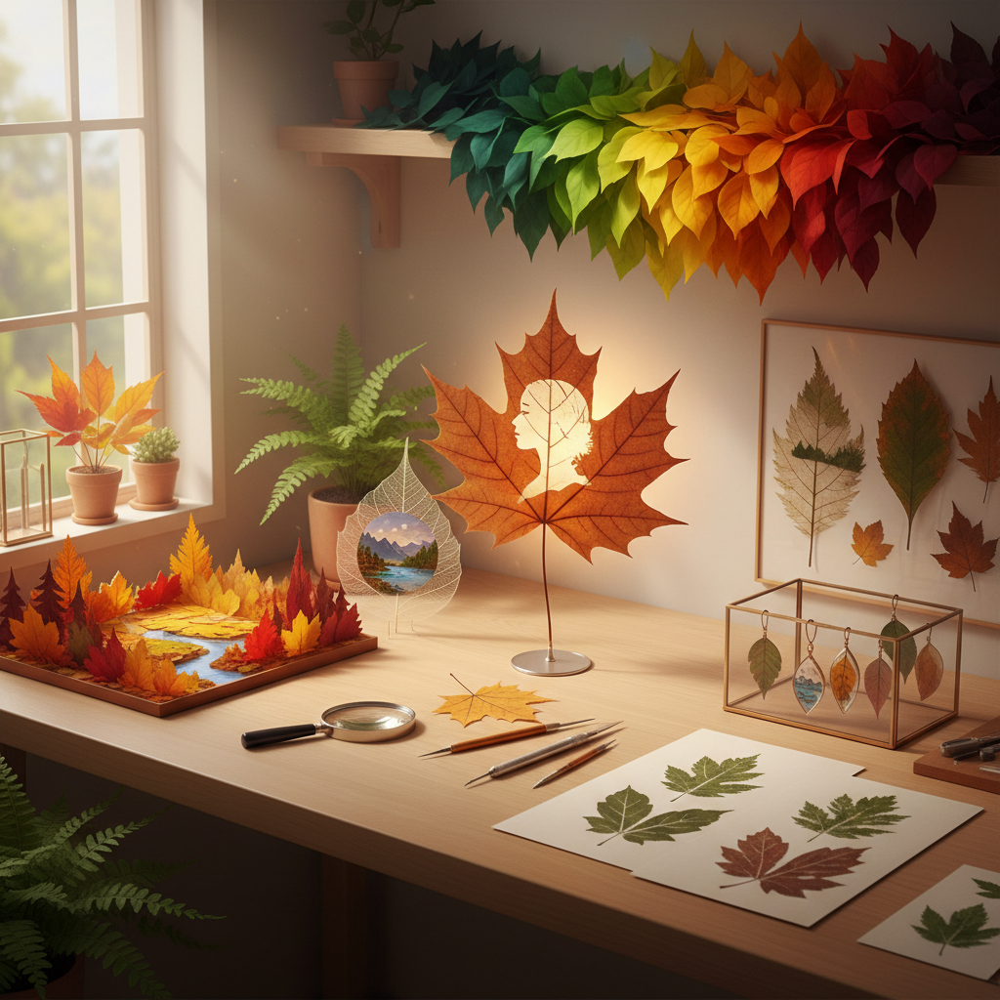

# Leaf Art 树叶艺术

> "Every leaf is a canvas painted by nature — veined with rivers, edged with mountains, colored by seasons. When an artist works with leaves, they enter a collaboration with time itself: the green of spring, the gold of autumn, the skeleton of winter. Leaf art celebrates the most ephemeral of materials, finding permanence in impermanence, art in what most people rake into piles and discard." — Unknown

## 概述

树叶艺术（Leaf Art）是以树叶为主要材料或创作载体的艺术形式——利用树叶的天然形态、色彩、纹理和透光性进行艺术创作。树叶艺术涵盖从精细的叶雕到大型的落叶装置的广泛实践。

树叶艺术的实践包括：1）叶雕——在树叶上进行精细切割，创造镂空图案；2）叶脉画——在叶脉标本上绘画；3）树叶拼贴——用不同颜色和形状的树叶拼贴成图画；4）落叶装置——用大量落叶创作的大地艺术和装置；5）叶脉书签——将树叶处理成透明叶脉的装饰品；6）压花/压叶——将树叶压平保存并用于装饰；7）树叶印刷——用树叶作为印版或模板进行印刷。

## 核心特征

| 特征 | 描述 |
|------|------|
| 自然 | 纯天然材料 |
| 季节 | 与季节变化相关 |
| 脆弱 | 材料脆弱易碎 |
| 多样 | 形态色彩极其多样 |
| 短暂 | 材料的短暂性 |
| 免费 | 材料随处可得 |

## 视觉特征

- **绿色**：新鲜树叶的绿色
- **金红**：秋叶的金色和红色
- **透光**：叶片的透光效果
- **纹理**：叶脉的精细纹理
- **镂空**：叶雕的镂空效果
- **有机**：有机的自然形态

## 代表作品

| 作品 | 艺术家 | 年代 | 意义 |
|------|--------|------|------|
| *Leaf carvings* | Various | 当代 | 精细叶雕 |
| *Leaf land art* | Andy Goldsworthy | 1980年代至今 | 落叶大地艺术 |
| *Leaf collages* | Various | 当代 | 树叶拼贴 |
| *Skeleton leaf art* | Various | 维多利亚时代至今 | 叶脉艺术 |
| *Pressed leaf art* | Various | 古代至今 | 压叶艺术 |

## 历史时间线

| 时期 | 事件 |
|------|------|
| 古代 | 树叶作为书写和装饰材料 |
| 维多利亚时代 | 压花和叶脉标本的流行 |
| 1980年代 | 大地艺术中的树叶运用 |
| 2000年代 | 叶雕艺术的兴起 |
| 当代 | 社交媒体推动的叶艺术热潮 |

## 中国语境

树叶艺术在中国有独特的文化传统和当代发展。中国的叶雕艺术——在梧桐叶等大型树叶上进行精细雕刻——近年来在网络上广受关注，艺术家能在一片树叶上雕出完整的山水画或人物肖像。中国古代的"贝叶经"——在菩提树叶上书写佛经——是树叶作为书写载体的重要传统。中国传统的"叶脉画"——在处理后的透明叶脉上绘画——是一种独特的民间艺术。中国的秋季赏叶文化（如北京香山红叶）也催生了以落叶为材料的艺术创作。中国当代的叶雕艺术家将传统剪纸的技法应用于树叶，创造出融合传统与当代的作品。

## AI生成概念图

## 与其他风格的关系

- **Land Art** → 大地艺术
- **Nature Art** → 自然艺术
- **Paper Cutting Art** → 剪纸艺术
- **Ephemeral Art** → 短暂艺术
- **Botanical Art** → 植物艺术
- **Eco Art** → 生态艺术

---

*浮光艺志 | Chronicle of Artistry*
