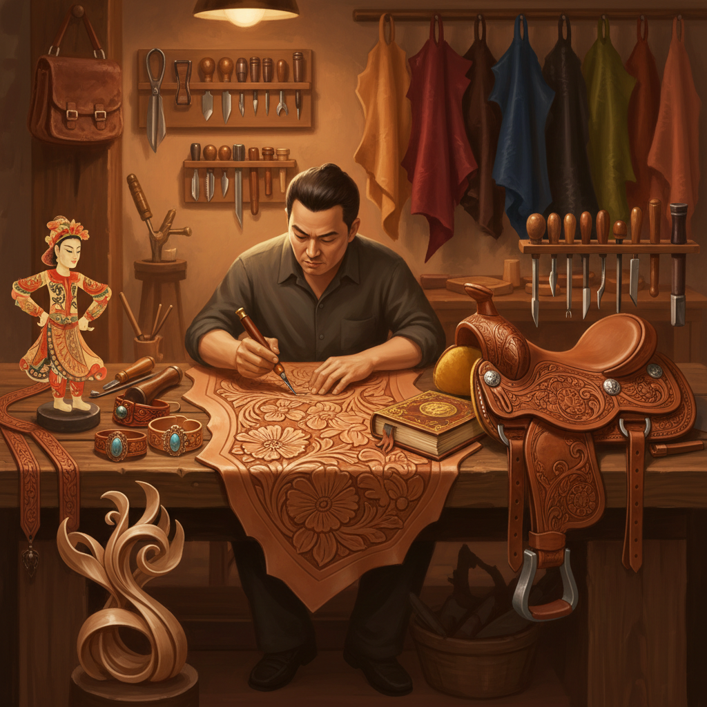

# Leather Art 皮革艺术

> "Leather is the most intimate of materials — it was once the skin of a living creature, and it retains something of that life in its warmth, its flexibility, its ability to age and develop character over time. Unlike most materials that deteriorate with use, leather improves — developing a patina that records every touch, every fold, every exposure to sun and rain. It is a material that remembers." — Unknown

## 概述

皮革艺术（Leather Art）是以皮革为主要材料进行艺术创作的实践——利用皮革的柔韧性、可塑性、耐久性和天然纹理创造各种艺术形式。皮革艺术是人类最古老的工艺之一，从史前时代的皮革服装到当代的皮革雕塑，有着漫长的历史。

皮革艺术的实践包括：1）皮雕——在皮革表面进行浮雕雕刻；2）皮革染色——用各种技法为皮革着色；3）皮革编织——用皮革条编织成图案；4）皮革镶嵌——将不同颜色的皮革拼接成图案；5）皮革塑形——将湿皮革塑造成三维形态（cuir bouilli）；6）皮革装订——精美的皮革书籍装订；7）皮革首饰——用皮革制作的首饰和配饰；8）皮革家具——用皮革制作的艺术家具。

## 核心特征

| 特征 | 描述 |
|------|------|
| 柔韧 | 柔韧可塑 |
| 耐久 | 极其耐久 |
| 温暖 | 温暖的触感 |
| 包浆 | 使用后产生包浆 |
| 天然 | 天然有机材料 |
| 多变 | 可雕、可染、可塑 |

## 视觉特征

- **棕色**：皮革的天然棕色调
- **纹理**：天然的皮纹纹理
- **光泽**：打蜡后的温润光泽
- **浮雕**：皮雕的立体效果
- **包浆**：使用后的包浆色泽
- **厚实**：厚实的质感

## 代表作品

| 作品 | 艺术家 | 年代 | 意义 |
|------|--------|------|------|
| *Leather tooling* | 西部传统 | 19世纪至今 | 美国西部皮雕 |
| *Cordovan leather* | 西班牙传统 | 中世纪至今 | 科尔多瓦皮革 |
| *Leather bookbinding* | Various | 中世纪至今 | 皮革装订 |
| *Leather armor* | 各文化传统 | 古代至今 | 皮革甲胄 |
| *Contemporary leather art* | Various | 当代 | 当代皮革艺术 |

## 历史时间线

| 时期 | 事件 |
|------|------|
| 史前 | 最早的皮革使用 |
| 古代 | 鞣制技术的发展 |
| 中世纪 | 皮革装订和皮雕 |
| 19世纪 | 美国西部皮雕传统 |
| 当代 | 皮革作为当代艺术媒介 |

## 中国语境

皮革艺术在中国有独特的文化传统。中国的皮影戏——用精细雕刻和彩绘的皮革制作的戏剧人物——是世界上最精美的皮革艺术形式之一，已被列入联合国非物质文化遗产。中国传统的马具制作（特别是蒙古族和藏族的马鞍装饰）展示了精湛的皮革工艺。中国的皮革装订在古代也有传统——用皮革包裹的经卷和书籍。中国当代的皮革艺术涵盖了从传统皮雕到现代皮具设计的广泛领域——中国的手工皮具工作室近年来蓬勃发展，大量匠人将传统皮雕技法与现代设计结合。中国的皮影雕刻艺术家将传统技艺传承并创新，创作出融合传统与当代的皮革艺术品。

## AI生成概念图

## 与其他风格的关系

- **Shadow Puppet Art** → 皮影艺术
- **Bookbinding Art** → 装订艺术
- **Fashion Art** → 时尚艺术
- **Sculpture** → 雕塑
- **Craft Art** → 工艺美术
- **Functional Art** → 功能性艺术

---

*浮光艺志 | Chronicle of Artistry*
