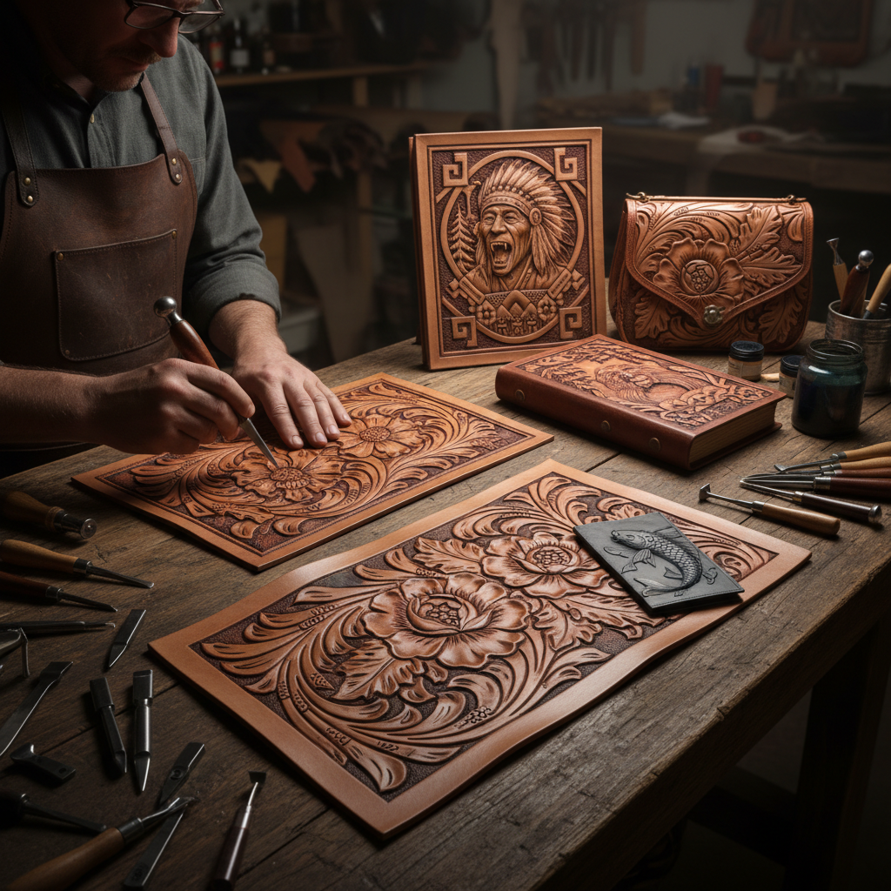

# Leather Carving 皮革雕刻

> "Leather carving is sculpture in two dimensions — the swivel knife traces the design, and the beveler pushes the background away, until flowers and leaves seem to grow from the surface of the hide." — Unknown

## 概述

皮革雕刻（Leather Carving）是使用旋转刀（swivel knife）在湿润的植鞣革表面切割出图案轮廓线，然后配合各种印花工具（stamps）将图案周围的背景压低，使图案呈现出立体浮雕效果的工艺。皮革雕刻是皮革装饰中最具艺术性的技法——它能在平面的皮革上创造出令人惊叹的三维视觉效果。

皮革雕刻与皮革压花（leather tooling）密切相关——实际上两者常常结合使用。区别在于：皮革雕刻强调用旋转刀切割轮廓线和用斜面工具（beveler）创造立体感，而皮革压花更侧重于用各种印花工具敲击出纹理和图案。最经典的皮革雕刻风格是Sheridan风格——以美国怀俄明州谢里丹镇命名，以精美的花卉和卷草图案著称。

## 核心特征

| 特征 | 描述 |
|------|------|
| 旋转刀 | 使用旋转刀切割 |
| 浮雕 | 创造浮雕效果 |
| 立体 | 强烈的立体感 |
| 花卉 | 经典花卉图案 |
| 技巧 | 需要高超技巧 |
| 艺术 | 高度艺术性 |

## 视觉特征

- **立体**：强烈的三维效果
- **流畅**：流畅的线条
- **花卉**：精美的花卉图案
- **层次**：多层次的深浅
- **光影**：光影的变化
- **精细**：极其精细的细节

## 代表作品

| 作品 | 艺术家 | 年代 | 意义 |
|------|--------|------|------|
| *Sheridan-style saddles* | Don King等 | 20世纪 | 谢里丹风格马鞍 |
| *Carved leather portfolios* | Various | 当代 | 雕刻皮革文件夹 |
| *Leather carving competitions* | Various | 当代 | 皮革雕刻比赛作品 |
| *Japanese leather carving* | Various | 当代 | 日本皮革雕刻 |
| *Contemporary carved art* | Various | 当代 | 当代皮革雕刻艺术 |

## 历史时间线

| 时期 | 事件 |
|------|------|
| 古代 | 早期皮革装饰技法 |
| 中世纪 | 欧洲皮革雕刻的发展 |
| 19世纪 | 美国西部皮革雕刻 |
| 1940-50s | Sheridan风格的确立和传播 |
| 1970s | 日本皮革雕刻的兴起 |
| 当代 | 全球皮革雕刻艺术的繁荣 |

## 中国语境

皮革雕刻在中国有着快速增长的爱好者群体。中国的皮革雕刻爱好者主要受日本和美国两大传统的影响——日本的精细风格和美国的Sheridan风格都有大量追随者。中国的一些皮革工艺大师在国际比赛中获奖。中国的手工皮具工作坊中，皮革雕刻课程是高级课程的核心内容。社交媒体上有活跃的中国皮革雕刻社区。一些中国的独立皮具品牌以精美的皮革雕刻作为品牌特色。

## AI生成概念图

## 与其他风格的关系

- **Leather Tooling** → 皮革压花
- **Leatherwork** → 皮革工艺
- **Relief Sculpture** → 浮雕
- **Wood Carving** → 木雕
- **Saddle Making** → 马鞍制作
- **Western Art** → 西部艺术

---

*浮光艺志 | Chronicle of Artistry*
