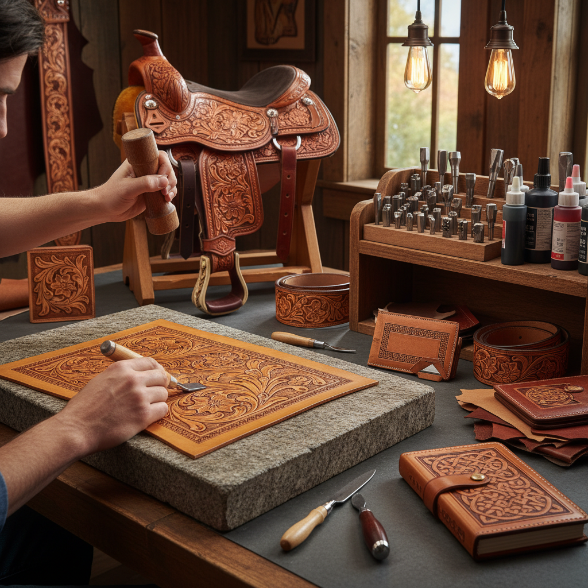

# Leather Tooling 皮革压花

> "Leather tooling is writing in relief — each stamp strike leaves its mark in the dampened hide, building up pattern and texture that will outlast generations of use." — Unknown

## 概述

皮革压花（Leather Tooling）是使用金属印花工具（stamps）在湿润的植鞣革（vegetable-tanned leather）表面敲击出图案和纹理的工艺。植鞣革在湿润状态下具有可塑性——当金属工具在其表面敲击时，皮革会永久保留压痕。干燥后，这些压痕成为永久的装饰。

皮革压花的基本流程是：将皮革浸湿（casing）、用转印笔将图案转印到皮革上、用各种形状的印花工具（bevelers、seeders、backgrounders、camouflage tools等）逐步敲击出图案的各个部分。皮革压花常与皮革雕刻（leather carving）结合使用——先用旋转刀（swivel knife）切割轮廓线，再用印花工具压出立体效果。

## 核心特征

| 特征 | 描述 |
|------|------|
| 印花 | 使用金属印花工具 |
| 湿革 | 在湿润皮革上操作 |
| 永久 | 永久性的压痕 |
| 立体 | 创造立体浮雕效果 |
| 植鞣 | 使用植鞣革 |
| 工具 | 需要大量专用工具 |

## 视觉特征

- **浮雕**：立体的浮雕效果
- **纹理**：丰富的背景纹理
- **精细**：精细的图案细节
- **对比**：高低起伏的对比
- **皮革**：皮革的天然色泽
- **染色**：可配合染色增强效果

## 代表作品

| 作品 | 艺术家 | 年代 | 意义 |
|------|--------|------|------|
| *Western saddles* | Various | 传统 | 西部马鞍装饰 |
| *Tooled leather belts* | Various | 传统 | 压花皮带 |
| *Sheridan-style tooling* | Various | 20世纪 | 谢里丹风格压花 |
| *Tooled leather wallets* | Various | 当代 | 压花皮夹 |
| *Contemporary leather art* | Various | 当代 | 当代皮革艺术 |

## 历史时间线

| 时期 | 事件 |
|------|------|
| 古代 | 早期皮革装饰 |
| 中世纪 | 欧洲皮革压花的发展 |
| 19世纪 | 美国西部皮革工艺的繁荣 |
| 1940s | Sheridan风格的确立 |
| 20世纪 | Tandy Leather等公司的推广 |
| 当代 | 全球皮革压花爱好者社区 |

## 中国语境

皮革压花在中国的手工皮具爱好者群体中非常流行。中国的手工皮具工作坊大量开设——从一线城市到二三线城市都有皮革手工体验店。中国的电商平台上有丰富的皮革压花工具和材料供应。中国的一些皮具品牌和独立设计师将压花作为产品的装饰特色。社交媒体上（小红书、B站）有大量中文的皮革压花教程。中国的皮革手工社区非常活跃。

## AI生成概念图

## 与其他风格的关系

- **Leather Carving** → 皮革雕刻
- **Leatherwork** → 皮革工艺
- **Embossing** → 压印
- **Stamping** → 印花
- **Saddle Making** → 马鞍制作
- **Western Art** → 西部艺术

---

*浮光艺志 | Chronicle of Artistry*
