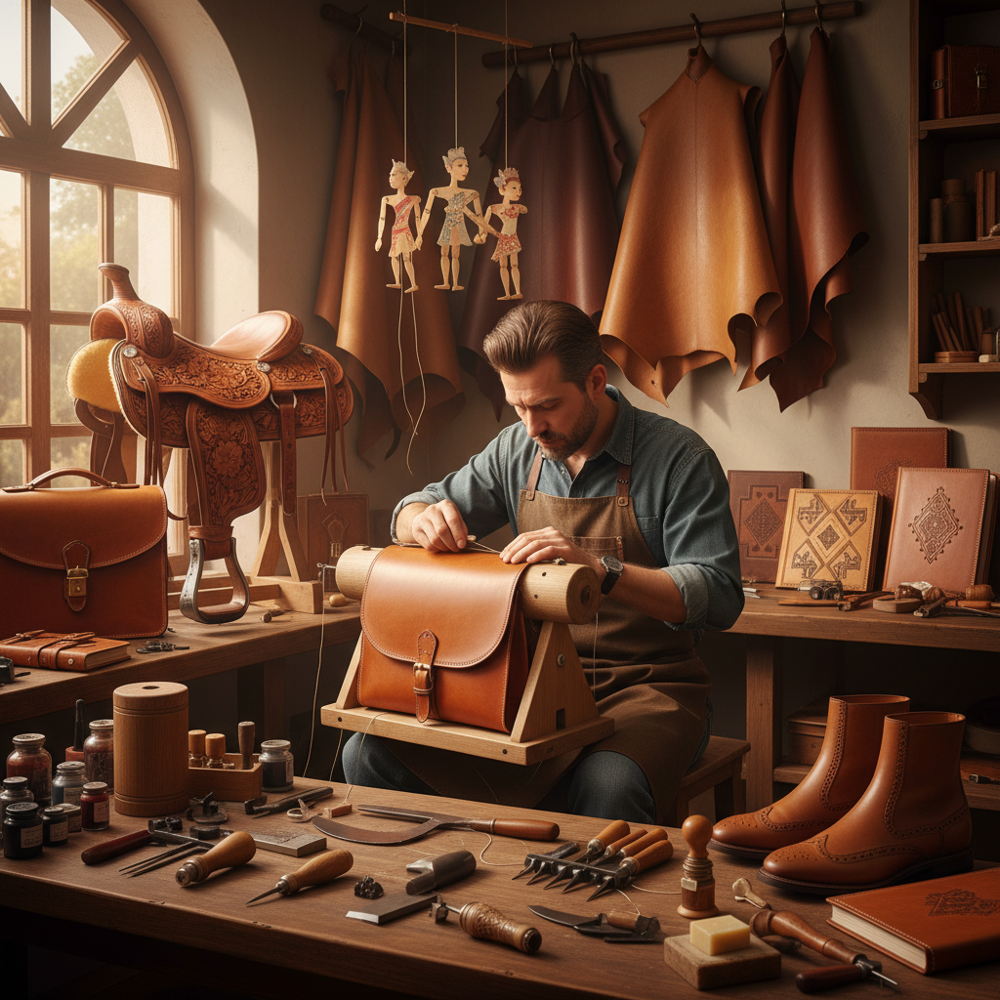

# Leatherwork Art 皮革艺术

> "Leather is skin transformed — animal hide preserved and softened into a material that is simultaneously tough and supple, waterproof and breathable, rigid and flexible. The leatherworker shapes this paradoxical material into objects that age like wine: saddles that mold to the rider, boots that remember the walker's foot, bags that develop a patina of use that no factory can replicate. Leather carries time beautifully." — Unknown

## 概述

皮革艺术（Leatherwork Art）是以皮革为主要材料，通过切割、缝制、雕刻、染色和塑形等技法创造各种物品和艺术作品的工艺——包括皮具制作、皮雕、皮塑和皮革装饰艺术。皮革工艺是人类最古老的手工艺之一，至今仍是最受重视的手工技艺。

皮革艺术的实践包括：1）皮具制作——包、钱夹、皮带等皮革制品；2）皮雕——在皮革表面雕刻图案；3）皮塑——将皮革塑造成三维造型；4）马具制作——马鞍和马具的制作；5）皮革装订——书籍的皮革装订；6）皮革服装——皮衣、皮靴等服装；7）当代皮革艺术——将皮革作为当代艺术媒介的创作。

## 核心特征

| 特征 | 描述 |
|------|------|
| 耐久 | 极其耐久的材料 |
| 柔韧 | 柔韧而坚固 |
| 质感 | 独特的天然质感 |
| 老化 | 越用越美的老化效果 |
| 手工 | 强调手工缝制 |
| 功能 | 高度的功能性 |

## 视觉特征

- **纹理**：天然的皮革纹理
- **色泽**：温暖的棕色调
- **缝线**：手工缝线的装饰性
- **浮雕**：皮雕的立体效果
- **光泽**：使用后的自然光泽
- **老化**：美丽的使用痕迹

## 代表作品

| 作品 | 艺术家/品牌 | 年代 | 意义 |
|------|-------------|------|------|
| *Hermès leather goods* | Hermès | 1837至今 | 奢侈皮具 |
| *Western saddles* | 美国传统 | 19世纪至今 | 西部马鞍 |
| *Moroccan leather* | 摩洛哥传统 | 中世纪至今 | 摩洛哥皮革 |
| *Japanese leather craft* | 日本传统 | 古代至今 | 日本皮革工艺 |
| *Contemporary leather art* | Various | 当代 | 当代皮革艺术 |

## 历史时间线

| 时期 | 事件 |
|------|------|
| 史前 | 最早的皮革使用 |
| 古代 | 鞣制技术的发展 |
| 中世纪 | 皮革行会和精细工艺 |
| 工业革命 | 皮革加工的工业化 |
| 当代 | 手工皮革的复兴和艺术化 |

## 中国语境

皮革艺术在中国有独特的传统和当代发展。中国北方的游牧民族（蒙古族、哈萨克族等）有悠久的皮革工艺传统——从马鞍到皮靴，从皮囊到皮画。中国的皮影戏使用的皮影是一种独特的皮革艺术形式——用牛皮或驴皮雕刻并彩绘的戏剧人物。中国当代的手工皮具制作在近年来快速发展——受到日本和欧洲手工皮具文化的影响，中国出现了大量手工皮具工作室和爱好者。中国的皮革产业规模巨大——从工业生产到手工定制都有完整的产业链。中国的一些设计师将传统中国元素融入现代皮具设计——创造具有东方特色的皮革作品。中国的皮雕艺术也在发展——一些艺术家用皮雕技法创造精美的装饰作品。

## AI生成概念图

## 与其他风格的关系

- **Saddle Making** → 马具制作
- **Bookbinding** → 书籍装订
- **Fashion Design** → 时尚设计
- **Sculpture** → 雕塑
- **Folk Art** → 民间艺术
- **Craft Art** → 工艺美术

---

*浮光艺志 | Chronicle of Artistry*
