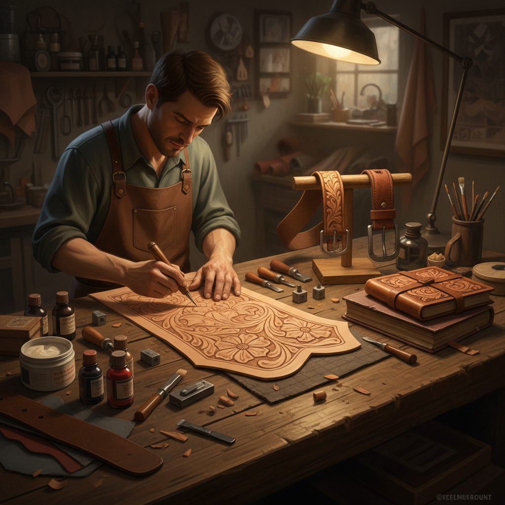

# Leatherwork 皮革工艺

> "Leather is the second skin of civilization — tooled, carved, and dyed into art that ages with grace." — Unknown

## 概述

皮革工艺（Leatherwork）是以动物皮革为材料，通过鞣制、雕刻、冲压、染色、缝合等技法创造功能性和装饰性物品的古老工艺。从游牧民族的马鞍到中世纪的书籍装帧，从西部牛仔的皮带到当代的皮革艺术，皮革工艺跨越了实用与奢华的全部光谱。皮革的独特之处在于它是"活的"材料——随着使用和时间，它会发展出独特的光泽和质感（patina），越用越美。

皮革工艺的哲学在于：时间的伙伴——好的皮革制品不是在完成时最美，而是在使用多年后达到巅峰。

## 核心特征

| 特征 | 描述 |
|------|------|
| 皮革 | 以动物皮革为材料 |
| 雕刻 | 湿革雕刻技法 |
| 染色 | 丰富的染色可能 |
| 缝合 | 手工缝合 |
| 耐久 | 极其耐久的材料 |
| 包浆 | 随时间发展包浆 |

## 视觉特征

- **质感**：皮革的天然纹理
- **雕刻**：浮雕般的雕刻图案
- **色彩**：从自然棕色到鲜艳染色
- **光泽**：使用后的温润光泽
- **缝线**：手工缝线的装饰性
- **厚重**：材料的厚重质感

## 代表作品

| 作品 | 艺术家 | 年代 | 意义 |
|------|--------|------|------|
| *Medieval book covers* | 匿名 | 中世纪 | 皮革书籍装帧 |
| *Western saddles* | 匿名 | 19世纪+ | 西部马鞍雕刻 |
| *Hermès leather goods* | Hermès | 1837+ | 奢侈皮具 |
| *Sheridan style carving* | Various | 1940s+ | 谢里丹风格雕刻 |
| *Contemporary leather art* | Various | 当代 | 当代皮革艺术 |

## 历史时间线

| 时期 | 事件 |
|------|------|
| 史前 | 最早的皮革使用 |
| 古代 | 各文明的皮革工艺 |
| 中世纪 | 皮革行会和书籍装帧 |
| 19世纪 | 西部马鞍雕刻传统 |
| 20世纪 | 奢侈皮具品牌的兴起 |
| 当代 | 皮革作为艺术媒介 |

## 中国语境

中国的皮革工艺有悠久传统——从游牧民族的皮革制品到宫廷的皮革装饰。蒙古族、藏族等少数民族有丰富的皮革工艺传统。中国传统的皮影戏也是一种独特的皮革艺术。当代中国是全球最大的皮革制品生产国，同时也有越来越多的独立皮匠和皮革艺术家在探索手工皮革的艺术可能性。

## AI生成概念图

## 与其他风格的关系

- **Bookbinding** → 皮革书籍装帧
- **Saddle Making** → 马鞍制作
- **Tooling** → 皮革雕刻
- **Fashion** → 皮革时装
- **Folk Art** → 民间皮革工艺
- **Shadow Puppetry** → 皮影戏

---

*浮光艺志 | Chronicle of Artistry*
