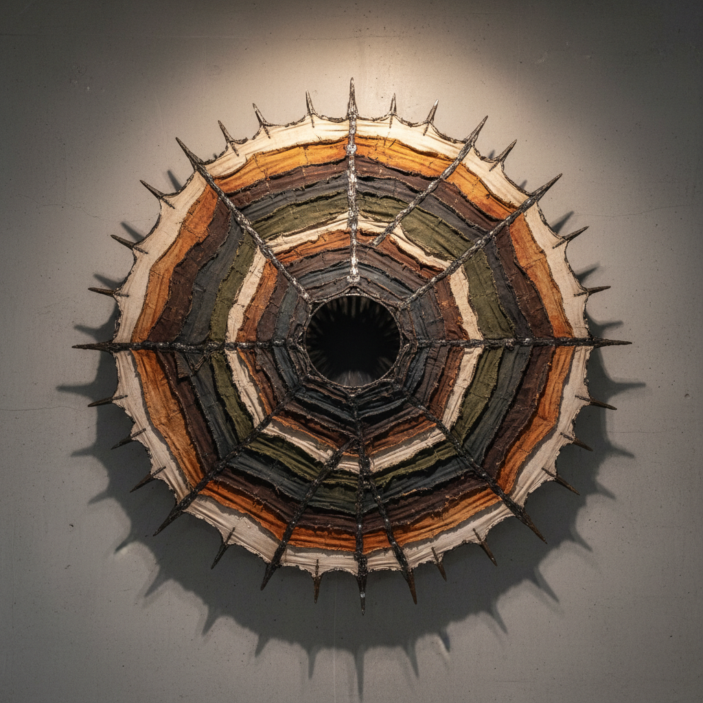

# Lee Bontecou 李·邦特库

> **时期：** 1931–2022  
> **关键词：** 黑洞浮雕、帆布与钢丝、虚空与威胁、太空时代雕塑

## 概述

Lee Bontecou 是美国雕塑家，以1960年代的标志性墙面浮雕闻名——用焊接钢框架和缝合的帆布碎片构建的巨大凹陷形态，中心是深不可测的黑色虚空。这些作品同时暗示喷气发动机、火山口、眼睛和子宫，在冷战太空竞赛的背景下传达出既迷人又威胁的力量。

## 风格特征

- **中心虚空**：作品中心的深黑色洞口创造出吸引力和威胁感
- **工业材料的手工缝合**：帆布、钢丝、铁丝网等材料被手工缝合和焊接
- **墙面浮雕**：介于绘画和雕塑之间，从墙面向观者突出
- **太空时代意象**：形态暗示涡轮引擎、太空舱和宇宙黑洞
- **有机与机械的融合**：工业结构中蕴含生物体的呼吸感

## 代表作品

- *Untitled*（1961，焊接钢与帆布）
- *Untitled*（1966，大型墙面浮雕）
- 晚期花朵和鱼类雕塑（1990s–2000s）
- *Untitled*（1980s，真空成型塑料）

## 历史意义

Bontecou 在1960年代与Rauschenberg和Johns齐名，却在1972年突然退出纽约艺术界，隐居乡间继续创作。她的早期作品预示了后来的女性主义艺术对身体和空间的探索，也影响了太空时代的视觉想象。

## 概念图

