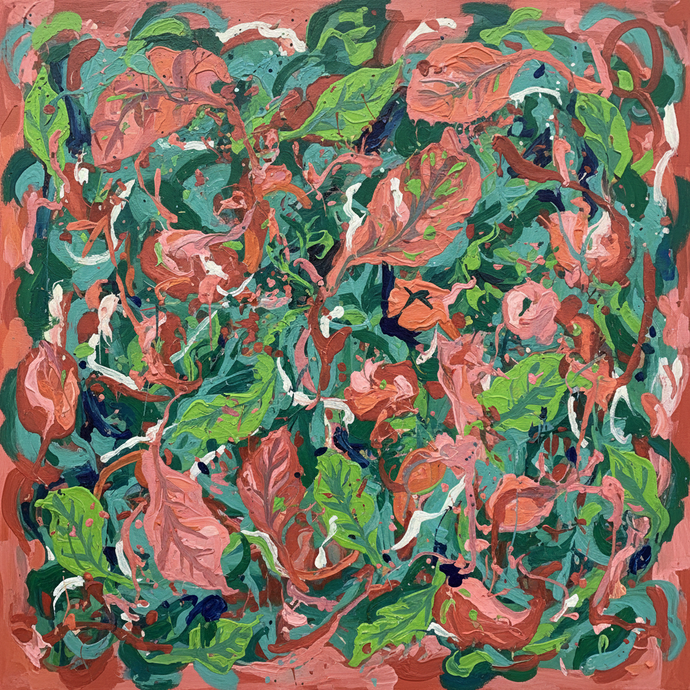

# Lee Krasner 李·克拉斯纳

> **时期：** 1908–1984  
> **关键词：** 抽象表现主义先驱、全幅构图、自我重塑、被遮蔽的大师

## 概述

Lee Krasner 是美国抽象表现主义的核心人物之一，长期被丈夫 Jackson Pollock 的光环遮蔽。她的作品跨越多种风格——从立体主义到全幅抽象再到晚期的大尺幅生物形态——展现了持续自我重塑的勇气。她是少数在抽象表现主义运动中始终保持独立声音的女性艺术家。

## 风格特征

- **全幅构图**：画面边缘到边缘充满能量，没有焦点或层次之分
- **生物形态**：后期作品中出现大量有机曲线和植物般的形态
- **自我剪裁**：将早期不满意的作品剪碎重组为新的拼贴画
- **色彩克制**：早期以赭石和棕色为主，晚期爆发出强烈的粉红和绿色
- **持续实验**：每个时期的风格都截然不同，拒绝固定标签

## 代表作品

- *The Seasons*（1957）
- *Gaea*（1966）
- *Night Creatures*（1965）
- *Palingenesis*（1971）

## 历史意义

Krasner 的重新发现是艺术史性别修正的标志性案例。她证明了在最男性化的艺术运动中，女性不仅参与了，而且创造了同等甚至更持久的作品。

## 概念图

