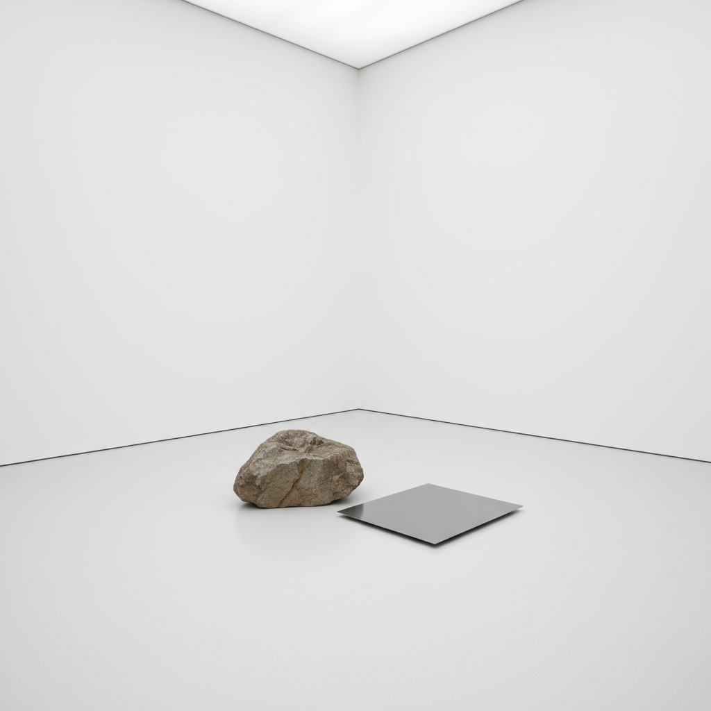

# Lee Ufan 李禹焕

> **时期：** 1936–至今  
> **关键词：** 物派、留白、石与钢板、关系项

## 概述

Lee Ufan 是韩国艺术家，物派（Mono-ha）运动的理论核心人物。他的作品极度简约——一块未加工的石头放在一块钢板旁边，或画布上几笔淡淡的灰蓝色笔触——探索物与物、物与空间、存在与虚无之间的"关系"。

## 风格特征

- **石与钢**：天然石头与工业钢板的并置
- **极致留白**：大面积空白空间是作品的核心
- **单一笔触**：画布上仅有几笔渐隐的笔触（从浓到淡）
- **关系性**：作品的意义在于物体之间的关系而非物体本身
- **呼吸感**：笔触如同呼吸，从有到无的渐变

## 代表作品

- *Relatum*系列（1968–至今）
- *From Point*系列（1973–至今）
- *From Line*系列（1973–至今）
- *Dialogue*系列（2006–至今）

## 概念图

