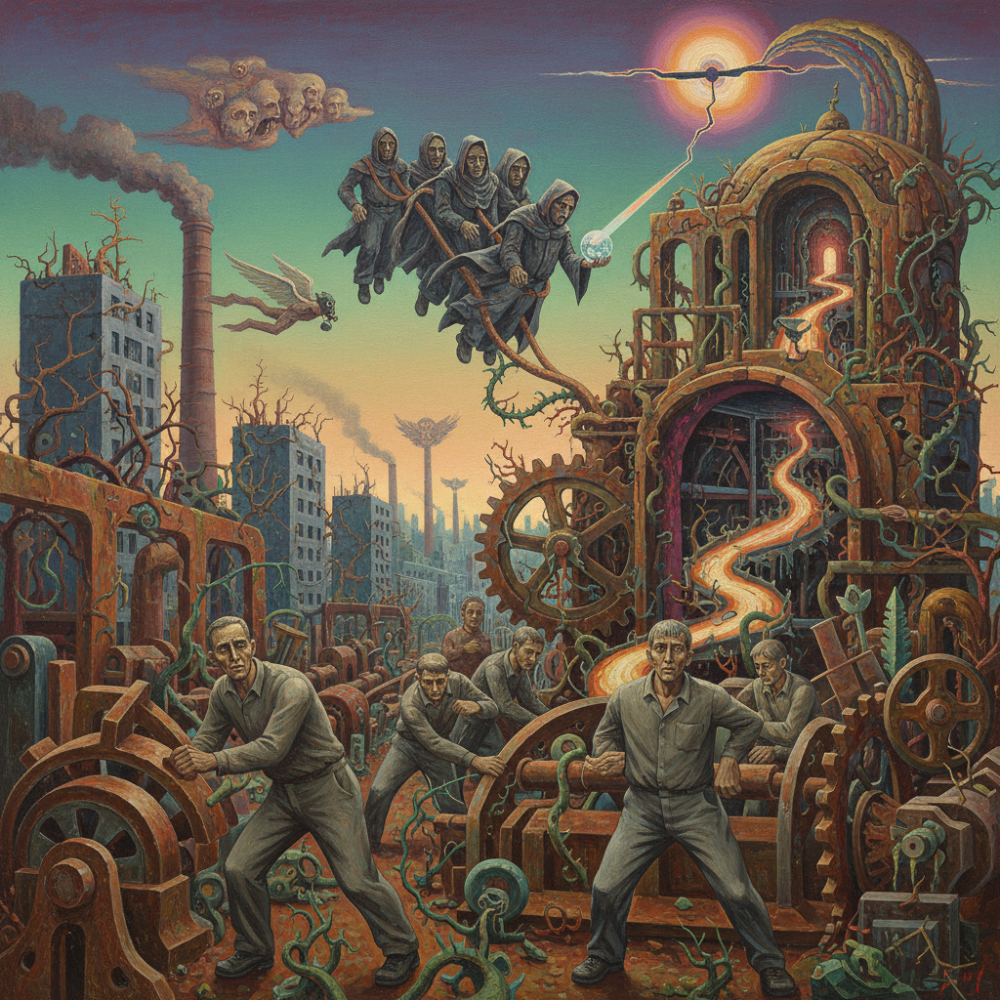

# Leipzig School 莱比锡画派

> **时期：** 1990年代–至今  
> **关键词：** 新德国绘画、具象回归、东德遗产、市场热潮、技法精湛

## 概述

Leipzig School（莱比锡画派）是1990年代从莱比锡视觉艺术学院涌现的一批德国画家，以尼奥·劳赫为代表。他们继承了东德时期严格的学院技法训练，却用超现实的叙事和历史碎片创造出一种独特的当代具象绘画——在柏林墙倒塌后的身份真空中，用画笔重建记忆和想象的废墟。

## 风格特征

- **技法精湛**：学院派的扎实绘画功底
- **超现实叙事**：梦境般的场景和人物
- **历史碎片**：东德记忆与当代现实的混合
- **大尺幅**：博物馆级别的巨型画布
- **具象回归**：在观念艺术主导时代坚持绘画

## 代表人物与作品

- 尼奥·劳赫《搜索》《集会》
- 蒂姆·艾特尔 城市风景
- 马蒂亚斯·韦舍尔 室内场景
- 大卫·施奈尔 抽象风景

## 概念图

