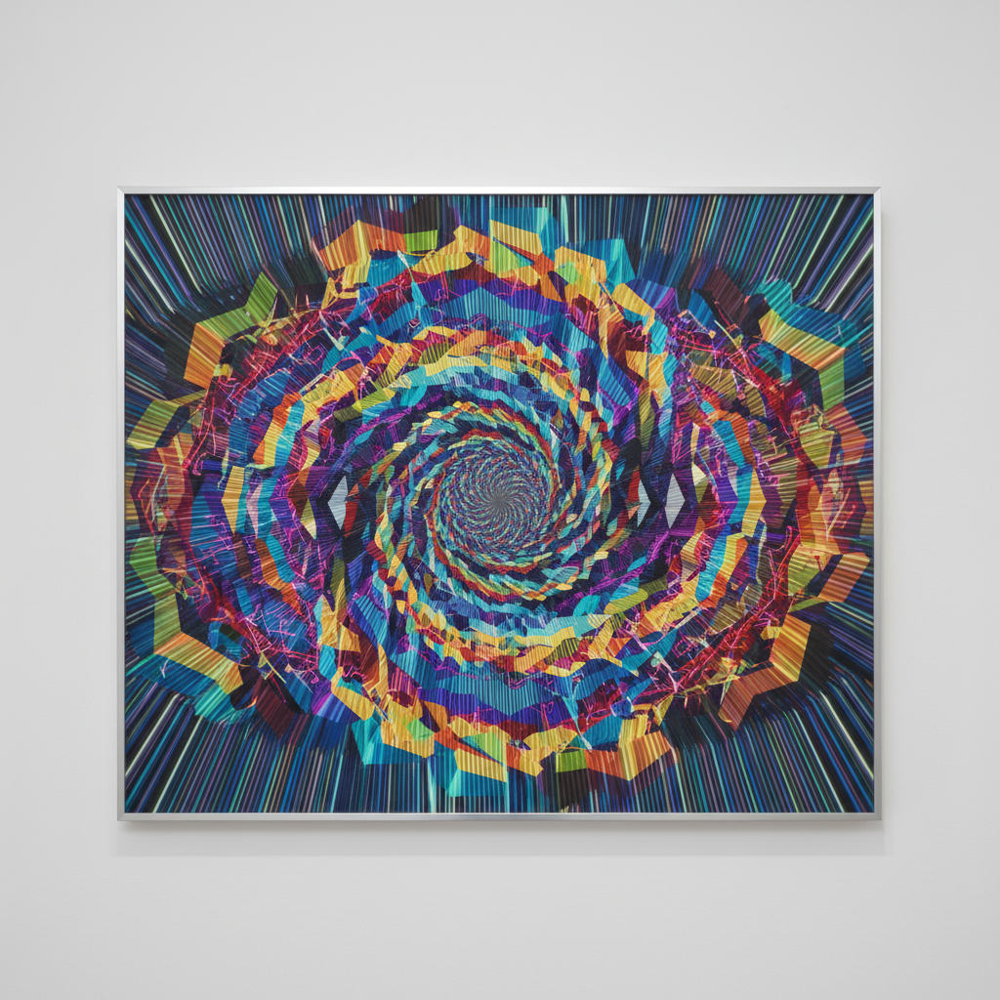

# Lenticular Art 光栅艺术

> **时期：** 1940年代–至今  
> **关键词：** 透镜光栅、视角动画、深度幻觉、变换图像、裸眼3D

## 概述

Lenticular Art（光栅艺术）通过在印刷图像表面覆盖柱状透镜阵列，使观者从不同角度看到不同的图像——实现裸眼3D效果、动画序列或图像变换。从1940年代的商业明信片到当代艺术家的大型装置，光栅技术将平面图像赋予了时间和空间的维度。

## 风格特征

- **视角切换**：不同角度显示不同图像
- **裸眼3D**：无需眼镜的立体深度感
- **动画效果**：倾斜时产生的运动幻觉
- **变形过渡**：一幅图像渐变为另一幅
- **条纹交织**：多幅图像的精密交错编排

## 代表人物与作品

- 维克托·瓦萨雷利（光栅+欧普艺术）
- 山村浩二（光栅动画艺术）
- 当代商业应用（收藏卡、海报）
- 大型光栅建筑外墙装置

## 概念图

