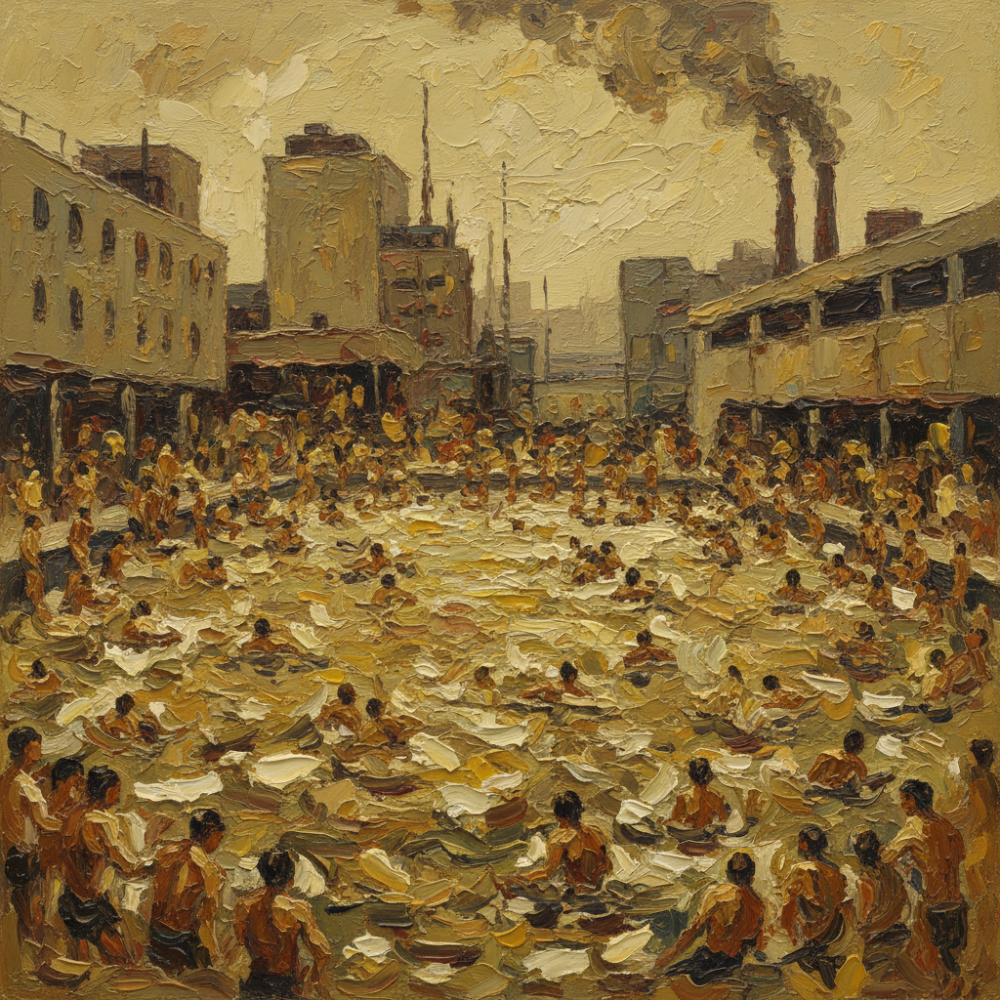

# Leon Kossoff 莱昂·科索夫

> **时期：** 1926–2019  
> **关键词：** 厚涂风景、伦敦日常、反复观察、战后英国学派

## 概述

Leon Kossoff 是英国画家，与 Frank Auerbach 同为"伦敦学派"的核心成员。他终生描绘伦敦的游泳池、教堂、铁路和街道，用厚重的颜料层和反复的观察将日常场景转化为具有史诗感的视觉记录。他的作品是对一座城市长达半个世纪的深情凝视。

## 风格特征

- **厚涂堆积**：颜料以调色刀和大笔刷堆积，表面粗糙如同泥土
- **反复观察**：同一场景画数十遍，每次都是全新的观看
- **伦敦题材**：游泳池、基督教堂、Dalston Junction、建筑工地
- **土黄色调**：以赭石、深黄和灰褐为主，偶尔出现天空的蓝
- **人群场景**：游泳池和教堂中的人群以快速笔触概括，充满动态

## 代表作品

- *Swimming Pool, Autumn Afternoon*（1971）
- *Christ Church, Spitalfields*（1990s，系列）
- *Dalston Junction*（1970s，系列）
- *Children's Swimming Pool*（1969）

## 历史意义

Kossoff 证明了"地方性"可以是一种力量而非局限——通过终生专注于一座城市的有限场景，他达到了普遍性的深度。他的工作方式是对当代艺术全球化和流动性的静默抵抗。

## 概念图

