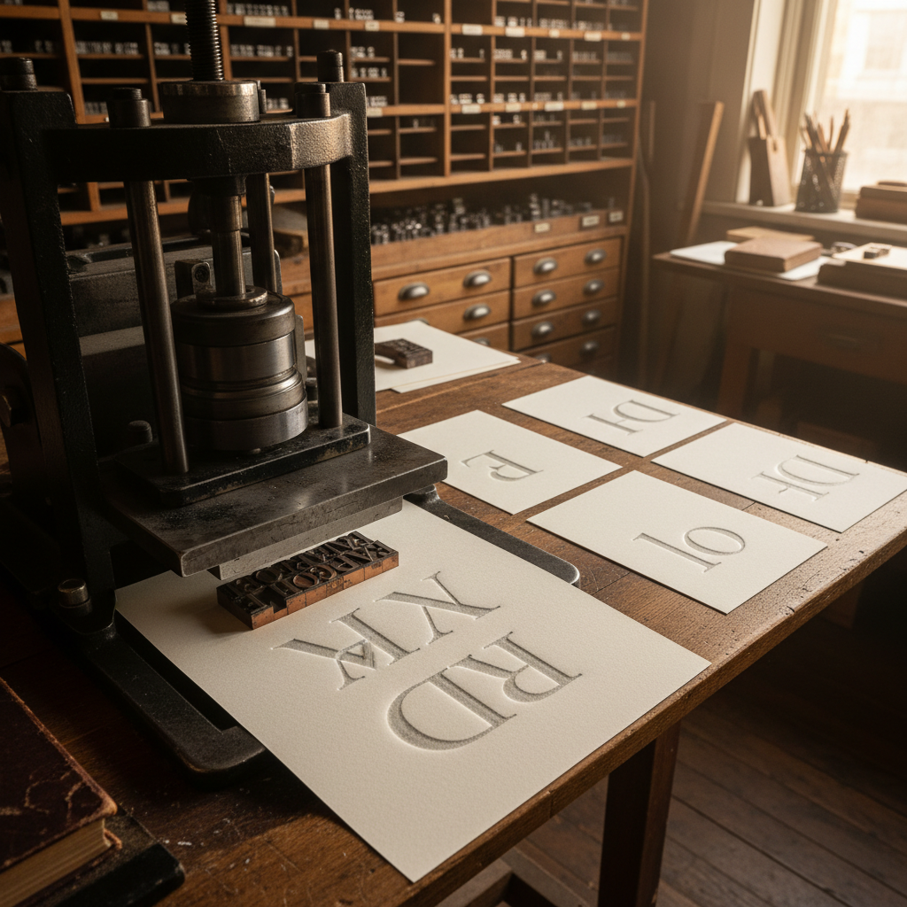

# Letterpress Art 活版印刷艺术

> "Letterpress is printing as sculpture — raised metal or wood type pressed into dampened paper leaves not just ink but an impression, a physical bite that transforms the page into a bas-relief where every letter has weight and presence. The kiss of type against paper creates a deboss that catches light at its edges, making text something you can feel with your fingertips as well as read with your eyes." — Unknown

## 概述

活版印刷艺术（Letterpress Art）是一种使用凸起的活字或图版通过压力将油墨转印到纸张上的传统印刷技法。活版印刷是古登堡发明的印刷方式——在数字印刷时代，它作为一种手工艺术形式获得了新生，以其独特的压痕质感、精美的油墨效果和手工品质著称。

活版印刷艺术的实践包括：1）排版——手工排列金属或木质活字；2）上墨——用墨辊均匀上墨；3）印刷——在印刷机上施加压力印刷；4）压痕——活字在纸面留下的凹陷压痕；5）多色印刷——多次通过印刷不同颜色；6）聚合物版——使用感光聚合物版印刷图像；7）当代活版——将传统技法与现代设计结合的创作。

## 核心特征

| 特征 | 描述 |
|------|------|
| 凸版 | 凸起的活字印刷 |
| 压痕 | 纸面的凹陷压痕 |
| 手工 | 手工排版和印刷 |
| 质感 | 独特的触觉质感 |
| 传统 | 数百年的印刷传统 |
| 精美 | 精美的油墨效果 |

## 视觉特征

- **压痕**：纸面的凹陷压痕
- **清晰**：清晰锐利的边缘
- **质感**：油墨的丰富质感
- **触感**：可触摸的印刷效果
- **经典**：经典的排版美学
- **手工**：手工的不完美之美

## 代表作品

| 作品 | 艺术家/文化 | 年代 | 意义 |
|------|-------------|------|------|
| *Gutenberg Bible* | 德国 | 1455年 | 古登堡圣经 |
| *Kelmscott Press* | 英国 | 1891-1898年 | 凯尔姆斯科特出版社 |
| *Doves Press* | 英国 | 1900-1916年 | 鸽子出版社 |
| *Hatch Show Print* | 美国 | 1879年起 | 海报活版印刷 |
| *Contemporary letterpress* | 国际 | 当代 | 当代活版印刷 |

## 历史时间线

| 时期 | 事件 |
|------|------|
| 1040年 | 毕昇发明活字印刷 |
| 1455年 | 古登堡的金属活字印刷 |
| 15-19世纪 | 活版印刷的主导时代 |
| 20世纪 | 胶印取代活版 |
| 当代 | 活版印刷的艺术化复兴 |

## 中国语境

活版印刷与中国有最深刻的历史渊源——中国是活字印刷的发明国。北宋毕昇发明了泥活字印刷——比古登堡早约400年。中国的木活字和铜活字印刷——在中国印刷史上有重要地位。中国当代的活版印刷复兴——在北京、上海等城市出现了多家活版印刷工作室。中国的设计教育中，活版印刷作为重要的传统印刷技法——在各大设计院校教授。中国的独立出版和文创产业中，活版印刷——因其手工品质和独特质感而受到欢迎。中国的印刷博物馆——收藏和展示了丰富的活字印刷历史。

## AI生成概念图

## 与其他风格的关系

- **Typography** → 字体设计
- **Woodcut** → 木刻版画
- **Foil Stamping** → 烫金
- **Blind Embossing** → 无墨压凸
- **Book Arts** → 书籍艺术
- **Printmaking** → 版画

---

*浮光艺志 | Chronicle of Artistry*
