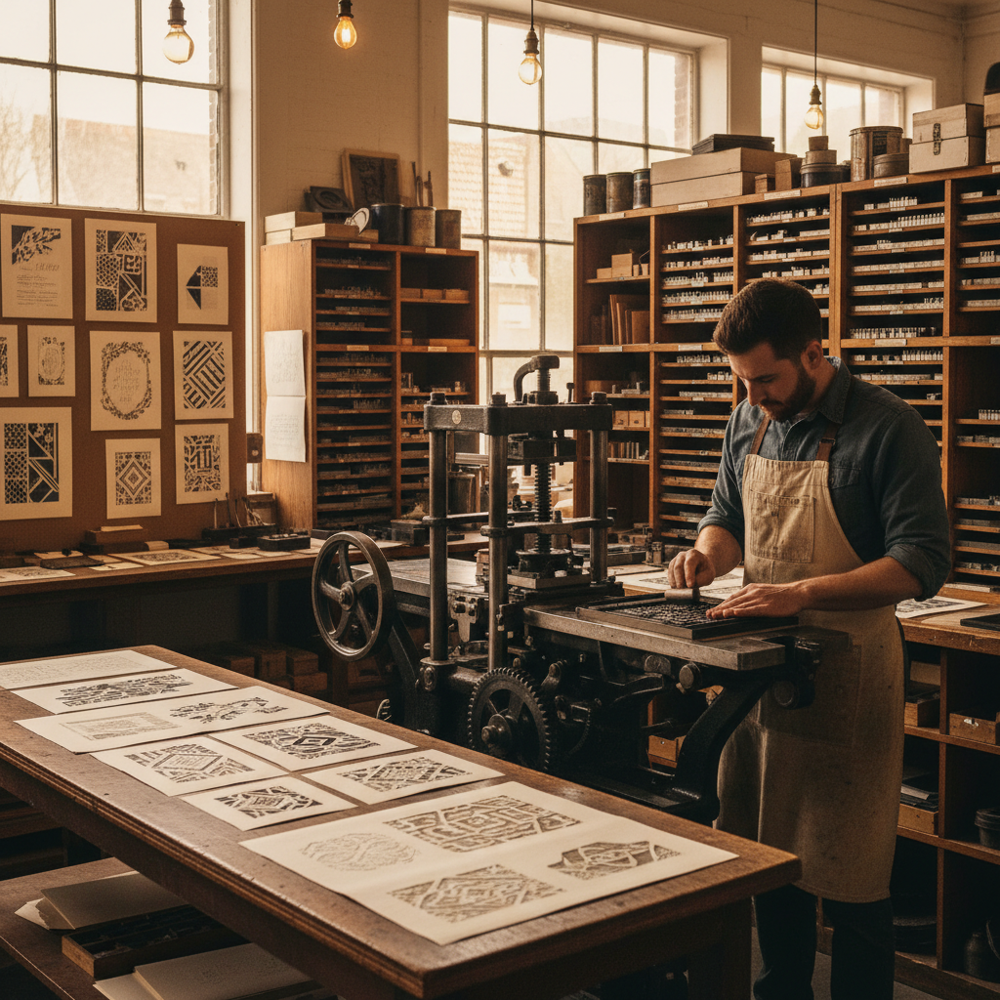

# Letterpress 活字印刷

> "Letterpress is printing with presence — each letter pressed into paper leaves not just ink, but a physical impression of craft." — Unknown

## 概述

活字印刷（Letterpress）是使用凸版活字和印刷机将油墨转印到纸张上的印刷技术。每个字母或图案都是一个独立的金属或木质凸块，排列组合后上墨，通过压力将图案印在纸上。活字印刷的独特之处在于"压印"（impression）——字母不仅留下油墨，还在纸面上留下物理性的凹痕，这种触觉质感是数字印刷无法复制的。

活字印刷的魅力在于：物质性——每一个字母都是一个物理实体，每一次印刷都是一次物理接触，纸张上的凹痕是力量的证据。

## 核心特征

| 特征 | 描述 |
|------|------|
| 凸版 | 凸起的活字版面 |
| 压印 | 物理性的压印 |
| 活字 | 可重复使用的活字 |
| 油墨 | 油墨的转印 |
| 触感 | 纸面的触觉质感 |
| 手工 | 手工排版和印刷 |

## 视觉特征

- **压痕**：纸面的物理凹痕
- **锐利**：清晰锐利的边缘
- **质感**：油墨的质感
- **字体**：经典的金属活字字体
- **简洁**：简洁有力的设计
- **纸张**：厚实的手工纸

## 代表作品

| 作品 | 艺术家 | 年代 | 意义 |
|------|--------|------|------|
| *Gutenberg Bible* | Johannes Gutenberg | 1455 | 西方活字印刷的开端 |
| *Kelmscott Press books* | William Morris | 1890s | 工艺美术运动印刷 |
| *Doves Press Bible* | T.J. Cobden-Sanderson | 1903-05 | 私人出版社巅峰 |
| *Hatch Show Print* | Various | 1879+ | 美国活字海报 |
| *Contemporary letterpress* | Various | 当代 | 当代活字复兴 |

## 历史时间线

| 时期 | 事件 |
|------|------|
| 1040年 | 毕昇发明活字印刷 |
| 1455 | 古腾堡金属活字印刷 |
| 15-19世纪 | 活字印刷的主导时代 |
| 1890s | 私人出版社运动 |
| 20世纪 | 胶印取代活字 |
| 2000s+ | 活字印刷的艺术复兴 |

## 中国语境

中国是活字印刷的发明国——北宋毕昇于1040年发明了泥活字印刷术，比古腾堡早约400年。中国后来还发展了木活字和铜活字。然而由于汉字数量庞大，活字印刷在中国的应用不如在西方那样革命性。当代中国的活字印刷正在经历艺术复兴——一些设计师和艺术家重新使用传统活字进行创作，将其作为一种具有文化深度的艺术表达方式。

## AI生成概念图

## 与其他风格的关系

- **Typography** → 字体设计
- **Woodblock Printing** → 木版印刷
- **Calligraphy** → 书法
- **Graphic Design** → 平面设计
- **Bookbinding** → 装帧
- **Print Making** → 版画

---

*浮光艺志 | Chronicle of Artistry*
