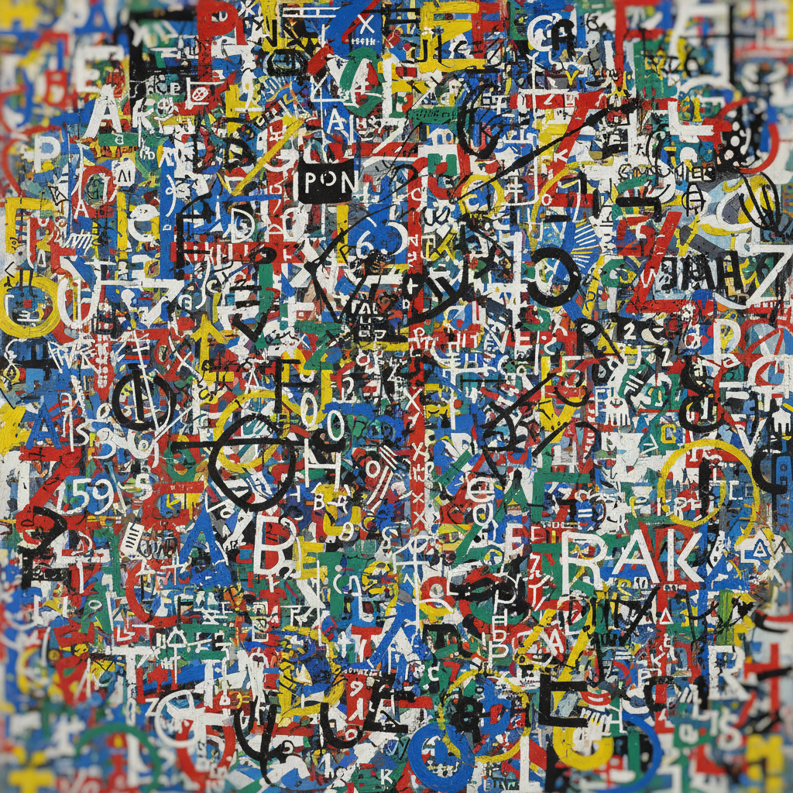

# Lettrism 字母主义

> **时期：** 1945年–至今  
> **关键词：** 伊西多尔·伊苏、字母解放、声音诗、超图形、先锋电影

## 概述

Lettrism（字母主义）由罗马尼亚裔法国诗人伊西多尔·伊苏于1945年在巴黎创立，主张将艺术还原到最基本的元素——字母和符号。在视觉艺术中，它表现为"超图形"（hypergraphics）：字母、数字、音乐符号和发明的符号在画面上自由组合，既不是文字也不是纯粹的图形，而是一种超越语言和绘画边界的新视觉语言。

## 风格特征

- **字母解放**：字母脱离语义成为纯视觉元素
- **超图形**：多种符号系统的混合
- **密集构图**：符号填满整个画面
- **发明符号**：创造全新的视觉语言
- **跨媒介**：诗歌、绘画、电影的融合

## 代表人物与作品

- 伊西多尔·伊苏 超图形画作
- 莫里斯·勒梅特尔 字母绘画
- 吉尔-约瑟夫·沃尔曼 拼贴
- 罗兰·萨巴蒂耶 无限艺术

## 概念图

