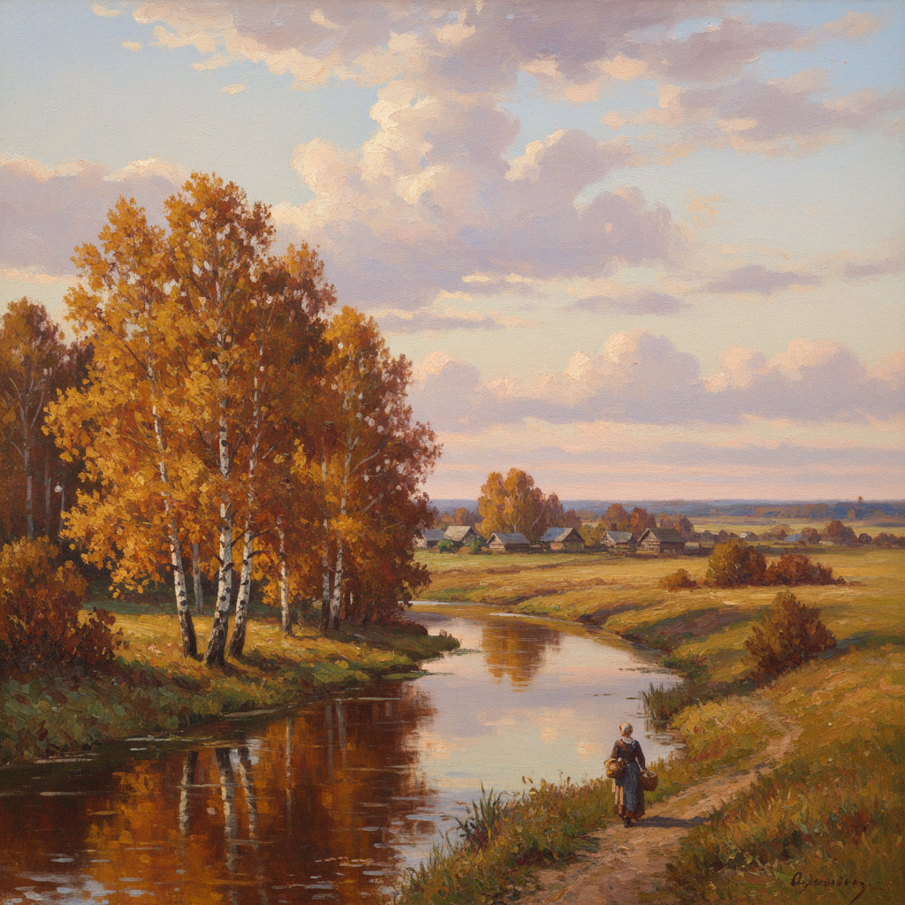

# Levitan Art 列维坦艺术

> "In nature there is no such thing as a trifle." — Isaac Levitan

## 概述

列维坦艺术（Levitan Art）是19世纪俄罗斯风景画大师伊萨克·伊里奇·列维坦（Isaac Ilyich Levitan, 1860-1900）创立的抒情写实风景画风格。列维坦被誉为"情绪风景画"（mood landscape）的大师——他不仅描绘自然的外貌，更捕捉自然中蕴含的情感和诗意。与希施金的精确写实不同，列维坦追求的是风景的"灵魂"——通过色彩、光线和构图传达深沉的情感。

列维坦是契诃夫的挚友——两人在艺术上有深刻的共鸣，都善于在平凡中发现诗意。列维坦的作品如《弗拉基米尔路》《永恒的安宁之上》《金色的秋天》等，以简洁的构图和深沉的情感打动了无数观者。他仅活了40岁，却创造了俄罗斯风景画的最高成就。

列维坦艺术的核心要素包括：1）情绪风景——风景中蕴含的情感；2）抒情写实——写实与抒情的结合；3）简洁构图——去除多余细节的简洁；4）色彩诗意——色彩的诗意表达；5）俄罗斯大地——对俄罗斯平原的深情；6）季节变化——对季节转换的敏感；7）哲学深度——风景中的哲学思考。

## 核心特征

| 特征 | 描述 |
|------|------|
| 情绪风景 | 风景中蕴含的情感 |
| 抒情写实 | 写实与抒情结合 |
| 简洁构图 | 去除多余细节 |
| 色彩诗意 | 色彩的诗意表达 |
| 俄罗斯大地 | 对俄罗斯平原深情 |
| 哲学深度 | 风景中的哲学思考 |

## 视觉特征

- **开阔平原**：俄罗斯广袤的平原和河流
- **黄昏暮色**：黄昏和暮色中的忧郁美
- **秋色金黄**：金色秋天的诗意
- **简洁有力**：简洁但情感充沛的构图
- **天空辽阔**：占据画面大部分的天空
- **静谧深沉**：宁静中的深沉情感

## 代表作品

| 作品 | 年代 | 意义 |
|------|------|------|
| *弗拉基米尔路* (Vladimirka) | 1892 | 流放之路的悲怆 |
| *永恒的安宁之上* (Above Eternal Peace) | 1894 | 哲学性的巅峰 |
| *金色的秋天* (Golden Autumn) | 1895 | 俄罗斯秋天的象征 |
| *三月* (March) | 1895 | 春天的期待 |
| *暮钟* (Evening Bells) | 1892 | 宁静的诗意 |
| *湖* (Lake. Russia) | 1899-1900 | 未完成的遗作 |

## 历史时间线

| 时期 | 事件 |
|------|------|
| 1860年 | 出生于立陶宛考纳斯 |
| 1873-1885年 | 就读莫斯科绘画雕塑建筑学校 |
| 1880年代 | 早期创作和风格形成 |
| 1890年代 | 创作巅峰期 |
| 1898年 | 成为风景画教授 |
| 1900年 | 因心脏病去世，年仅40岁 |

## 中国语境

列维坦在中国的影响同样深远。中国画家对列维坦的"情绪风景"概念有特殊的共鸣——因为中国传统山水画本身就强调"意境"和"情景交融"。列维坦的方法为中国油画家提供了一种将西方写实技法与东方诗意精神结合的可能性。中国风景油画家如罗工柳、吴冠中等都受到列维坦的影响——他们在写实的基础上追求诗意和情感的表达。列维坦的《金色的秋天》在中国美术教育中被广泛引用——作为"情景交融"的西方范例。列维坦证明了风景画不仅是对自然的记录，更是对生命和存在的思考——这与中国"天人合一"的哲学传统深度契合。

## 真实作品

## 与其他风格的关系

- **Shishkin** → 希施金（精确写实风景）
- **Peredvizhniki** → 巡回展览画派
- **Kuindzhi** → 库因芝（光影风景）
- **Chekhov** → 契诃夫（文学中的对应）
- **Impressionism** → 印象主义（光色探索）
- **Barbizon School** → 巴比松画派

---

*浮光艺志 | Chronicle of Artistry*
