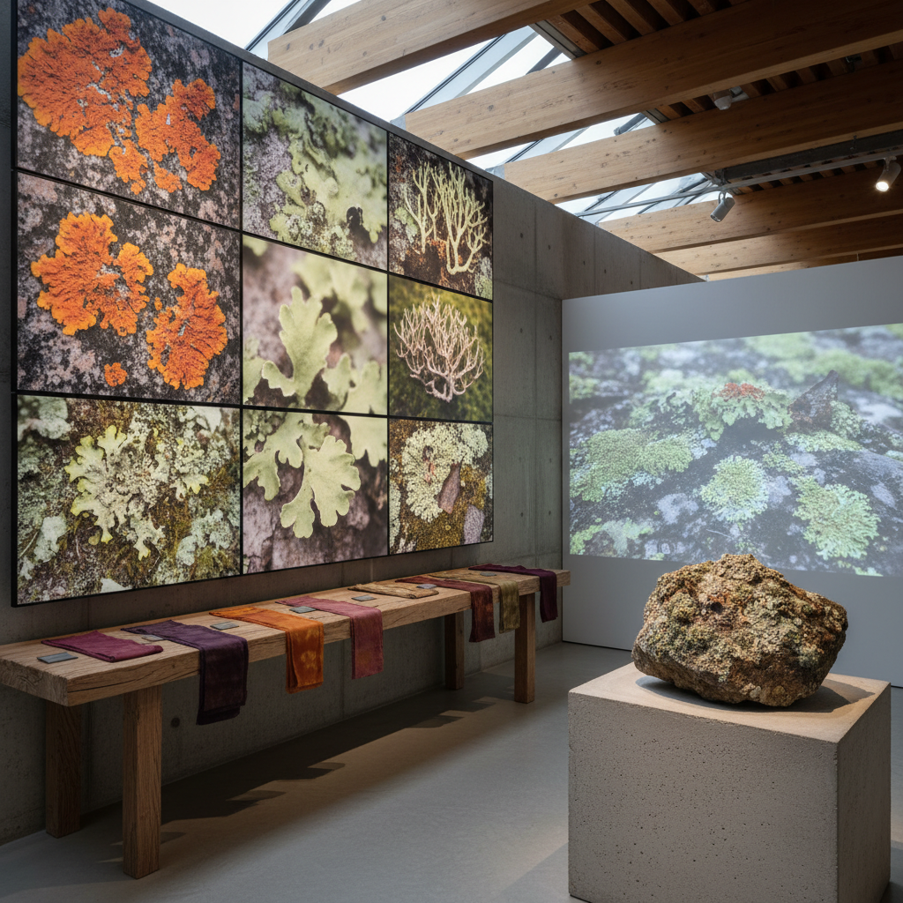

# Lichen Art 地衣艺术

> "Lichen art celebrates the original symbiosis — the ancient partnership between fungus and alga that produces something neither could create alone, a being that is not one organism but two becoming something new together, that grows on bare rock where nothing else can live, that paints the world in colors no single species could produce, and that teaches us the most fundamental lesson of life: that cooperation, not competition, is the deepest creative force in nature." — Unknown

## 概述

地衣艺术（Lichen Art）是以地衣——真菌和藻类（或蓝藻）的共生体——为灵感、主题和媒介的艺术实践。地衣是自然界中最成功的共生关系之一：真菌提供结构和保护，藻类提供光合作用产生的营养，两者共同创造了一种全新的生命形式，能够在最极端的环境中生存。

地衣艺术的实践包括：1）地衣色彩的利用——地衣产生丰富的天然色素（黄色、橙色、红色、紫色），可用于染色和绘画；2）地衣形态的艺术化——地衣的多样形态（壳状、叶状、枝状）作为视觉灵感；3）地衣作为时间的标记——地衣生长极其缓慢（每年仅几毫米），是时间流逝的自然记录；4）地衣作为共生的象征——用地衣来思考合作、共存和互利关系；5）地衣作为环境指标——地衣对空气污染极其敏感，是环境健康的指示器。

## 核心特征

| 特征 | 描述 |
|------|------|
| 共生 | 共生的象征 |
| 缓慢 | 极其缓慢的生长 |
| 色彩 | 丰富的天然色彩 |
| 坚韧 | 极端环境的生存 |
| 时间 | 时间的标记 |
| 指示 | 环境指示 |

## 视觉特征

- **色彩**：黄、橙、灰、绿的色调
- **纹理**：粗糙的岩石表面纹理
- **圆形**：同心圆的生长模式
- **分支**：枝状地衣的精细分支
- **覆盖**：覆盖岩石和树皮
- **微观**：微观结构的美

## 代表作品

| 作品 | 艺术家 | 年代 | 意义 |
|------|--------|------|------|
| *Lichen dye textiles* | Various | 传统 | 地衣染色 |
| *Lichen photography* | Various | 2000年代 | 地衣摄影 |
| *Lichen as time marker* | Various | 2010年代 | 地衣测年艺术 |
| *Symbiosis installations* | Various | 2020年代 | 共生装置 |
| *Lichen pigment paintings* | Various | 当代 | 地衣颜料绘画 |

## 历史时间线

| 时期 | 事件 |
|------|------|
| 古代 | 地衣染色的传统使用 |
| 1867 | Simon Schwendener发现地衣的共生本质 |
| 2000年代 | 地衣作为艺术主题的兴起 |
| 2010年代 | 地衣与环境艺术的结合 |
| 当代 | 地衣美学的当代化 |

## 中国语境

地衣艺术在中国有独特的发展空间。中国拥有丰富的地衣多样性——从青藏高原的岩石地衣到热带雨林的悬垂地衣，中国的地衣物种超过2000种。中国传统文化中，虽然地衣没有像灵芝那样被特别关注，但"苔藓"（包括地衣）在中国传统美学中有重要地位——"苔痕上阶绿"（刘禹锡）表达了对古老、宁静和时间流逝的欣赏。中国传统园林中对"古意"的追求——让石头和墙壁长满苔藓和地衣——也是一种地衣美学。中国当代的一些艺术家在探索地衣艺术：利用中国特有的地衣物种作为天然颜料、将地衣的缓慢生长作为"慢艺术"的实践、以及用地衣来监测和表达中国城市的空气质量变化。

## AI生成概念图

## 与其他风格的关系

- **Symbiotic Art** → 共生艺术
- **Eco-Art** → 生态艺术
- **Natural Dye Art** → 天然染色艺术
- **Slow Art** → 慢艺术
- **Botanical Art** → 植物艺术
- **Material Art** → 材料艺术

---

*浮光艺志 | Chronicle of Artistry*
