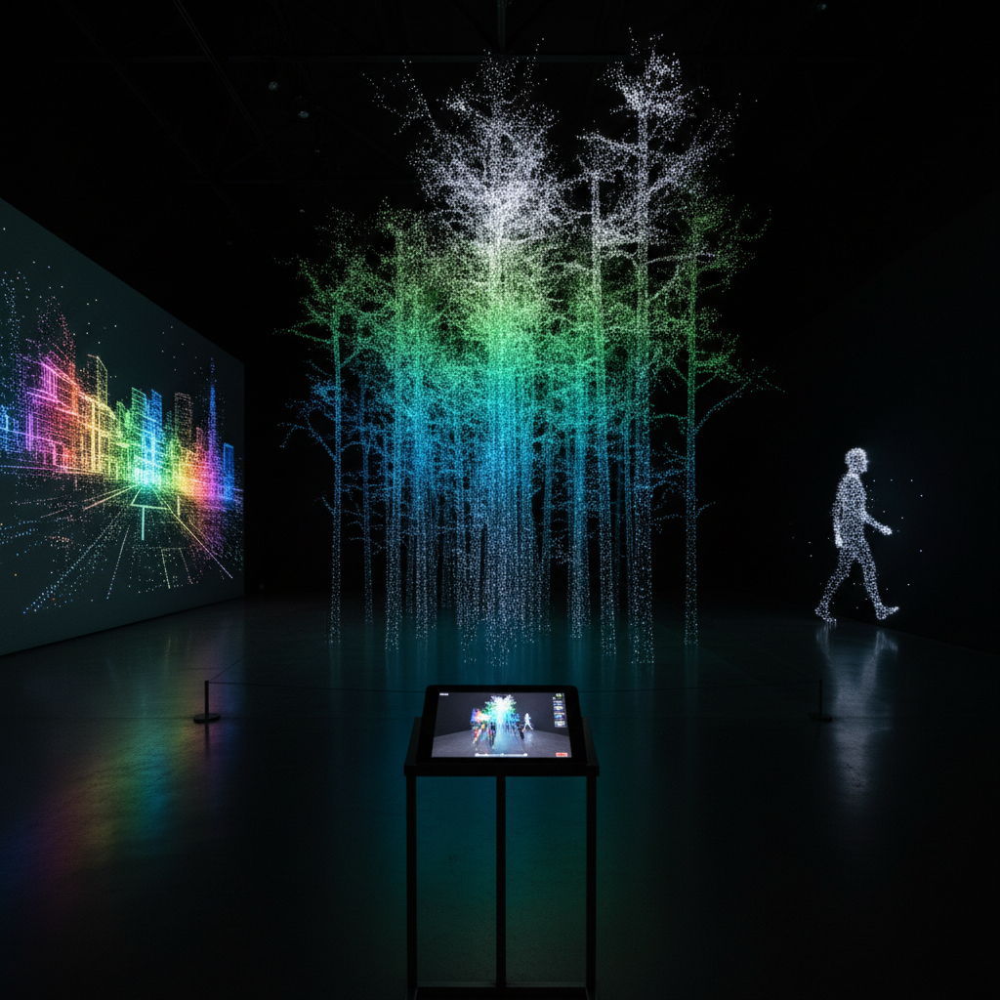

# LiDAR Art 激光雷达艺术

> "LiDAR art sees the world as the machine sees it — not in color or light, but in distance, in the precise measurement of how far away every surface is from the sensor. A LiDAR scan strips away color, texture, and material, leaving only pure geometry — the skeleton of reality, the mathematical truth of space itself. What remains is hauntingly beautiful: millions of points floating in void, each one a precise coordinate in three-dimensional space, together forming a ghost image of the world made entirely of measurement." — Unknown

## 概述

激光雷达艺术（LiDAR Art）是利用LiDAR（Light Detection and Ranging，光探测和测距）技术——通过发射激光脉冲并测量反射时间来精确测量距离——进行艺术创作的实践。LiDAR产生的点云数据具有独特的美学品质：精确但幽灵般的、密集但透明的、真实但抽象的。

激光雷达艺术的实践包括：1）点云美学——将LiDAR点云数据的视觉特性作为美学对象；2）隐藏揭示——用LiDAR揭示肉眼看不到的结构（植被下的地形、建筑内部）；3）时间扫描——在不同时间扫描同一场景，记录变化；4）移动扫描——在移动中扫描，创造扭曲和拉伸的效果；5）手机LiDAR——利用iPhone等设备的LiDAR传感器进行日常扫描创作；6）大规模测绘——用航空LiDAR创造大规模地形艺术。

## 核心特征

| 特征 | 描述 |
|------|------|
| 精确 | 毫米级精度 |
| 点云 | 点云数据 |
| 距离 | 基于距离测量 |
| 透明 | 透明的幽灵感 |
| 揭示 | 揭示隐藏结构 |
| 规模 | 从手持到航空 |

## 视觉特征

- **点**：离散的点构成形态
- **彩虹**：距离编码的彩虹色
- **透明**：可穿透的形态
- **精确**：几何的精确性
- **幽灵**：幽灵般的存在感
- **密度**：点密度的变化

## 代表作品

| 作品 | 艺术家 | 年代 | 意义 |
|------|--------|------|------|
| *LiDAR point cloud art* | Various | 2010年代 | 点云艺术 |
| *Archaeological LiDAR* | Various | 2010年代 | 考古LiDAR |
| *iPhone LiDAR art* | Various | 2020年代 | 手机LiDAR艺术 |
| *Forest scanning* | Various | 2010年代 | 森林扫描艺术 |
| *City scanning* | Various | 2010年代 | 城市扫描艺术 |

## 历史时间线

| 时期 | 事件 |
|------|------|
| 1960年代 | LiDAR技术发明 |
| 2000年代 | 地面LiDAR扫描仪普及 |
| 2010年代 | 航空LiDAR考古发现 |
| 2020 | iPhone 12 Pro搭载LiDAR |
| 当代 | LiDAR艺术的爆发 |

## 中国语境

激光雷达艺术在中国有重要的技术和应用基础。中国在LiDAR技术领域有大量投入——从自动驾驶汽车的LiDAR传感器到测绘和考古应用。中国的考古学家使用航空LiDAR发现了大量隐藏在植被下的古代遗址——如在中国南方热带丛林中发现的古代城市遗迹。中国的智慧城市项目大量使用LiDAR进行城市三维建模。中国当代的一些艺术家在探索LiDAR艺术：用LiDAR扫描中国古建筑创造幽灵般的点云作品、将中国城市的LiDAR数据作为创作素材、以及用手机LiDAR记录中国日常生活空间的三维形态。

## AI生成概念图

## 与其他风格的关系

- **Photogrammetry Art** → 摄影测量艺术
- **Point Cloud Art** → 点云艺术
- **Volumetric Art** → 体积艺术
- **Data Art** → 数据艺术
- **Digital Sculpture** → 数字雕塑
- **Mapping Art** → 测绘艺术

---

*浮光艺志 | Chronicle of Artistry*
