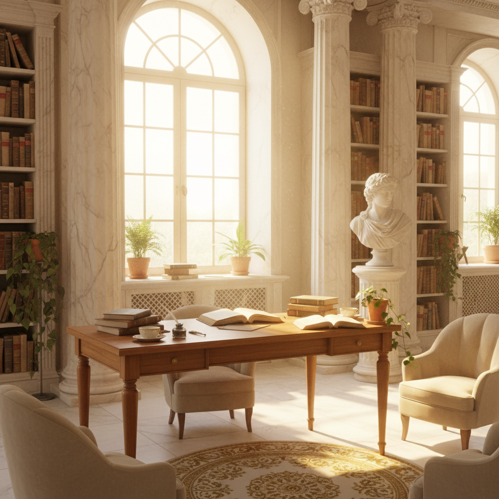

# Light Academia Art 浅色学院派美学

> **时期：** 2020–至今  
> **关键词：** 古典乐观、阳光图书馆、希腊雕塑、奶油色调、知识之美

## 概述

Light Academia 是 Dark Academia 的明亮对应物——同样崇尚古典学术、文学和艺术，但用阳光、温暖和乐观取代了前者的哥特忧郁。它想象的是春天的大学校园、阳光洒满的图书馆、希腊神庙的白色大理石——一种对知识和美的纯粹热爱，没有Dark Academia的死亡执念。

## 风格特征

- **暖白色调**：奶油色、米色、淡金色为主
- **古典元素**：希腊柱式、文艺复兴绘画、古典雕塑
- **自然光**：阳光透过窗户的温暖氛围
- **学术符号**：书籍、笔记、植物标本、乐器
- **田园感**：花园、草地、户外阅读

## 代表人物与作品

- Tumblr/Pinterest Light Academia 社区
- 文艺复兴时期绘画的当代引用
- 独立电影的学院派视觉风格
- 古典音乐专辑封面设计

## 概念图

