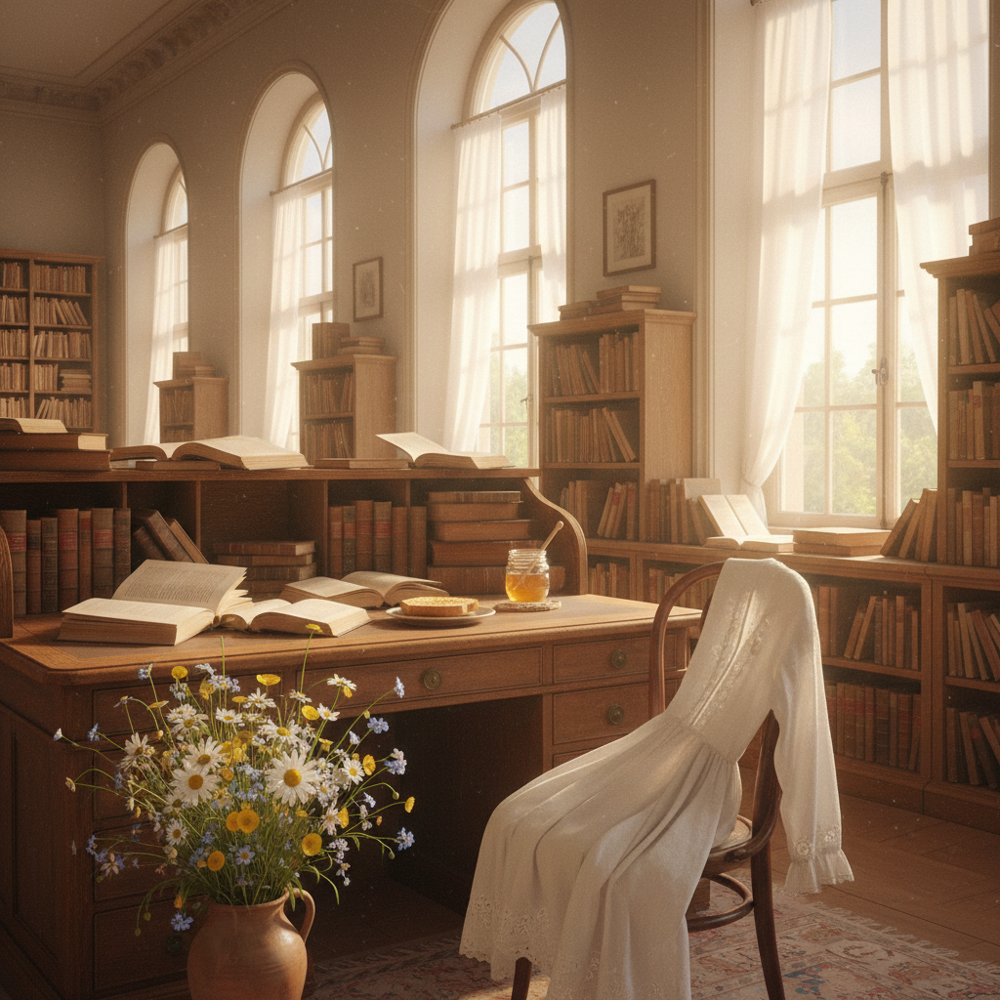

# Light Academia 明亮学院



> **"阳光洒在旧书页上，白色亚麻裙在花园里飘动——学术的浪漫，不需要黑暗。"**

## 概述

| 维度 | 描述 |
|------|------|
| 时期 | 2020–至今 |
| 别名 | Light Academia, Bright Academia, Romantic Academia |
| 核心色彩 | 米白、奶油黄、浅棕、蜜色、淡金 |
| 关键元素 | 旧书、阳光图书馆、白色衬衫、花园、诗歌 |
| 代表人物 | Jane Austen、《Call Me By Your Name》、Saoirse Ronan |
| 关联风格 | Dark Academia, Cottagecore, Regencycore, Old Money |

---

## 历史脉络

### 2020：Dark Academia 的"白天版"

Light Academia 作为 Dark Academia 的**明亮对应物**出现：

| 维度 | Dark Academia | Light Academia |
|------|--------------|----------------|
| 时间 | 秋冬、夜晚 | 春夏、白天 |
| 色调 | 深棕、黑色、墨绿 | 米白、奶油、淡金 |
| 情绪 | 忧郁、神秘、痛苦 | 温暖、希望、浪漫 |
| 文学 | 陀思妥耶夫斯基、Donna Tartt | Jane Austen、莎士比亚喜剧 |
| 空间 | 暗色图书馆、哥特教堂 | 阳光花园、明亮书房 |

### 文化基因

| 来源 | 贡献 |
|------|------|
| Jane Austen 小说 | 英国乡村的知性浪漫 |
| 《Call Me By Your Name》 | 意大利夏日的学术美 |
| 印象派绘画 | 阳光、花园、户外阅读 |
| 牛津/剑桥 | 学院建筑的明亮面 |
| 希腊/罗马古典 | 白色大理石、阳光神殿 |

### 核心哲学

Light Academia 提供了一种**没有痛苦的知性生活想象**：
- Dark Academia 说："知识是痛苦的，美是危险的"
- Light Academia 说："知识是快乐的，美是温暖的"
- 你可以热爱文学而不必忧郁
- 学术可以是阳光下的花园对话，不必是深夜的孤独阅读

---

## 视觉语法

### 色彩系统

```
主色：
  米白 (#FFFDD0) — 旧书页、亚麻
  奶油黄 (#FFFACD) — 阳光、黄油
  浅棕 (#D2B48C) — 皮革、木材
  蜜色 (#EB9605) — 蜂蜜、琥珀
  淡金 (#FFD700 + 低饱和) — 阳光

辅色：
  天蓝 (#87CEEB) — 晴朗天空
  薰衣草 (#E6E6FA) — 花园
  橄榄绿 (#808000) — 植物
  玫瑰粉 (#FFB7C5) — 花朵

质感：
  亚麻/棉 — 衣物、桌布
  旧纸 — 书页、信件
  阳光/光斑 — 透过窗户的光
  大理石 — 古典建筑
  花瓣 — 自然装饰
```

### 标志性元素

| 类别 | 元素 |
|------|------|
| 书籍 | 旧书、诗集、手写信件、日记 |
| 空间 | 阳光图书馆、花园、咖啡馆、博物馆 |
| 服装 | 白色衬衫、亚麻裙、针织背心、草帽 |
| 食物 | 蜂蜜、茶、柠檬蛋糕、水果 |
| 活动 | 户外阅读、写诗、素描、散步 |
| 艺术 | 印象派、水彩、古典雕塑 |

---

## 与千禧怀旧的关系

### 对"毒性学术文化"的回应
- 2010s 的"内卷"/"996"文化让学习变得痛苦
- Light Academia 说："学习本身可以是美好的"
- 它怀念一种"没有KPI的知识追求"

### 与 Cottagecore 的交叉
- 两者都逃向一种"慢生活"
- Cottagecore = 田园劳动
- Light Academia = 田园阅读
- 共享"阳光+自然+手工"的视觉语言

---

## 中国语境

- "文艺复兴"/"知性风"穿搭
- 小红书上的"图书馆穿搭"/"学院风"
- 与"法式风格"的交叉（亚麻、阳光、咖啡）
- 独立书店/咖啡馆文化的视觉
- "松弛感"生活方式的视觉表达

---

## 设计应用

| 场景 | 应用方式 |
|------|----------|
| 品牌 | 米白+衬线字体+手绘插画+阳光摄影 |
| 空间 | 自然光+木质+白色+植物+旧书 |
| 包装 | 亚麻质感+手写字体+暖色调 |
| 数字 | 暖色滤镜+衬线字体+留白+柔和动效 |

---

## 延伸阅读

- "Light Academia vs Dark Academia" 对比分析
- Jane Austen 小说的视觉世界
- 印象派绘画与 Light Academia 的色彩关系

---

## 相关风格

← [Dark Academia 暗黑学院](dark-academia.md) | [Cottagecore 田园核](cottagecore.md) →

↑ [返回千禧怀旧目录](README.md) | [返回总目录](../README.md)
