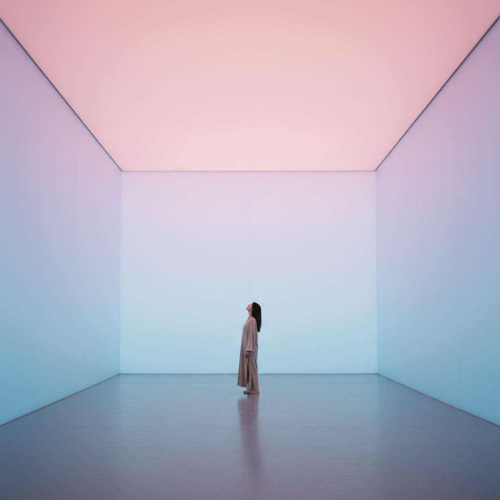

# Light Art 光艺术

> "My work is made of light." — James Turrell

## 概述

光艺术（Light Art）是以光线本身——自然光、人造光、霓虹灯、LED、激光、投影——作为主要创作媒介的艺术形式。它不是用光来照亮其他物体，而是让光本身成为可感知的物质存在。

光艺术的历史可以追溯到印象派对光的痴迷，但作为独立的艺术形式，它在1960年代随着霓虹灯、荧光灯和电子技术的发展而成熟。

## 核心特征

| 特征 | 描述 |
|------|------|
| 光即媒介 | 光线本身是作品的材料和主题 |
| 空间性 | 光充满整个空间，创造沉浸体验 |
| 感知性 | 挑战和改变观者的视觉感知 |
| 时间性 | 光的变化创造时间维度 |
| 非物质 | 光是最接近"无"的物质存在 |
| 技术性 | 依赖电气、光学和数字技术 |

## 视觉特征

- **媒介**：霓虹灯管、荧光灯、LED、激光、投影、自然光
- **色彩**：纯色光——红、蓝、绿、白、紫外
- **空间**：整个房间被光充满或分割
- **边界**：光的边缘模糊了物理空间的边界
- **感知**：Ganzfeld效应——均匀光场中失去空间感
- **时间**：缓慢的色彩渐变、日出日落的自然节奏

## 代表作品

| 作品 | 艺术家 | 年代 | 意义 |
|------|--------|------|------|
| *Roden Crater* | James Turrell | 1977-至今 | 火山口中的天光观测——毕生之作 |
| *The Weather Project* | Olafur Eliasson | 2003 | Tate Modern的人造太阳 |
| *Untitled (to you, Heiner, with admiration)* | Dan Flavin | 1973 | 荧光灯管的极简诗意 |
| *Your blind passenger* | Olafur Eliasson | 2010 | 雾中的彩色光——感知的消解 |
| *Breathing Light* | James Turrell | 2013 | Ganzfeld——失去空间感的纯光体验 |
| *Neon Installations* | Bruce Nauman | 1960s+ | 霓虹文字的概念性 |

## 历史时间线

| 时期 | 事件 |
|------|------|
| 1920s | Moholy-Nagy的光空间调节器——先驱 |
| 1960s | Flavin开始使用荧光灯管，ZERO Group的光实验 |
| 1966 | Turrell开始光与空间运动（Light and Space） |
| 1970s | 加州Light and Space运动成熟 |
| 1977 | Turrell开始Roden Crater项目 |
| 2003 | Eliasson的Weather Project——光艺术的大众化时刻 |
| 2010s | LED技术使光艺术更加普及 |
| 2020s | 沉浸式光影展览成为全球现象 |

## 子类型

| 子类型 | 特征 |
|--------|------|
| 光与空间 | Turrell、Irwin——感知现象学 |
| 霓虹/荧光 | Flavin、Nauman——工业光源的诗意 |
| 环境光 | Eliasson——大规模沉浸式光环境 |
| 激光艺术 | 激光束在空间中的几何 |
| 投影映射 | 建筑表面的动态光影 |
| 自然光 | Turrell——框住天空和日光 |

## 中国语境

光艺术在中国近年来获得了巨大的公众关注。teamLab等沉浸式光影展览在中国各大城市巡回，成为社交媒体上的热门打卡点。中国本土的光艺术实践也在发展——李晖的LED装置、杨泳梁的数字光影、以及各种城市灯光节。然而，商业化的"网红光影展"与严肃的光艺术之间的边界日益模糊。

## 争议与遗产

- **争议**：沉浸式光影展是艺术还是娱乐？
- **商业化**：teamLab式体验是光艺术的普及还是庸俗化？
- **技术依赖**：光艺术的保存和再现依赖特定技术设备
- **遗产**：为沉浸式艺术、数字艺术、建筑照明设计奠定基础
- **当代回响**：VR/AR体验、建筑投影、城市灯光节

## AI生成概念图

## 与其他风格的关系

- **ZERO Group** → 零派的光实验是光艺术的直接先驱
- **Minimalism** → 极简主义的纯粹性延伸到光的纯粹
- **Op Art** → 欧普艺术共享光学感知的探索
- **Installation Art** → 装置艺术的空间性为光艺术提供框架
- **Kinetic Art** → 动态艺术中的光运动
- **Immersive Art** → 沉浸式艺术是光艺术的当代延伸

---

*浮光艺志 | Chronicle of Artistry*
