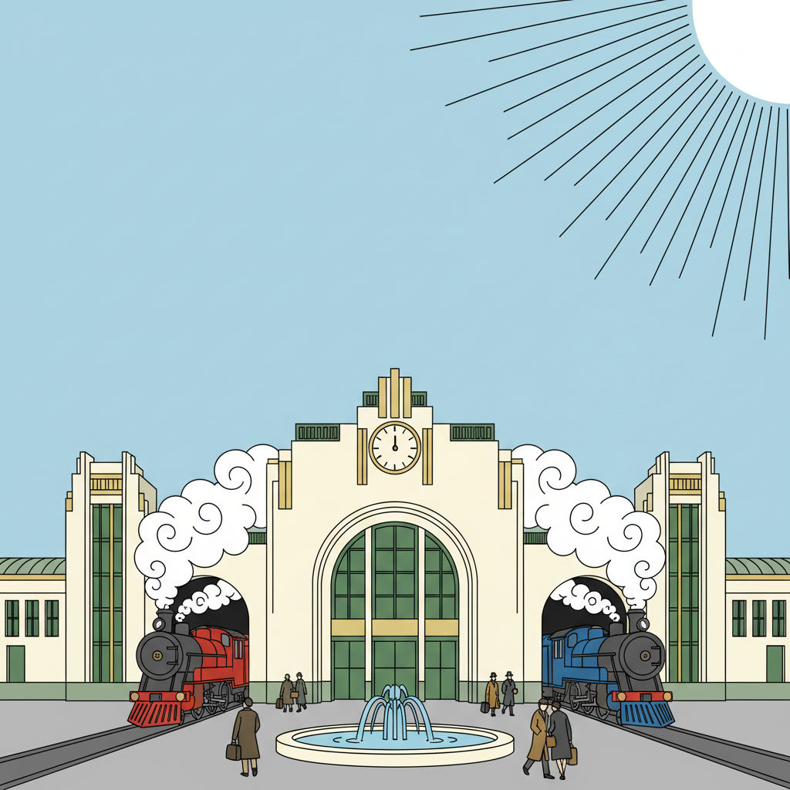

# Ligne Claire 清线风格

> **时期：** 1930年代–至今  
> **关键词：** 均匀线条、平涂色彩、无阴影、精确构图、叙事清晰

## 概述

Ligne Claire（法语"清晰线条"）是由埃尔热在《丁丁历险记》中确立的漫画绘画风格。其核心特征是所有元素——无论前景人物还是背景建筑——都使用相同粗细的均匀线条勾勒，配合平涂色彩和极少的阴影处理，创造出一种干净、明确、高度可读的视觉效果。

## 风格特征

- **均匀线条**：所有轮廓线粗细一致
- **平涂色彩**：无渐变的纯色填充
- **无阴影**：极少使用明暗对比
- **精确背景**：建筑和物体的精确描绘
- **简化人物**：面部简化但表情丰富

## 代表人物与作品

- 埃尔热《丁丁历险记》
- 约斯特·斯瓦特（荷兰清线大师）
- 泰德·伯努瓦《Ray Banana》
- 杰森·卢特斯《柏林》

## 概念图

