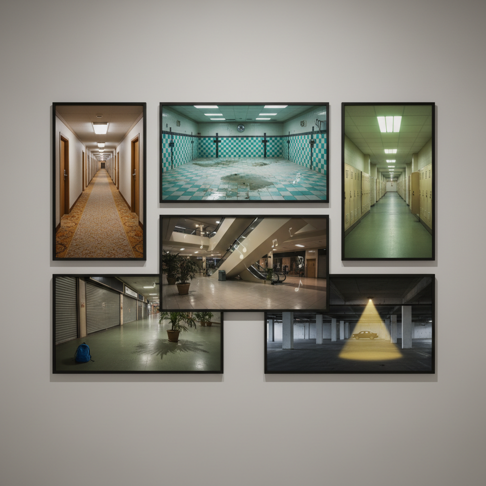

# Liminal Space Art 阈限空间艺术

> "Liminal spaces are the places between places — empty hallways at 3am, closed shopping malls with lights still on, hotel corridors that stretch forever, swimming pools without water or people, spaces designed for transit that become eerie when you stop and stay, photographs that trigger a primal recognition of somewhere you have been in a dream but never in waking life, the architecture of transition frozen in eternal pause." — Unknown

## 概述

阈限空间（Liminal Space）是2019-2020年代兴起的一种互联网美学，聚焦于那些"过渡性"空间——设计用于通过而非停留的地方，当它们空无一人时会产生一种深层的不安和怀旧感。"Liminal"来自拉丁语"limen"（门槛），指的是"阈限"——两种状态之间的过渡区域。

阈限空间美学的核心体验是"不该在这里"的感觉——这些空间（走廊、楼梯间、停车场、商场、机场、游泳池等）在正常使用时是完全普通的，但当它们空无一人、在非正常时间被拍摄时，就会产生一种诡异的"似曾相识"感。这种美学与"Backrooms"（后室）概念密切相关——一个虚构的无限空间，由无尽的黄色墙壁、潮湿的地毯和嗡嗡作响的荧光灯组成。

## 核心特征

| 特征 | 描述 |
|------|------|
| 过渡 | 过渡性的空间 |
| 空旷 | 空无一人的状态 |
| 熟悉 | 熟悉但不安的感觉 |
| 荧光 | 荧光灯的冷光 |
| 无限 | 似乎无限延伸 |
| 怀旧 | 深层的怀旧感 |

## 视觉特征

- **走廊**：无尽的走廊和通道
- **荧光灯**：嗡嗡作响的荧光灯
- **地毯**：潮湿的商业地毯
- **空旷**：完全空无一人
- **重复**：重复的建筑元素
- **夜晚**：非正常时间的空间

## 代表作品

| 作品 | 艺术家 | 年代 | 意义 |
|------|--------|------|------|
| *The Backrooms* | Anonymous | 2019 | 后室的原始帖子 |
| *Liminal space photography* | Various | 2019起 | 阈限空间摄影 |
| *Pools* | Jared Pike | 2020年代 | 空旷泳池系列 |
| *Kane Pixels Backrooms* | Kane Parsons | 2022 | 后室的视觉化 |
| *Anemoiapolis* | Modus Interactive | 2022 | 阈限空间游戏 |

## 历史时间线

| 时期 | 事件 |
|------|------|
| 2019 | Backrooms原始帖子在4chan |
| 2019-20 | 阈限空间美学的命名 |
| 2020 | Reddit r/LiminalSpace社区 |
| 2022 | Kane Pixels的Backrooms视频 |
| 当代 | 阈限空间的游戏和影视化 |

## 中国语境

阈限空间在中国年轻人中有广泛的传播和本土化创作。中国特有的阈限空间包括：空旷的地下通道、深夜的商场、无人的学校走廊、老式居民楼的楼梯间、以及中国特有的"鬼城"（建成但无人居住的新城区）。中国的快速城市化产生了大量独特的阈限空间——那些建成但尚未投入使用的建筑、被废弃的早期商业开发项目等。中国的"后室"爱好者社区也非常活跃，创作了大量融合中国建筑特征的阈限空间内容。

## AI生成概念图

## 与其他风格的关系

- **Dreamcore** → 梦核
- **Weirdcore** → 怪核
- **Backrooms** → 后室美学
- **Brutalism** → 粗野主义建筑
- **Surrealism** → 超现实主义
- **Photography** → 建筑摄影

---

*浮光艺志 | Chronicle of Artistry*
