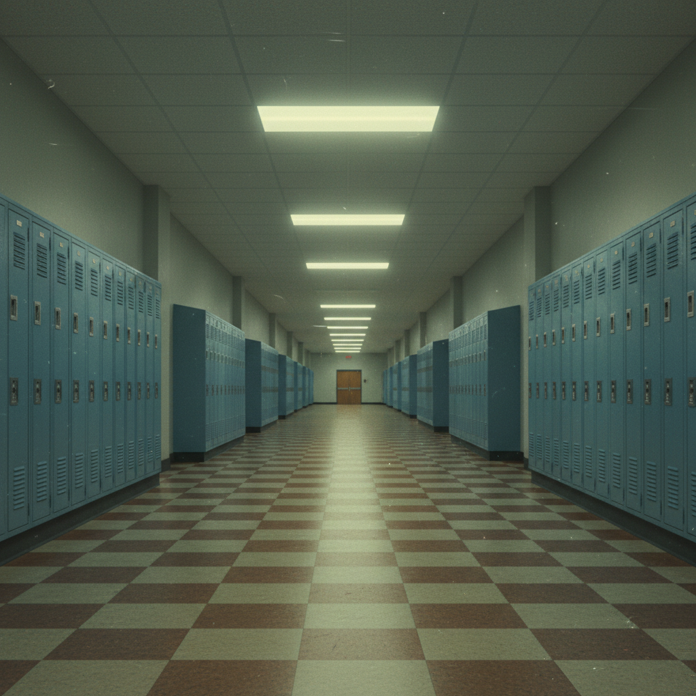

# Liminal Space（阈限空间）

> **别名**：Liminal Aesthetic, Backrooms, 阈限美学  
> **活跃年代**：2019 – 至今（作为互联网美学）；怀念对象跨越所有年代  
> **核心平台**：Reddit (r/LiminalSpace)、YouTube、TikTok、4chan

---

## 一句话定义

Liminal Space 是一种以**空无一人的过渡性空间**为核心的互联网美学——空荡的走廊、深夜的停车场、无人的游泳池、关门后的商场，这些"本应有人却没有人"的场景唤起一种介于怀旧与不安之间的复杂情绪。

---

## 视觉语言

| 元素 | 描述 |
|------|------|
| 空间类型 | 走廊、楼梯间、停车场、泳池、教室、机场、商场 |
| 人物 | **绝对没有人**——空无一人是核心条件 |
| 灯光 | 荧光灯、黄色钨丝灯、不自然的均匀照明 |
| 时间 | 深夜、凌晨、"不该在这里的时间" |
| 质感 | 地毯纹理、瓷砖、塑料椅、老旧墙纸 |
| 色调 | 黄绿色荧光灯色、冷白、褪色暖黄 |
| 状态 | 介于使用中和废弃之间——"刚刚有人离开" |

### 为什么它令人不安？

Liminal Space 的不安感来自几个心理机制：

1. **期望违背**：这些空间"应该"有人（学校、商场、办公室），但没有
2. **时间错位**：你不应该在凌晨3点站在一个空荡的学校走廊里
3. **记忆触发**：这些空间与童年记忆高度相似，但又"不太对"
4. **无限延伸**：重复的走廊、相同的门——暗示空间没有尽头
5. **恐怖谷效应**：空间本身看起来"几乎正常"，但有某种说不清的错误

---

## 历史时间线

| 时期 | 事件 |
|------|------|
| 2019.05 | 4chan /x/ 板上出现"The Backrooms"概念帖——一张黄色墙纸走廊的照片 |
| 2019-2020 | r/LiminalSpace 创建并快速增长 |
| 2020 | COVID-19 封城——现实世界变成了 Liminal Space（空荡的城市、学校、商场） |
| 2020-2021 | Backrooms 成为独立的恐怖创作宇宙（Wiki、视频、游戏） |
| 2021 | Kane Pixels 的 Backrooms Found Footage 系列在 YouTube 爆红 |
| 2022 | r/LiminalSpace 突破 50 万订阅；Liminal Space 进入主流文化讨论 |
| 2022-2023 | A24 宣布改编 Backrooms 电影；品牌开始使用 Liminal 美学 |
| 2023+ | AI 图像生成工具让 Liminal Space 创作门槛大幅降低 |

---

## 文化内核

### 阈限性（Liminality）的学术根源

"Liminal"一词来自拉丁语 *limen*（门槛），由人类学家 Arnold van Gennep（1909）和 Victor Turner（1969）提出：

- 原始含义：仪式中"不再是旧身份、尚未获得新身份"的过渡阶段
- 空间含义：走廊、楼梯、候车室——**不是目的地，而是通往目的地的路径**
- 互联网含义：那些"本应有人经过但此刻空无一人"的空间

### 集体记忆的触发器

Liminal Space 之所以引发强烈情感反应，是因为这些空间是**所有人共享的记忆**：
- 每个人都去过学校走廊
- 每个人都在商场里走过
- 每个人都见过深夜的停车场
- 但没有人会特意"记住"这些空间

当这些被忽视的背景空间突然成为焦点时，它们唤起的是一种**模糊的、无法定位的怀旧**——你知道你见过这个地方，但你不记得是什么时候、在哪里。

### COVID-19 的催化

2020 年的封城让 Liminal Space 从互联网美学变成了**现实体验**：
- 空荡的学校、商场、机场、办公室
- 人们第一次在现实中体验到"本应有人的空间没有人"
- 这种体验与 Liminal Space 美学完美重合
- 疫情后，人们对这种美学的共鸣更加深刻

### The Backrooms：从 meme 到宇宙

The Backrooms 是 Liminal Space 美学最成功的叙事化尝试：

> "如果你不小心从现实中'穿越'出去，你会发现自己在 Backrooms 里——无限延伸的黄色墙纸走廊、嗡嗡作响的荧光灯、潮湿的地毯。这里有 600 平方英里的随机生成空间。上帝保佑你，如果你听到了什么声音，因为它肯定已经听到了你。"

Backrooms 将 Liminal Space 的不安感转化为一个完整的恐怖宇宙，包含：
- 数百个"层级"（Level），每个有不同的环境和规则
- "实体"（Entity）——栖息在各层级中的生物
- 完整的 Wiki 和社区创作体系

---

## 子类型

| 子类型 | 特征 | 典型场景 |
|--------|------|----------|
| **Classic Liminal** | 纯粹的空旷过渡空间 | 走廊、楼梯间、候车室 |
| **Poolcore** | 空无一人的泳池/水上乐园 | 室内泳池、水滑梯、更衣室 |
| **Backrooms** | 无限延伸的人造空间 | 黄色走廊、办公室迷宫 |
| **Dead Mall** | 废弃/空旷的商场 | 与 Mallsoft 重叠 |
| **Schoolcore** | 空荡的学校 | 教室、体育馆、食堂 |
| **After Hours** | 深夜的公共空间 | 24小时便利店、空旷街道 |
| **Dreamcore** | 超现实化的 Liminal Space | 与 Dreamcore/Weirdcore 重叠 |

---

## 与其他风格的关系

| 风格 | 关系 |
|------|------|
| **Dreamcore/Weirdcore** | Liminal Space 的超现实化版本 |
| **Mallsoft** | Dead Mall 是 Liminal Space 的经典子类型 |
| **Vaporwave** | 共享对废弃商业空间的迷恋 |
| **Frutiger Aero** | Liminal Space 中的公共空间常带有 Frutiger Aero 时代的设计 |
| **Gen X Soft Club** | 共享机场、酒店等"非地点"的冷色调美学 |
| **Webcore** | 废弃网站 = 数字版 Liminal Space |

---

## 中国语境：中式阈限空间

中国的 Liminal Space 有独特的本土记忆：

- **90年代小学走廊**：水磨石地面、绿色墙裙、木质公告栏
- **老式百货大楼楼梯间**：大理石台阶、铁栏杆、回声
- **地下通道**：瓷砖墙面、荧光灯、广告灯箱
- **早期商品房走廊**：防盗门、声控灯、水泥楼梯
- **空旷的网吧**：凌晨的蓝色屏幕光、键盘声
- **废弃的少年宫/文化宫**：80年代建筑的空旷大厅

"中式梦核"（Chinese Dreamcore）已经成为一个独立的互联网标签，专门收集这类具有中国特色的阈限空间影像。

---

## 代表性视觉参考

- r/LiminalSpace 高赞帖子
- Kane Pixels "The Backrooms" 系列（YouTube）
- Kenopsia（对空旷场所的怪异感）摄影项目
- COVID-19 期间的空城摄影
- 中式梦核 / 中式阈限空间合集

---

## 延伸阅读

- [Aesthetics Wiki - Liminal Space](https://aesthetics.fandom.com/wiki/Liminal_Space)
- [The Dictionary of Obscure Sorrows - "Kenopsia"](https://www.dictionaryofobscuresorrows.com/post/kenopsia)
- Victor Turner, *The Ritual Process*（1969）——阈限性理论原著
- 本项目相关：[Dreamcore & Weirdcore](dreamcore-weirdcore.md) | [Mallsoft](mallsoft.md) | [Gen X Soft Club](gen-x-soft-club.md)
