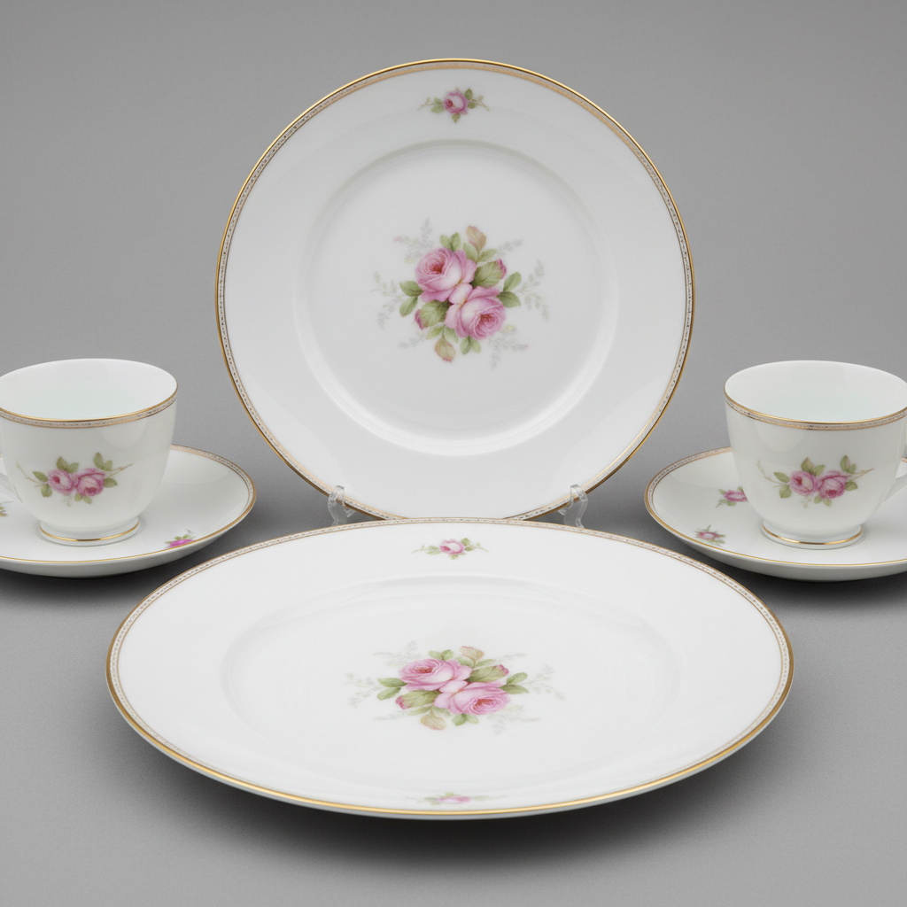

# Limoges Art 利摩日艺术

> "Limoges is France's porcelain heartland — a city blessed with kaolin deposits that made it the center of French hard-paste porcelain production from the late eighteenth century onward, where dozens of factories produced everything from imperial dinner services to hand-painted trinket boxes, establishing a tradition of technical excellence and decorative refinement that continues to define French porcelain today." — Unknown

## 概述

利摩日艺术（Limoges Art）是法国利摩日（Limoges）地区自18世纪末以来发展的硬质瓷器艺术传统。利摩日因其附近发现的高岭土矿藏而成为法国瓷器生产的中心——数十家瓷器工厂在此建立，生产从高档餐具到精美装饰品的各种瓷器。利摩日瓷器以其纯白的胎体、精美的手绘装饰和卓越的品质著称——"Limoges"这个名字本身就成为了法国高品质瓷器的代名词。

利摩日艺术的核心要素包括：1）高岭土——当地丰富的高岭土资源；2）硬质瓷——高品质的硬质瓷器；3）手绘装饰——精美的手绘装饰传统；4）多家工厂——众多瓷器工厂的集群；5）餐具传统——高档餐具的生产中心；6）小盒子——著名的利摩日小盒子；7）品质标准——法国瓷器品质的标杆。

## 核心特征

| 特征 | 描述 |
|------|------|
| 高岭土 | 当地丰富高岭土资源 |
| 硬质瓷 | 高品质硬质瓷器 |
| 手绘装饰 | 精美手绘装饰传统 |
| 多家工厂 | 众多瓷器工厂集群 |
| 餐具传统 | 高档餐具生产中心 |
| 品质标准 | 法国瓷器品质标杆 |

## 视觉特征

- **纯白胎体**：极其纯白的瓷胎
- **精细手绘**：精美的手绘装饰
- **金边装饰**：优雅的金色边饰
- **花卉图案**：精致的花卉图案
- **薄胎透光**：薄胎的半透明效果
- **优雅简洁**：优雅简洁的风格

## 代表作品

| 作品 | 艺术家/文化 | 年代 | 意义 |
|------|-------------|------|------|
| *Haviland餐具* | Haviland | 19世纪 | 美国市场的成功 |
| *Bernardaud瓷器* | Bernardaud | 20世纪 | 当代利摩日代表 |
| *利摩日小盒子* | 各工坊 | 19世纪起 | 收藏品经典 |
| *白宫餐具* | 利摩日 | 各时期 | 美国总统餐具 |
| *当代艺术合作* | 各品牌 | 当代 | 当代艺术瓷器 |

## 历史时间线

| 时期 | 事件 |
|------|------|
| 1768年 | 利摩日附近发现高岭土 |
| 1771年 | 第一家瓷器工厂建立 |
| 19世纪 | 利摩日瓷器工业的繁荣 |
| 20世纪 | 现代化和品牌化 |
| 当代 | 利摩日瓷器的持续发展 |

## 中国语境

利摩日瓷器的诞生直接源于对中国瓷器原料的发现。1768年在利摩日附近的圣伊里耶（Saint-Yrieix）发现高岭土——这种与中国景德镇相同的瓷土原料使法国终于可以生产真正的硬质瓷器。利摩日瓷器在技术上与中国瓷器属于同一类型——都是以高岭土为主要原料的高温硬质瓷。但利摩日发展出了完全不同于中国的装饰风格——以欧洲花卉、风景和几何图案为主。利摩日的Haviland公司在19世纪成功打入美国市场——成为美国上流社会餐桌上的标配，其地位类似于中国瓷器在18世纪欧洲的地位。利摩日瓷器至今仍是法国的骄傲——多个品牌继续生产高品质瓷器，延续着两百多年的传统。

## AI生成概念图

## 与其他风格的关系

- **Sevres** → 塞夫勒
- **Meissen** → 迈森
- **French Porcelain** → 法国瓷器
- **Bone China** → 骨瓷
- **Hard-Paste Porcelain** → 硬质瓷
- **Tableware Design** → 餐具设计

---

*浮光艺志 | Chronicle of Artistry*
