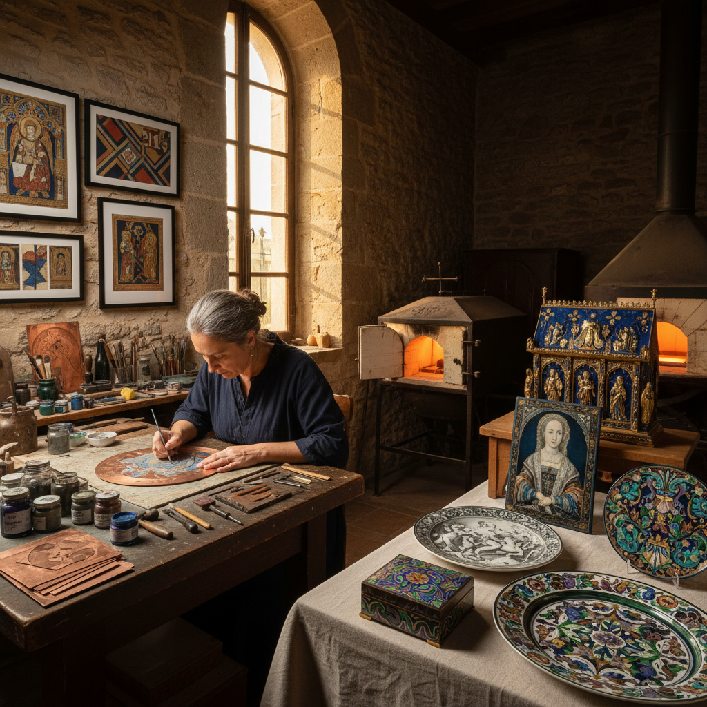

# Limoges Enamel 利摩日珐琅

> "Limoges enamel is where painting meets permanence — for five centuries, the enamelers of this French city have transformed copper and powdered glass into images of such refinement that they rival the finest panel paintings, yet will endure for millennia." — Unknown

## 概述

利摩日珐琅（Limoges Enamel）是指法国利摩日（Limoges）地区生产的珐琅艺术品——利摩日是欧洲珐琅艺术的中心，从12世纪至今已有800多年的珐琅制作传统。利摩日珐琅涵盖了多种珐琅技法：早期以Champlevé（凹雕填珐琅）为主，后来发展出Painted Enamel（画珐琅）和Grisaille（灰色珐琅画）。

利摩日珐琅的历史可分为两个主要时期：中世纪时期（12-14世纪）以Champlevé技法制作宗教器物（圣物箱、十字架、祭坛装饰）为主；文艺复兴时期（15-17世纪）则以Painted Enamel和Grisaille技法制作世俗题材的装饰品（盘子、花瓶、肖像牌）为主。利摩日珐琅是法国最重要的装饰艺术传统之一。

## 核心特征

| 特征 | 描述 |
|------|------|
| 利摩日 | 法国利摩日产地 |
| 多技法 | 涵盖多种珐琅技法 |
| 800年 | 800多年的传统 |
| 宗教 | 早期以宗教题材为主 |
| 精致 | 极其精致的工艺 |
| 法国 | 法国装饰艺术代表 |

## 视觉特征

- **精致**：极其精致的描绘
- **色彩**：丰富的珐琅色彩
- **叙事**：叙事性的图案
- **宗教**：宗教和神话题材
- **金属**：金色金属框架
- **光泽**：珐琅的玻璃光泽

## 代表作品

| 作品 | 艺术家 | 年代 | 意义 |
|------|--------|------|------|
| *Limoges reliquaries* | 匿名 | 12-13世纪 | 利摩日圣物箱 |
| *Léonard Limousin portraits* | Léonard Limousin | 16世纪 | 利穆赞肖像珐琅 |
| *Pierre Reymond dishes* | Pierre Reymond | 16世纪 | 雷蒙德珐琅盘 |
| *Jean Pénicaud triptychs* | Jean Pénicaud | 16世纪 | 佩尼科三联画 |
| *Contemporary Limoges* | Various | 当代 | 当代利摩日珐琅 |

## 历史时间线

| 时期 | 事件 |
|------|------|
| 12世纪 | 利摩日Champlevé珐琅的兴起 |
| 13世纪 | 利摩日成为欧洲珐琅中心 |
| 14世纪 | 百年战争的冲击 |
| 15世纪 | Painted Enamel的出现 |
| 16世纪 | 利摩日珐琅的第二个黄金时代 |
| 当代 | 利摩日珐琅传统的延续 |

## 中国语境

利摩日珐琅在中国的艺术史和博物馆领域有一定的知名度——中国的一些博物馆收藏有利摩日珐琅作品。中国的艺术史教育中介绍利摩日珐琅作为欧洲装饰艺术的重要代表。中国的珐琅工艺研究者对利摩日珐琅有深入的学术研究。一些中国的珐琅艺术家曾赴利摩日学习传统技法。利摩日珐琅与中国的景泰蓝（掐丝珐琅）常被并列为东西方珐琅艺术的两大传统。

## AI生成概念图

## 与其他风格的关系

- **Champlevé** → 凹雕填珐琅
- **Painted Enamel** → 画珐琅
- **Grisaille Enamel** → 灰色珐琅画
- **Cloisonné** → 掐丝珐琅
- **French Decorative Arts** → 法国装饰艺术
- **Religious Art** → 宗教艺术

---

*浮光艺志 | Chronicle of Artistry*
