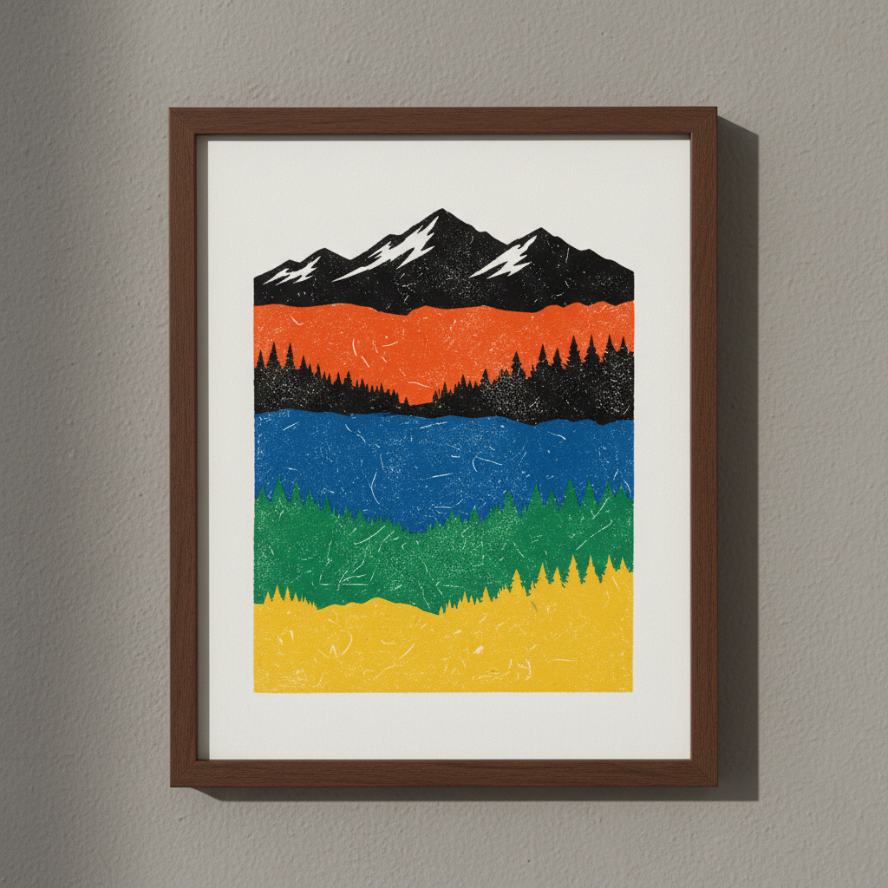

# Linocut Reduction Art 减版木刻艺术

> "Reduction linocut is printmaking as countdown — the artist carves and prints from a single block in stages, cutting away more material after each color layer, destroying what came before to build what comes next. There is no going back, no second edition; each print in the run is a survivor of a process that consumes its own matrix, making the final image a record of irreversible decisions." — Unknown

## 概述

减版木刻艺术（Linocut Reduction Art）是一种使用单块亚麻油毡（linoleum）通过逐步雕刻和印刷来创造多色版画的技法——每印完一种颜色后，在同一块版上继续雕刻去除更多材料，然后印刷下一种颜色。这个过程是不可逆的——版面在每次雕刻后被"减少"，最终被完全消耗，因此也被称为"消失版"或"自杀版"。

减版木刻艺术的实践包括：1）规划色层——从浅到深规划颜色顺序；2）第一次雕刻——雕刻保留最浅色的区域；3）第一次印刷——印刷最浅的颜色；4）逐步雕刻——每次去除更多材料；5）逐步印刷——每次印刷更深的颜色；6）最终版——最后一次雕刻和印刷最深色；7）当代减版——将传统技法与现代设计结合的创作。

## 核心特征

| 特征 | 描述 |
|------|------|
| 单版 | 使用单块版材 |
| 不可逆 | 不可逆的过程 |
| 多色 | 创造多色效果 |
| 逐步 | 逐步雕刻和印刷 |
| 限量 | 版数在开始时确定 |
| 消耗 | 版面最终被消耗 |

## 视觉特征

- **色层**：清晰的色彩层次
- **套准**：精确的多色套准
- **对比**：强烈的色彩对比
- **图形**：图形化的视觉效果
- **纹理**：刀痕创造的纹理
- **大胆**：大胆的色彩组合

## 代表作品

| 作品 | 艺术家/文化 | 年代 | 意义 |
|------|-------------|------|------|
| *Pablo Picasso linocuts* | 西班牙/法国 | 1950-60年代 | 毕加索的减版木刻 |
| *Cyril Power linocuts* | 英国 | 1930年代 | 鲍尔的减版木刻 |
| *Contemporary reduction prints* | 国际 | 当代 | 当代减版版画 |
| *Wildlife reduction linocuts* | 国际 | 当代 | 野生动物减版木刻 |
| *Landscape reduction prints* | 国际 | 当代 | 风景减版版画 |

## 历史时间线

| 时期 | 事件 |
|------|------|
| 1900年代 | 亚麻油毡版画的起源 |
| 1930年代 | 减版技法的早期使用 |
| 1950-60年代 | 毕加索推广减版木刻 |
| 1980年代 | 减版技法的广泛传播 |
| 当代 | 减版木刻的艺术化发展 |

## 中国语境

减版木刻与中国的版画传统有密切的关系。中国的套色木刻传统——从明代的饾版印刷到现代的水印木刻——与减版技法有相似的多色印刷理念。中国的版画教育中，减版木刻作为重要的版画技法——在各大美术院校教授。中国当代的版画艺术家将减版技法与中国传统木刻结合——创造出具有中国特色的减版作品。中国的云南绝版木刻——是中国独特的减版木刻流派，在国际上有重要影响。中国的版画展览中，减版木刻作品——因其独特的视觉效果和技术难度而受到关注。

## AI生成概念图

## 与其他风格的关系

- **Linocut** → 亚麻油毡版画
- **Woodcut** → 木刻版画
- **Screen Printing** → 丝网印刷
- **Relief Printing** → 凸版印刷
- **Printmaking** → 版画
- **Color Theory** → 色彩理论

---

*浮光艺志 | Chronicle of Artistry*
