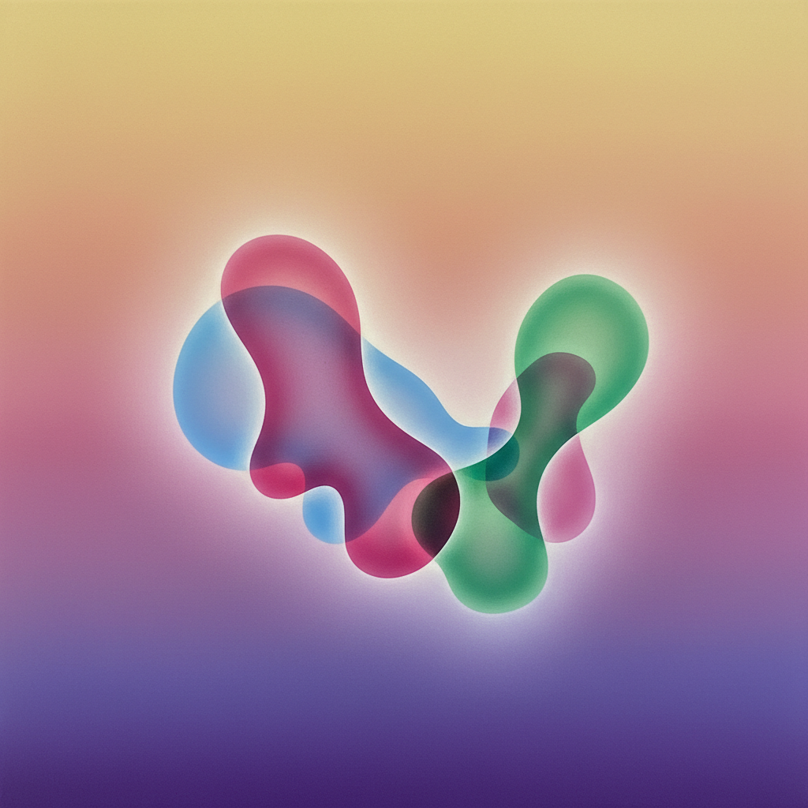

# Lisa Yuskavage 丽莎·尤斯卡维奇

> **时期：** 1962–至今  
> **关键词：** 色彩渐变、情色幻想、光晕效果、女性凝视

## 概述

Lisa Yuskavage 是美国当代画家，以描绘夸张女性形体的梦幻场景闻名。她的作品将文艺复兴的光影技法与漫画式的身体比例结合，创造出介于色情与崇高之间的独特视觉世界——糖果色的光晕中，变形的女性形象既是欲望对象也是权力主体。

## 风格特征

- **色彩渐变**：标志性的彩虹渐变背景，从暖黄过渡到冷紫，如同日落或舞台灯光
- **光晕效果**：人物被柔和的光环包围，边缘模糊如同梦境
- **身体夸张**：胸部、臀部被极度放大，比例介于漫画与古典雕塑之间
- **古典构图**：参考提香、布歇等大师的斜倚姿态和三角构图
- **表面精致**：颜料薄而均匀，表面如同喷枪效果，拒绝笔触的物质性

## 代表作品

- *Triptych*（2011）
- *Bonfire*（2015）
- *Northview*（2019）
- *Bad Habits*（1996）

## 历史意义

Yuskavage 挑战了女性艺术家不应描绘情色化女体的禁忌，她的作品提出了一个核心问题：当凝视者本身是女性时，"物化"的含义是否改变？她的技法精湛程度也为当代绘画设定了新的标准。

## 概念图

