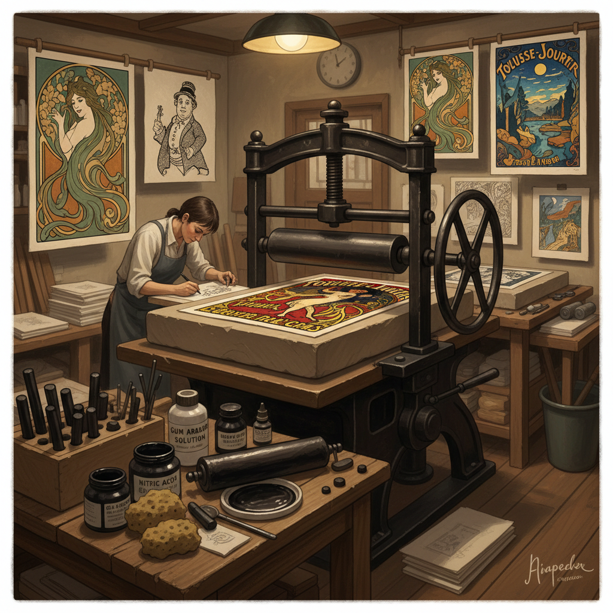

# Lithography Art 石版画艺术

> "Lithography is drawing on stone with the certainty that water and oil will never mix — the artist draws with greasy crayon on limestone, then wets the stone so that ink adheres only to the drawn marks and is repelled by the wet blank areas. It is chemistry as art, physics as aesthetics, a process so elegant that it can reproduce the subtlest pencil stroke or the boldest brushmark with equal fidelity." — Unknown

## 概述

石版画艺术（Lithography Art）是利用油水不相容原理，在石板（或金属板）上进行绘画和印刷的版画艺术形式——艺术家用油性材料在平滑的石灰石板上绘画，经过化学处理后，油墨只附着在绘画区域，空白区域因含水而排斥油墨，从而实现精确的图像转印。石版画是最接近直接绘画的版画技法。

石版画艺术的实践包括：1）传统石版画——在石灰石板上的经典石版画；2）彩色石版画——多版套色的彩色石版画；3）石版画海报——19世纪末的商业石版画海报；4）艺术家石版画——限量版艺术石版画；5）转写石版画——用转写纸制作的石版画；6）金属版石版画——在铝板或锌板上的石版画；7）当代石版画——将石版画与当代艺术理念结合的创作。

## 核心特征

| 特征 | 描述 |
|------|------|
| 平版 | 平面印刷原理 |
| 自由 | 接近直接绘画的自由度 |
| 精细 | 可再现精细的笔触 |
| 层次 | 丰富的灰度层次 |
| 复制 | 可印刷多份 |
| 化学 | 基于化学原理 |

## 视觉特征

- **笔触**：保留原始绘画笔触
- **层次**：丰富的灰度过渡
- **质感**：石板纹理的质感
- **色彩**：套色石版画的色彩层次
- **线条**：精细的线条表现
- **平面**：平面印刷的均匀感

## 代表作品

| 作品 | 艺术家 | 年代 | 意义 |
|------|--------|------|------|
| *Moulin Rouge poster* | Toulouse-Lautrec | 1891 | 石版画海报经典 |
| *The Scream (lithograph)* | Edvard Munch | 1895 | 表现主义石版画 |
| *Lithographs* | Honoré Daumier | 19世纪 | 讽刺石版画 |
| *Stones series* | Jasper Johns | 1960s | 当代石版画 |
| *Job poster* | Alphonse Mucha | 1896 | 新艺术运动石版画 |

## 历史时间线

| 时期 | 事件 |
|------|------|
| 1796 | Alois Senefelder发明石版画 |
| 19世纪 | 石版画的商业化和艺术化 |
| 1890年代 | 石版画海报的黄金时代 |
| 20世纪 | 艺术家石版画的发展 |
| 当代 | 石版画工坊的复兴 |

## 中国语境

石版画艺术在中国的发展始于20世纪初——随着西方印刷技术的传入，石版画被引入中国。中国早期的石版画主要用于商业印刷——如上海的月份牌画就是用石版印刷技术制作的。中国的美术院校在版画专业中设有石版画课程——培养了一批石版画艺术家。中国当代的一些版画家专注于石版画创作——利用石版画独特的质感和表现力进行艺术探索。中国的一些版画工坊保留了传统的石版画设备——为艺术家提供创作空间。中国的石版画在国际版画展览中也有一定的影响力——一些中国艺术家的石版画作品在国际上获得认可。中国的商业印刷虽然已经数字化，但艺术石版画作为一种独特的创作媒介仍然受到重视。

## AI生成概念图

## 与其他风格的关系

- **Printmaking** → 版画艺术
- **Poster Art** → 海报艺术
- **Art Nouveau** → 新艺术运动
- **Drawing** → 素描
- **Etching** → 蚀刻版画
- **Screen Printing** → 丝网印刷

---

*浮光艺志 | Chronicle of Artistry*
