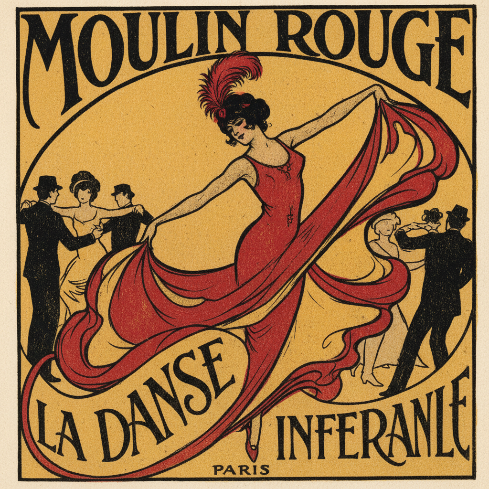

# Lithography 石版画

> "I have invented an entirely new method of printing." — Alois Senefelder, 1798

## 概述

石版画（Lithography，希腊语 lithos"石头" + graphein"书写"）是1796年由德国人阿洛伊斯·塞内费尔德发明的平版印刷技法。与凸版（木刻）和凹版（蚀刻）不同，石版画利用油水不相容的化学原理——在平坦的石灰石板上用油性蜡笔绘画，然后用水和油墨交替处理，使油墨只附着在画过的区域。

石版画是19世纪最重要的商业印刷技术，也是艺术家最自由的版画媒介——它允许像在纸上画画一样自由地创作，同时可以大量复制。从德拉克洛瓦到图卢兹-劳特累克，从穆夏的海报到毕加索的版画，石版画是艺术与大众传播的桥梁。

## 核心特征

| 特征 | 描述 |
|------|------|
| 化学原理 | 利用油水不相容的化学反应 |
| 平版印刷 | 在平坦表面上印刷（非凸版或凹版） |
| 绘画自由 | 可以像在纸上一样自由绘画 |
| 色调丰富 | 可以实现从浅灰到深黑的完整色调 |
| 彩色印刷 | 多版套色可实现全彩印刷 |
| 大量复制 | 一块石板可印数百张 |

## 视觉特征

- **线条**：蜡笔般的柔和线条和笔触
- **色调**：丰富的灰色调渐变
- **质感**：石板纹理产生的独特颗粒感
- **色彩**：彩色石版画的平涂色块（海报）
- **文字**：文字和图像可以自由结合
- **复制**：每张印刷品都是"原作"

## 代表人物

| 画家 | 石版画应用 | 时期 |
|------|-----------|------|
| Eugène Delacroix | 浪漫主义插图 | 19世纪早期 |
| Honoré Daumier | 政治讽刺漫画 | 19世纪中期 |
| Henri de Toulouse-Lautrec | 巴黎夜生活海报 | 19世纪末 |
| Alphonse Mucha | 新艺术运动海报 | 19世纪末 |
| Edvard Munch | *The Scream* 石版画版 | 20世纪初 |
| Pablo Picasso | 大量石版画创作 | 20世纪 |
| M.C. Escher | 数学错视版画 | 20世纪 |

## 与其他技法的关系

- **Etching** → 蚀刻是凹版，石版画是平版
- **Woodcut** → 木刻是凸版，石版画是平版
- **Poster Art** → 石版画是海报艺术的技术基础
- **Offset Printing** → 现代胶印是石版画的工业化发展
- **Screen Printing** → 丝网印刷是另一种平版技术

## 概念图

---

*浮光艺志 | Chronicle of Artistry*
