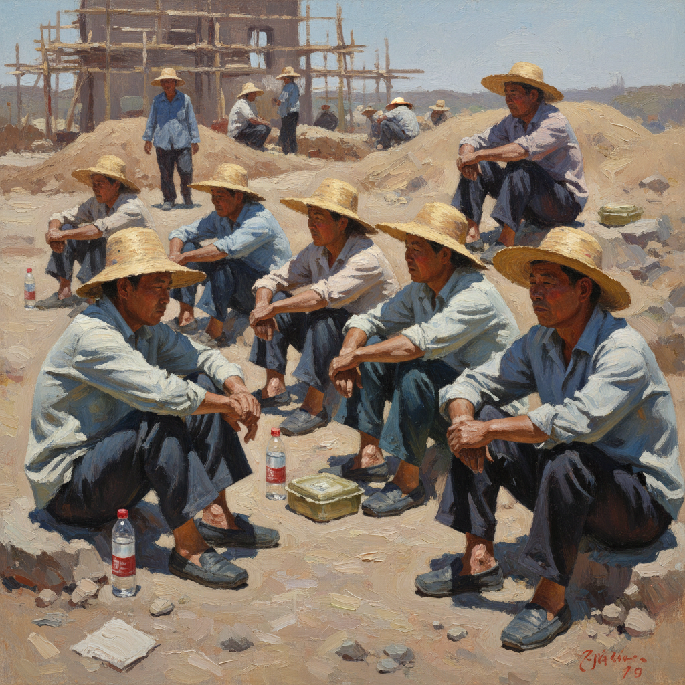

# Liu Xiaodong 刘小东

> **流派**: 新生代绘画 · 中国当代现实主义  
> **时期**: 1963–至今 中国  
> **关键词**: 现场写生、普通人、社会纪实、大尺幅油画

## 概述

刘小东是中国当代最重要的现实主义画家之一。他坚持在现场写生——带着画布和颜料前往三峡移民区、青海藏区、以色列边境或古巴街头，直接面对真实的人和场景作画。他的作品记录了全球化进程中普通人的生存状态，既有纪实摄影的即时性，又有油画传统的物质厚度。

## 视觉特征

- **现场写生**: 在真实场景中直接面对模特作画
- **大尺幅**: 作品常超过3米，具有壁画般的气势
- **松弛笔触**: 快速而准确的写意笔法
- **自然光线**: 户外光线的真实感
- **普通人物**: 工人、农民、移民、士兵等非精英群体

## 代表作品

- 《三峡新移民》(2004)
- 《温床》系列 (2005–06)
- 《出北川》(2010)
- 《半截子》(2015) — 以色列/巴勒斯坦项目

## 历史影响

刘小东证明了写实绘画在当代仍然具有不可替代的力量——当画家亲身在场，用身体和时间面对现实时，绘画可以达到摄影和视频无法企及的深度。他重新定义了"现实主义"在21世纪的意义。

## 相关风格

- [Zhang Xiaogang 张晓刚](zhang-xiaogang.md)
- [Zeng Fanzhi 曾梵志](zeng-fanzhi.md)
- [Contemporary Realism 当代现实主义](contemporary-realism.md)
