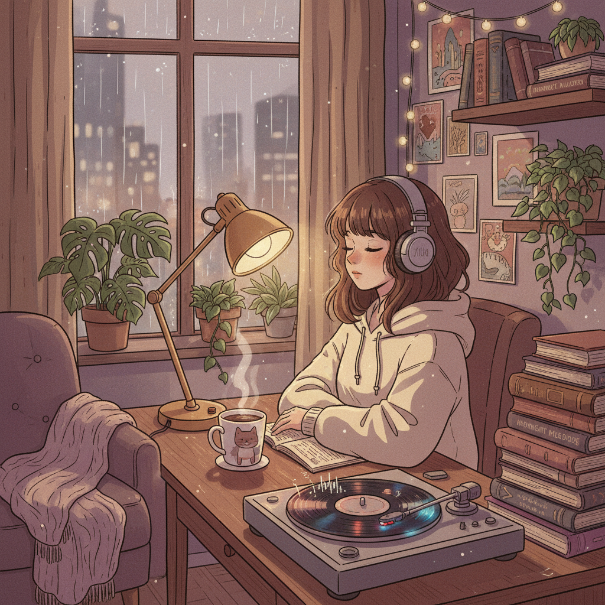

# Lo-fi Hip-Hop 低保真嘻哈



> **"雨声、黑胶噼啪、学习女孩——互联网时代的背景音乐革命。"**

## 概述

| 维度 | 描述 |
|------|------|
| 时期 | 2013–至今 |
| 别名 | Lo-fi Hip-Hop, Lofi, Chillhop, Study Beats |
| 核心色彩 | 暖棕、柔和紫、深蓝、奶油白 |
| 关键元素 | 黑胶噼啪声、Jazz采样、动画循环、雨/咖啡意象 |
| 代表人物 | Nujabes, J Dilla, ChilledCow/Lofi Girl |
| 关联风格 | Jazz Hop, Chillwave, Vaporwave, Ambient |

---

## 历史脉络

| 年份 | 事件 |
|------|------|
| 1996 | J Dilla——Lo-fi 节拍制作的先驱 |
| 2004 | Nujabes "Samurai Champloo" OST——日本+Hip-Hop |
| 2013 | SoundCloud Lo-fi 社区形成 |
| 2017 | ChilledCow "lofi hip hop radio" 24/7直播 |
| 2020 | 疫情期间——Lo-fi 成为全球"学习/工作BGM" |
| 2022 | Lofi Girl 品牌化——2000万+订阅 |

### 核心哲学

Lo-fi Hip-Hop 的精神是**"不完美就是完美——噼啪声和噪点让音乐有了温度"**：
- Lo-fi = 温暖（"完美的录音是冰冷的"）
- 背景 = 功能（"不需要你的全部注意力"）
- 循环 = 冥想（"重复是一种平静"）
- 社区 = 陪伴（"24/7直播 = 永远有人在听"）
- "Lo-fi 不是音乐类型——是一种生活状态"

---

## 视觉语法

### 色彩系统

```
主色：
  暖棕 (#8B7355) — 木头、咖啡
  柔和紫 (#9370DB) — 夜晚、梦幻
  深蓝 (#191970) — 夜空、窗外
  奶油白 (#FFFDD0) — 纸张、温暖

辅色：
  橙色 (#FF8C00) — 灯光、日落
  绿色 (#4A7C59) — 植物
  粉色 (#FFB6C1) — 温柔

规则：
  - 温暖色调
  - 柔和、不刺眼
  - 室内场景为主
  - 动画/插画风格

质感：
  纸张 — 书本、笔记
  木头 — 桌子、书架
  玻璃 — 窗户、雨滴
  蒸汽 — 咖啡、茶
```

### 标志性元素

| 类别 | 元素 |
|------|------|
| 视觉 | 学习女孩动画、窗外雨景、猫、植物 |
| 场景 | 书桌、咖啡馆、深夜房间、窗边 |
| 音乐 | Jazz采样、黑胶噼啪、慢拍、钢琴 |
| 物品 | 咖啡/茶、书本、笔记本、耳机 |
| 平台 | YouTube 24/7直播、Spotify播放列表 |
| 态度 | 平静、专注、温暖、陪伴、不完美 |

---

## 与千禧怀旧的关系

### 互联网时代的"环境音乐"
- Lo-fi = 2020s 的 Brian Eno（环境音乐）
- 24/7 直播 = 新形式的"电台"
- "Lofi Girl 是这一代人的MTV"
- 功能性音乐的复兴

### 日本动画美学的影响
- Nujabes + Samurai Champloo = Lo-fi 的视觉DNA
- 动画循环 = Lo-fi 的标志性视觉
- 日本"日常"美学的影响
- "Lo-fi 的视觉是日本的，音乐是美国的"

---

## 中国语境

- Lo-fi 在中国学生群体中的流行
- B站上的 Lo-fi 直播/视频
- 与中国"治愈系"/"白噪音"的交叉
- 中国 Lo-fi 制作人社区

---

## 设计应用

| 场景 | 应用方式 |
|------|----------|
| 品牌 | 温暖+平静+日常+陪伴+不完美 |
| 空间 | 咖啡馆+书店+学习空间+温暖灯光 |
| 数字 | 动画循环+温暖色调+室内+雨 |
| 产品 | 学习/专注工具+咖啡+文具+耳机 |

---

## 相关风格

← [Chillwave 寒潮](chillwave.md) | [Vaporwave 蒸汽波](vaporwave.md) →

↑ [返回千禧怀旧目录](README.md) | [返回总目录](../README.md)
