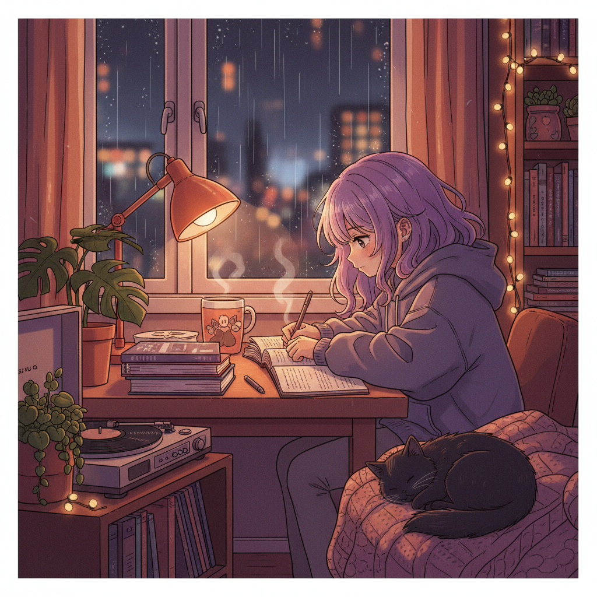

# Lo-Fi 低保真美学



> **"雨天窗边、咖啡杯、无尽的学习播放列表——低保真音乐创造了一整个视觉宇宙。"**

## 概述

| 维度 | 描述 |
|------|------|
| 时期 | 2017–至今 |
| 别名 | Lo-Fi, Lofi Hip Hop, Chillhop, Study Beats |
| 核心色彩 | 暖橙、深紫、柔粉、午夜蓝、暖黄 |
| 关键元素 | 动漫女孩学习、雨天窗户、咖啡杯、猫、唱片机 |
| 代表人物 | Lofi Girl (ChilledCow)、Nujabes、J Dilla |
| 关联风格 | Vaporwave, Animecore, Japandi, Cottagecore |

---

## 历史脉络

### 2017：Lofi Girl 的诞生

| 年份 | 事件 |
|------|------|
| 2015 | ChilledCow 开始 YouTube 直播 lo-fi 音乐 |
| 2017 | "Lofi Girl" 动画形象确立 |
| 2020 | 疫情居家 → lo-fi 学习音乐爆发 |
| 2022 | Lofi Girl 频道达到 1000万+ 订阅 |
| 至今 | Lo-fi 成为一种完整的生活方式美学 |

### 文化基因

| 来源 | 贡献 |
|------|------|
| Nujabes | 日本爵士嘻哈的先驱 |
| 宫崎骏动画 | 温暖的日常生活场景 |
| 日本城市流行 | City Pop 的氛围 |
| 咖啡馆文化 | 安静、专注、舒适 |
| ASMR | 雨声、翻书声、键盘声 |

### 核心哲学

Lo-Fi 美学的精神是**"不完美的舒适"**：
- 低保真 = 不追求完美
- 重复 = 安心、可预测
- 安静 = 远离噪音和焦虑
- 日常 = 学习、喝咖啡、看雨
- 孤独但不寂寞

---

## 视觉语法

### 色彩系统

```
主色：
  暖橙 (#E8A87C) — 台灯光、日落
  深紫 (#4A2C6B) — 夜空、氛围
  柔粉 (#FFB7B2) — 温暖、舒适
  午夜蓝 (#191970) — 深夜学习
  暖黄 (#FFD93D) — 灯光、温暖

辅色：
  深绿 (#2D5016) — 植物
  棕色 (#8B4513) — 木质家具
  灰蓝 (#6B7B8D) — 雨天

质感：
  颗粒感 — 胶片/VHS质感
  柔和 — 没有锐利边缘
  暖光 — 台灯、蜡烛
  雨滴 — 窗户上的水珠
  纸张 — 书本、笔记
```

### 标志性元素

| 类别 | 元素 |
|------|------|
| 人物 | 动漫风格女孩/男孩在学习 |
| 空间 | 书桌、窗边、咖啡馆、阁楼 |
| 物品 | 咖啡杯、书本、台灯、唱片机、耳机 |
| 动物 | 猫（必须有猫） |
| 天气 | 雨天、黄昏、深夜 |
| 植物 | 窗台绿植、悬挂植物 |
| 音乐 | 黑胶唱片、磁带、耳机 |

---

## 与千禧怀旧的关系

### 对"安静生活"的渴望
- 在信息过载的时代，Lo-Fi 提供了一个"安静的角落"
- 它是对社交媒体焦虑的解药
- "只是坐着学习/工作" = 一种奢侈

### 动漫+音乐+怀旧的交叉
- 宫崎骏式的温暖日常
- 90s/2000s 日本动漫的视觉风格
- Nujabes 式的爵士嘻哈
- 三者融合 = Lo-Fi 美学

---

## 中国语境

- "白噪音"/"学习音乐"在B站的流行
- "Lo-fi 学习直播"的中国版本
- 与"日系"/"治愈系"美学的交叉
- 咖啡馆+学习+下雨天 = 中国年轻人的共鸣
- 小红书上的"氛围感书桌"

---

## 设计应用

| 场景 | 应用方式 |
|------|----------|
| 品牌 | 暖色调+颗粒感+手绘插画+舒适氛围 |
| 空间 | 暖光+木质+植物+书本+咖啡 |
| UI | 暖色+圆角+柔和动效+氛围背景 |
| 视频 | 动画循环+雨声+暖色调+颗粒感 |

---

## 相关风格

← [Vaporwave 蒸汽波](vaporwave.md) | [Animecore 动漫核](animecore.md) →

↑ [返回千禧怀旧目录](README.md) | [返回总目录](../README.md)
