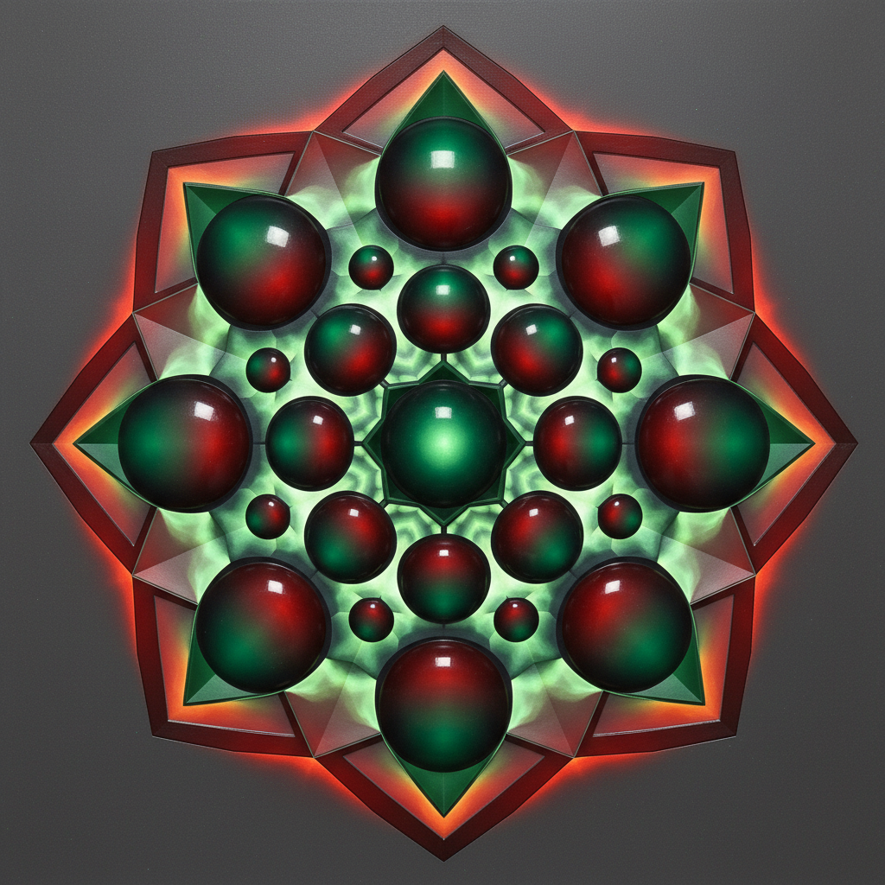

# Loie Hollowell 洛伊·霍洛韦尔

> **时期：** 1983–至今  
> **关键词：** 身体几何、光晕抽象、怀孕与生育、浮雕绘画

## 概述

Loie Hollowell 是美国当代画家，以将女性身体经验（怀孕、哺乳、生育）转化为几何抽象形态闻名。她的作品融合了硬边抽象、光效艺术和浮雕雕塑，用对称的圆形和锥形暗示乳房、腹部和子宫，表面覆盖着发光的渐变色彩。

## 风格特征

- **身体几何化**：将乳房、腹部等身体部位简化为圆形、锥形和椭圆形
- **光晕渐变**：色彩从中心向外辐射渐变，如同发光的宝石或日落
- **浮雕表面**：画布上附加木质或泡沫结构，使形态具有三维突起
- **对称构图**：严格的中轴对称，如同宗教图像或曼陀罗
- **饱和色彩**：以宝石色调为主——翡翠绿、红宝石红、蓝宝石蓝

## 代表作品

- *Linked Lingam*（2018，系列）
- *Standing in Blue*（2019）
- *Postpartum Plumb Line*（2020）
- *Split Orbs in Lime, Lilac, and Tangerine*（2019）

## 历史意义

Hollowell 将女性身体经验从具象再现中解放出来，用抽象语言赋予怀孕和生育以崇高感。她证明了抽象绘画可以同时是深度个人的和普遍共鸣的。

## 概念图

