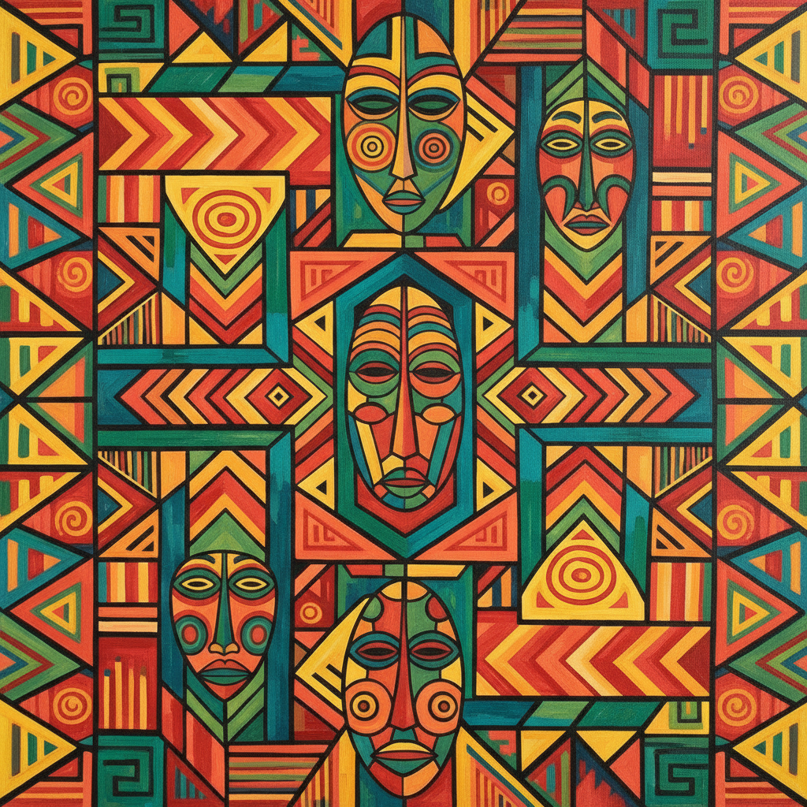

# Loïs Mailou Jones 洛伊丝·梅卢·琼斯

> **时期：** 1905–1998  
> **关键词：** 哈莱姆文艺复兴、非洲图案、加勒比色彩、跨文化融合

## 概述

Loïs Mailou Jones 是美国画家，职业生涯横跨七十余年，风格从哈莱姆文艺复兴时期的具象绘画演变为融合非洲纺织图案、海地色彩和法国现代主义的独特视觉语言。她在Howard大学执教47年，培养了数代非裔美国艺术家，同时自身不断革新，晚年作品比早期更加大胆和实验性。

## 风格特征

- **非洲图案融合**：将西非面具、Kente布纹和阿散蒂符号融入现代构图
- **加勒比色彩**：受海地经历影响，使用热烈的热带色调
- **装饰性平面**：将三维空间压缩为装饰性的图案层次
- **文化拼贴**：在同一画面中并置非洲、加勒比和欧洲视觉元素
- **持续演变**：从学院派写实到表现主义再到抽象装饰，风格不断更新

## 代表作品

- *Les Fétiches*（1938）
- *Mob Victim*（1944）
- *Ubi Girl from Tai Region*（1972）
- *Meunière, Haïti*（1954）

## 历史意义

Jones 是哈莱姆文艺复兴的重要参与者，也是最早系统性地将非洲视觉传统引入美国现代绘画的艺术家之一。她证明了非裔美国艺术家可以同时拥抱非洲遗产和国际现代主义，而不必在两者之间选择。

## 概念图

