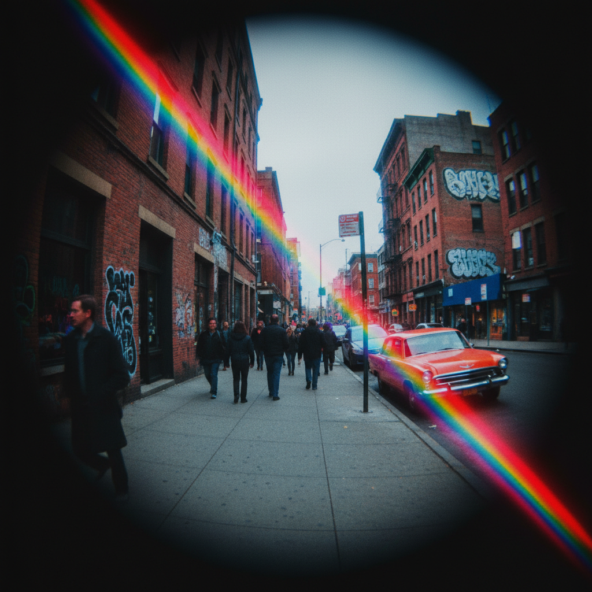

# Lomography LOMO摄影

> **时期：** 1992年–至今  
> **关键词：** 暗角、过饱和、随机美学、多重曝光、反规则摄影

## 概述

Lomography（LOMO摄影）起源于1992年维也纳学生发现苏联LOMO LC-A相机后发起的摄影运动。它倡导"不要思考，只管拍"的随机美学——拥抱光漏、暗角、色偏、模糊等"缺陷"，将技术失误转化为艺术表达。LOMO运动挑战了摄影的技术完美主义，强调直觉、偶然和生活的即时记录。

## 风格特征

- **暗角**：画面四角的自然暗化
- **过饱和**：浓烈鲜艳的色彩
- **光漏**：胶片漏光的彩色条纹
- **多重曝光**：多次曝光的叠加效果
- **随机构图**：从腰部盲拍的意外角度

## 代表应用

- LOMO LC-A相机（运动起源）
- Holga相机（塑料镜头美学）
- Diana相机（梦幻模糊效果）
- Lomography Society International（全球社区）

## 概念图

