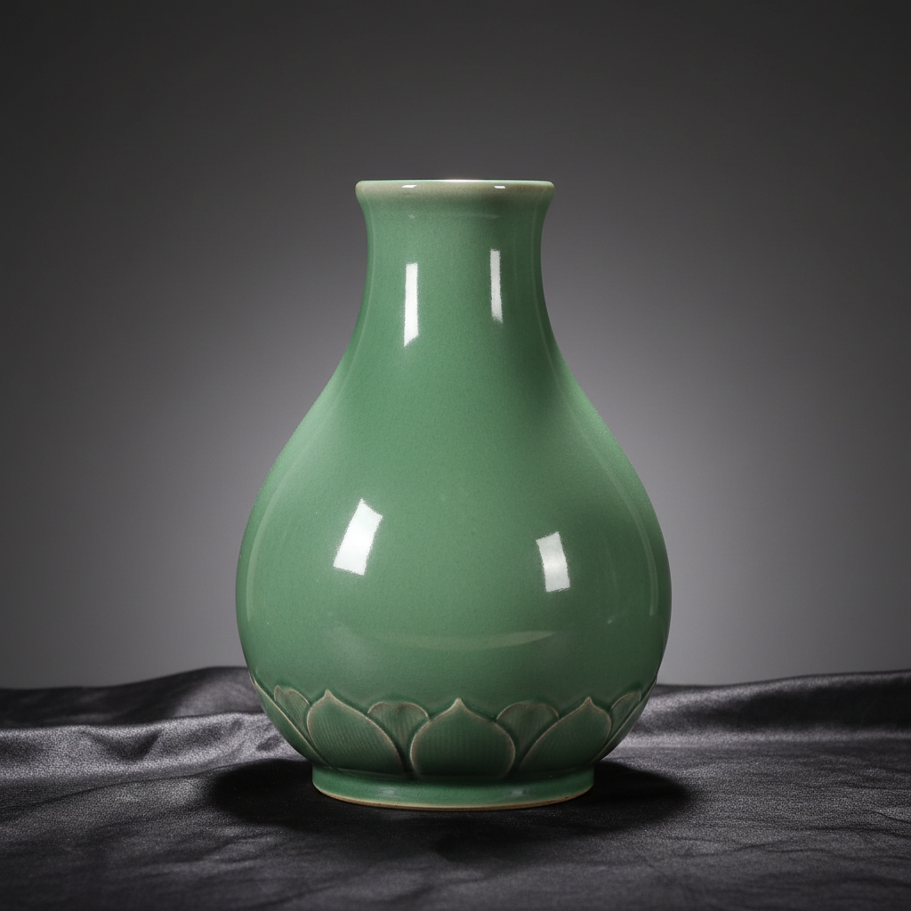

# Longquan Ware Art 龙泉窑艺术

> "Longquan celadon is jade made liquid and poured over clay — a glaze so thick and lustrous it seems to have its own inner light, the color of young bamboo or still water in a mountain pool, built up in multiple layers until the surface achieves a depth that invites the eye to sink into it, the Southern Song ideal of serene beauty given permanent form in the kilns of Zhejiang." — Unknown

## 概述

龙泉窑艺术（Longquan Ware Art）是中国南方最重要的青瓷窑系，位于今浙江省龙泉市，以其如玉般温润的厚釉青瓷著称于世。龙泉窑的青瓷釉色被誉为"千峰翠色"——其最著名的釉色有"梅子青"（如青梅般的翠绿）和"粉青"（如粉嫩的淡青），都是通过多次施釉、高温还原烧成获得的极致青色。

龙泉窑艺术的核心要素包括：1）如玉釉色——如玉般温润的青釉；2）梅子青——翠绿如青梅的釉色；3）粉青——淡雅如粉的青色；4）厚釉多层——多次施釉的厚重感；5）简洁造型——以釉色为主的简洁器形；6）出口贸易——大量出口海外；7）南方青瓷——南方青瓷的巅峰。

## 核心特征

| 特征 | 描述 |
|------|------|
| 如玉釉色 | 如玉般温润青釉 |
| 梅子青 | 翠绿如青梅 |
| 粉青 | 淡雅如粉的青色 |
| 厚釉多层 | 多次施釉厚重 |
| 简洁造型 | 以釉色为主 |
| 出口贸易 | 大量出口海外 |

## 视觉特征

- **梅子青**：翠绿如青梅的色泽
- **粉青色**：淡雅柔和的粉青色
- **如玉质感**：如玉般温润的质感
- **厚釉光泽**：厚釉的柔和光泽
- **简洁器形**：不需装饰的简洁造型
- **莲瓣纹**：经典的莲瓣浮雕装饰

## 代表作品

| 作品 | 艺术家/文化 | 年代 | 意义 |
|------|-------------|------|------|
| *龙泉窑梅子青* | 南宋龙泉 | 南宋 | 梅子青的巅峰 |
| *龙泉窑粉青* | 南宋龙泉 | 南宋 | 粉青的经典 |
| *龙泉窑凤耳瓶* | 南宋龙泉 | 南宋 | 经典器形 |
| *龙泉窑莲瓣碗* | 龙泉窑 | 各时期 | 莲瓣装饰 |
| *出口龙泉青瓷* | 元明龙泉 | 元明 | 海外贸易瓷 |

## 历史时间线

| 时期 | 事件 |
|------|------|
| 北宋 | 龙泉窑的兴起 |
| 南宋 | 龙泉窑的鼎盛（梅子青粉青） |
| 元代 | 龙泉窑的大规模出口 |
| 明代 | 龙泉窑的延续 |
| 当代 | 龙泉青瓷的复兴（非遗） |

## 中国语境

龙泉窑是中国青瓷艺术的最高成就之一——其梅子青和粉青釉色被认为是中国陶瓷釉色中最接近玉的质感。中国文化崇尚玉——"君子比德于玉"，龙泉青瓷以其如玉般的质感满足了中国人对玉的审美追求。龙泉窑在南宋时期达到巅峰——南宋朝廷南迁后，龙泉窑承担了大量宫廷用瓷的烧造任务。龙泉青瓷是中国古代最重要的出口商品之一——通过海上丝绸之路远销东南亚、中东、非洲和欧洲，在世界各地的考古遗址中都有发现。龙泉青瓷在法语中被称为"Celadon"——这个词后来成为所有青瓷的通称。2009年，龙泉青瓷传统烧制技艺被列入联合国人类非物质文化遗产代表作名录。

## AI生成概念图

## 与其他风格的关系

- **Celadon** → 青瓷
- **Song Dynasty Kilns** → 宋代名窑
- **Jade Aesthetics** → 玉的美学
- **Yaozhou Ware** → 耀州窑
- **Maritime Trade** → 海上贸易
- **Monochrome Glaze** → 单色釉

---

*浮光艺志 | Chronicle of Artistry*
