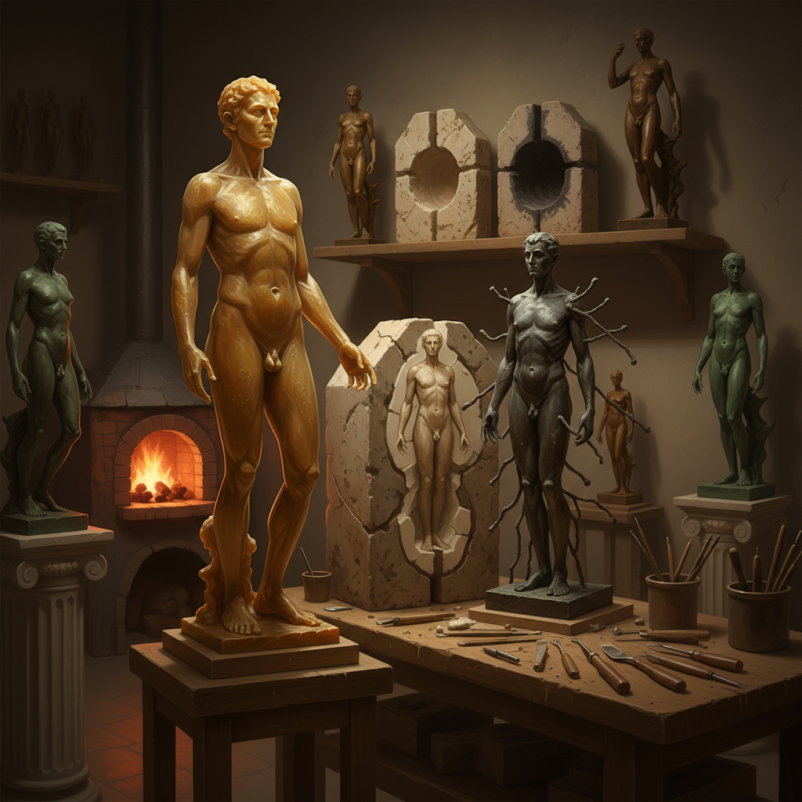

# Lost Wax Art 失蜡铸造艺术

> "Lost wax casting is an act of transformation through sacrifice — a wax original must be destroyed to create its metal twin. The wax is shaped with infinite care, every detail perfected by hand, and then it is encased in ceramic, heated until it melts away, leaving only its ghost in the form of a hollow mold. Into this void, molten metal flows, filling every crevice, capturing every fingerprint the artist left in the wax. The wax is lost forever, but its memory lives on in bronze." — Unknown

## 概述

失蜡铸造艺术（Lost Wax Art，又称脱蜡铸造、熔模铸造）是一种古老而精密的金属铸造技术——先用蜡制作原型，再用耐火材料包裹形成模壳，加热使蜡熔化流出（"失蜡"），最后将熔融金属浇入空腔。这种技术能够复制极其精细的细节。

失蜡铸造艺术的实践包括：1）青铜雕塑——用失蜡法铸造精细的青铜雕塑；2）首饰铸造——用失蜡法制作精密的金银首饰；3）蜡雕——以蜡为材料的精细雕刻（铸造前的原型）；4）空心铸造——用失蜡法创造空心的大型雕塑；5）多件铸造——用橡胶模具复制蜡型进行批量铸造；6）直接蜡塑——直接用蜡塑造形态然后铸造。

## 核心特征

| 特征 | 描述 |
|------|------|
| 精密 | 极高的精密度 |
| 牺牲 | 蜡型的牺牲 |
| 转化 | 从蜡到金属 |
| 细节 | 捕捉极细的细节 |
| 古老 | 五千年历史 |
| 唯一 | 每件都是唯一 |

## 视觉特征

- **精细**：极精细的表面细节
- **光滑**：比砂铸更光滑的表面
- **复杂**：可实现复杂的形态
- **金属**：青铜、金、银的光泽
- **有机**：有机的流动形态
- **指纹**：保留艺术家的手工痕迹

## 代表作品

| 作品 | 艺术家 | 年代 | 意义 |
|------|--------|------|------|
| *Benin Bronzes* | 贝宁王国 | 13-19世纪 | 非洲失蜡铸造 |
| *Perseus with Medusa* | Cellini | 1554 | 文艺复兴失蜡杰作 |
| *Bronze sculptures* | Rodin | 19世纪 | 现代失蜡铸造 |
| *Contemporary bronzes* | Various | 当代 | 当代失蜡雕塑 |
| *Lost wax jewelry* | Various | 古代至今 | 失蜡首饰 |

## 历史时间线

| 时期 | 事件 |
|------|------|
| 公元前4000年 | 最早的失蜡铸造 |
| 商代 | 中国失蜡法的使用 |
| 文艺复兴 | 欧洲失蜡铸造的高峰 |
| 19世纪 | 工业化失蜡铸造 |
| 当代 | 3D打印蜡型的应用 |

## 中国语境

失蜡铸造艺术在中国有悠久的历史。中国的失蜡法可追溯到春秋战国时期——曾侯乙墓出土的青铜尊盘（公元前433年）是中国失蜡铸造的杰出代表，其镂空透雕的复杂程度令人叹为观止。中国传统的佛像铸造大量使用失蜡法——从唐代到清代，精美的鎏金铜佛像都是失蜡铸造的产物。中国云南的"斑铜"工艺也使用失蜡法。中国当代的一些艺术家在探索失蜡铸造：将中国传统佛像铸造的精湛技艺与当代雕塑结合、用3D打印技术制作蜡型然后进行传统铸造、以及将中国古代失蜡法的"镂空"美学与当代首饰设计对话。

## AI生成概念图

## 与其他风格的关系

- **Bronze Sculpture** → 青铜雕塑
- **Sand Casting Art** → 砂型铸造艺术
- **Jewelry Art** → 首饰艺术
- **Wax Art** → 蜡艺术
- **Metal Art** → 金属艺术
- **Foundry Art** → 铸造艺术

---

*浮光艺志 | Chronicle of Artistry*
