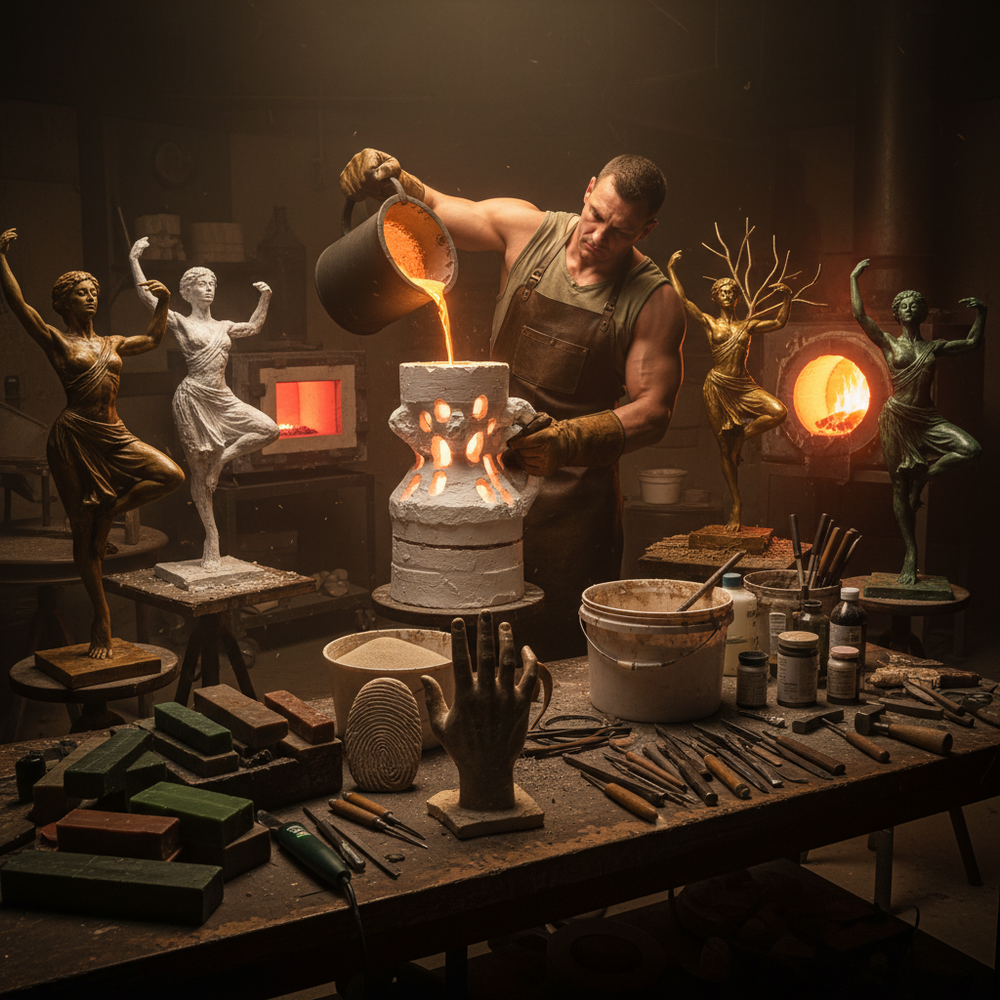

# Lost-Wax Casting Art 失蜡铸造艺术

> "Lost-wax casting is sculpture's great paradox — you must destroy the original to create the final work. The artist sculpts in wax with infinite freedom, knowing that this delicate model will be encased in ceramic, burned away to nothing, and replaced by molten metal that fills the void left behind. What emerges from the broken mold is a metal twin of the vanished wax, capturing every fingerprint, every texture, every subtle curve that the artist's hands once shaped." — Unknown

## 概述

失蜡铸造艺术（Lost-Wax Casting Art）是一种古老的金属铸造技法——先用蜡制作模型，然后用耐火材料包裹蜡模形成铸型，加热使蜡熔化流出（"失蜡"），再将熔融金属浇入蜡模留下的空腔中，冷却后打碎铸型取出金属铸件。失蜡法可以铸造出极其复杂和精细的金属制品，是青铜雕塑和精密珠宝铸造的核心技术。

失蜡铸造艺术的实践包括：1）实心铸造——小型实心金属件的铸造；2）空心铸造——大型空心雕塑的铸造；3）珠宝铸造——精密的首饰铸造；4）艺术铸造——雕塑和艺术品的铸造；5）工业精密铸造——航空航天等领域的精密铸件；6）当代失蜡——将传统技法与现代技术结合的创作。

## 核心特征

| 特征 | 描述 |
|------|------|
| 精密 | 极其精密的细节 |
| 自由 | 造型自由度极高 |
| 一次性 | 每个铸型只用一次 |
| 古老 | 6000年历史的技法 |
| 通用 | 适用于各种金属 |
| 复杂 | 可铸造复杂形态 |

## 视觉特征

- **精细**：极其精细的表面细节
- **复杂**：复杂的三维形态
- **金属**：各种金属的质感
- **有机**：自由的有机造型
- **纹理**：蜡模的手工纹理
- **光泽**：抛光后的金属光泽

## 代表作品

| 作品 | 艺术家/文化 | 年代 | 意义 |
|------|-------------|------|------|
| *Benin Bronzes* | 贝宁王国 | 13-19世纪 | 非洲失蜡铸造巅峰 |
| *Chola bronzes* | 印度朱罗 | 9-13世纪 | 印度青铜神像 |
| *Perseus by Cellini* | Cellini | 1554 | 文艺复兴铸造杰作 |
| *三星堆青铜器* | 古蜀 | 公元前12世纪 | 中国失蜡铸造 |
| *Rodin sculptures* | Rodin | 19世纪 | 现代雕塑铸造 |

## 历史时间线

| 时期 | 事件 |
|------|------|
| 公元前4000年 | 最早的失蜡铸造（美索不达米亚） |
| 青铜时代 | 各文明的失蜡铸造发展 |
| 古典时期 | 希腊罗马的青铜雕塑 |
| 文艺复兴 | 欧洲失蜡铸造的复兴 |
| 当代 | 失蜡法与现代技术的结合 |

## 中国语境

失蜡铸造艺术在中国有极其悠久和辉煌的传统。中国的失蜡铸造（古称"蜡模法"）至少可追溯到商周时期——三星堆出土的精美青铜器中有大量使用失蜡法铸造的作品。中国春秋战国时期的曾侯乙编钟等复杂青铜器使用了失蜡法——其精密程度令人叹为观止。中国的佛教造像传统大量使用失蜡铸造——从唐代到清代的铜佛像多采用此法。中国云南的"斑铜"工艺是失蜡铸造的独特应用——利用特殊铜合金的结晶效果创造斑斓的表面。中国当代的雕塑家和珠宝设计师继续使用失蜡铸造——将传统技法与现代艺术理念结合。中国的精密铸造工业在航空航天领域处于世界前列——失蜡法（投资铸造）是其核心技术。

## AI生成概念图

## 与其他风格的关系

- **Bronze Sculpture** → 青铜雕塑
- **Jewelry Art** → 珠宝艺术
- **Sand Casting** → 砂型铸造
- **Metalsmithing** → 金属锻造
- **Wax Art** → 蜡艺术
- **Sculpture** → 雕塑

---

*浮光艺志 | Chronicle of Artistry*
