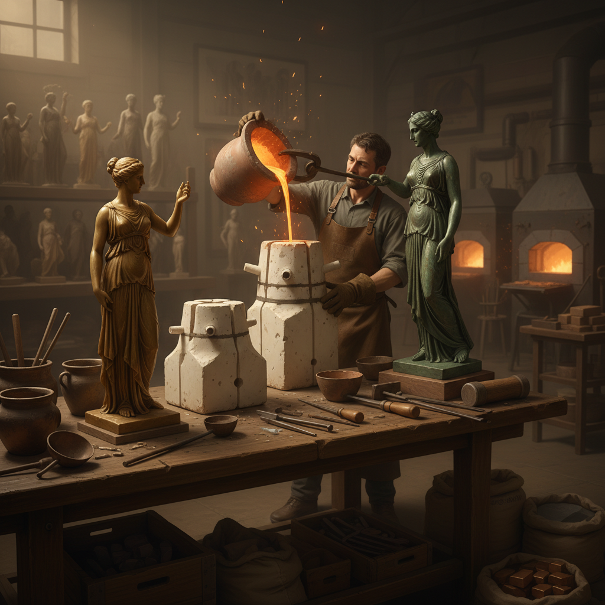

# Lost-Wax Casting 失蜡铸造

> "Lost-wax casting is the art of sacrifice — the wax must die so the metal can live." — Unknown

## 概述

失蜡铸造（Lost-Wax Casting / Cire Perdue）是人类最古老、最精密的金属铸造技法之一。艺术家先用蜡制作精细的模型，然后用耐火材料包裹形成铸型，加热使蜡熔化流出（"失蜡"），再将熔融金属注入蜡留下的空腔。冷却后打碎外壳，得到与蜡模完全一致的金属铸件。从5000年前的美索不达米亚到贝宁青铜头像，从中国商周青铜器到罗丹的雕塑，失蜡铸造使人类能够创造出任何形态的金属艺术品。

失蜡铸造的哲学在于：牺牲与重生——蜡的消失换来金属的永恒，每一件铸品都是一次不可逆的转化。

## 核心特征

| 特征 | 描述 |
|------|------|
| 蜡模 | 先制作蜡质模型 |
| 失蜡 | 蜡被熔化流出 |
| 铸造 | 金属注入空腔 |
| 精密 | 可复制极细的细节 |
| 一次性 | 每个铸型只能用一次 |
| 万能 | 可铸造任何形态 |

## 视觉特征

- **细节**：极其精细的表面细节
- **复杂**：可实现复杂的三维形态
- **金属**：青铜、黄金等金属质感
- **光滑**：铸造后的光滑表面
- **有机**：有机的自由形态
- **厚薄**：可控制壁厚

## 代表作品

| 作品 | 艺术家 | 年代 | 意义 |
|------|--------|------|------|
| *后母戊鼎* | 匿名 | 商代 | 中国青铜器巅峰 |
| *Benin Bronzes* | 匿名 | 13-16世纪 | 贝宁青铜艺术 |
| *Perseus* | Benvenuto Cellini | 1545-54 | 文艺复兴铸造杰作 |
| *The Thinker* | Auguste Rodin | 1904 | 现代雕塑经典 |
| *Dancing Girl of Mohenjo-daro* | 匿名 | 公元前2500年 | 印度河文明 |

## 历史时间线

| 时期 | 事件 |
|------|------|
| 公元前4000年 | 美索不达米亚的早期失蜡铸造 |
| 商周 | 中国青铜器的辉煌 |
| 古希腊 | 希腊青铜雕塑 |
| 中世纪 | 教堂铜门和钟 |
| 文艺复兴 | Cellini等大师的铸造 |
| 19-20世纪 | 现代雕塑的铸造 |
| 当代 | 工业和艺术的双重应用 |

## 中国语境

中国是失蜡铸造的重要发源地之一——商周青铜器代表了古代世界最高水平的金属铸造艺术。虽然商周青铜器主要使用范铸法（陶范），但失蜡法在春秋战国时期已经成熟，曾侯乙墓出土的铜尊盘是中国失蜡铸造的巅峰之作。云南的斑铜、西藏的佛像铸造至今仍使用失蜡法。当代中国的雕塑铸造工坊继续传承这一古老技艺。

## AI生成概念图

## 与其他风格的关系

- **Bronze Sculpture** → 青铜雕塑的主要技法
- **Jewelry** → 珠宝铸造
- **Metalwork** → 金属工艺的核心技法
- **Relief Sculpture** → 浮雕的铸造
- **Industrial Design** → 工业铸造
- **3D Printing** → 当代的数字失蜡铸造

---

*浮光艺志 | Chronicle of Artistry*
