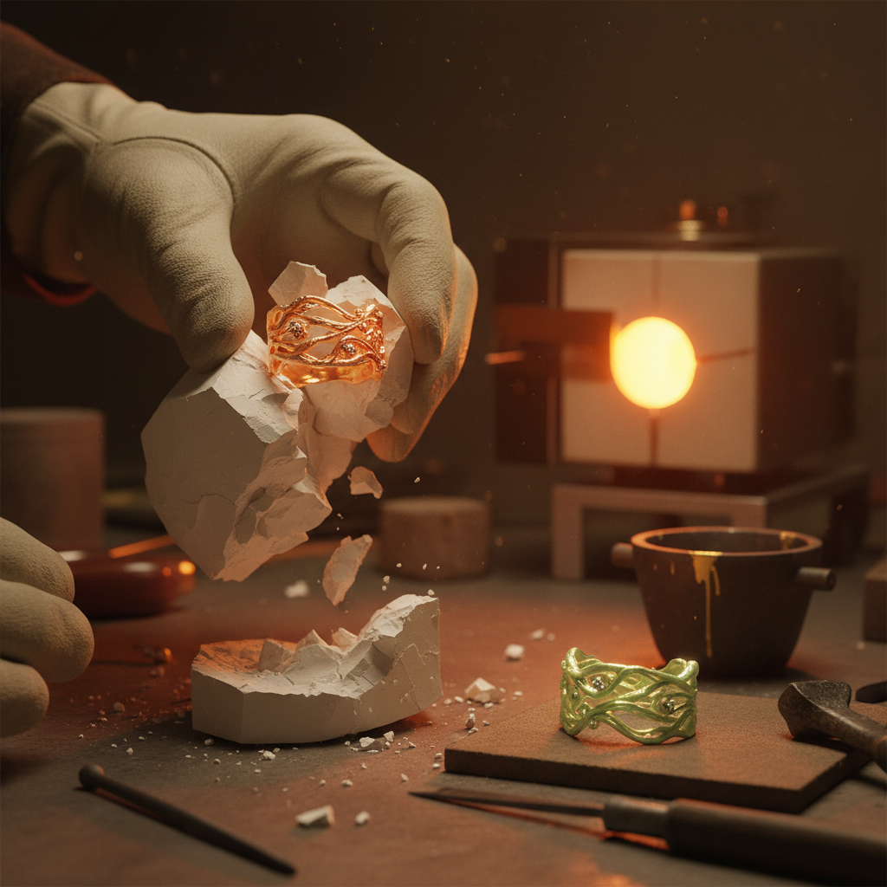

# Lost-Wax Jewelry Art 失蜡铸造珠宝艺术

> "Lost-wax casting is alchemy made tangible — a wax model is encased in plaster, heated until the wax melts away leaving a perfect negative void, and then molten metal is poured into that absence to fill every curve, every texture, every fingerprint the artist left in the original. The wax is sacrificed so the metal may live. It is one of humanity's oldest and most magical transformations of material into art." — Unknown

## 概述

失蜡铸造珠宝艺术（Lost-Wax Jewelry Art）是使用失蜡法（也称脱蜡法、熔模铸造）制作珠宝和小型金属雕塑的传统工艺——艺术家先用蜡制作模型，然后将蜡模包裹在耐火材料中，加热使蜡熔化流出，再将熔融金属注入留下的空腔中。这是人类最古老的精密铸造技术之一，可追溯到6000年前的美索不达米亚。

失蜡铸造珠宝艺术的实践包括：1）蜡模制作——用蜡雕刻或塑造原始模型；2）浇道系统——设计金属流入的通道；3）包模——用石膏或陶瓷包裹蜡模；4）脱蜡——加热使蜡熔化流出；5）浇铸——将熔融金属注入模腔；6）脱模——破碎外壳取出铸件；7）精修——打磨、抛光和镶嵌宝石。

## 核心特征

| 特征 | 描述 |
|------|------|
| 古老 | 6000年的历史 |
| 精密 | 极高的细节还原 |
| 牺牲 | 蜡模被牺牲 |
| 唯一 | 每件都是唯一的 |
| 复杂 | 可铸造复杂形状 |
| 通用 | 适用于各种金属 |

## 视觉特征

- **有机**：有机流畅的形态
- **细节**：极其精细的细节
- **质感**：丰富的表面质感
- **立体**：完全立体的造型
- **光泽**：金属的光泽和色彩
- **独特**：每件作品的独特性

## 代表作品

| 作品 | 艺术家/文化 | 年代 | 意义 |
|------|-------------|------|------|
| *Benin Bronzes* | 贝宁王国 | 13-19世纪 | 贝宁青铜器 |
| *Colombian gold* | 穆伊斯卡 | 前哥伦布 | 哥伦比亚金器 |
| *Cellini Salt Cellar* | Cellini | 1543年 | 切利尼盐罐 |
| *Art Nouveau jewelry* | Lalique | 1900年代 | 新艺术珠宝 |
| *Contemporary cast jewelry* | 当代 | 当代 | 当代铸造珠宝 |

## 历史时间线

| 时期 | 事件 |
|------|------|
| 公元前4000年 | 美索不达米亚最早的失蜡铸造 |
| 古代 | 埃及、希腊、罗马的失蜡铸造 |
| 中世纪 | 非洲贝宁青铜器的巅峰 |
| 文艺复兴 | 欧洲失蜡铸造的艺术化 |
| 当代 | 现代珠宝设计中的广泛应用 |

## 中国语境

失蜡铸造在中国有极其悠久的传统。中国的失蜡铸造可追溯到春秋战国时期——曾侯乙墓出土的青铜器就使用了失蜡法。中国古代的青铜器铸造是世界上最精湛的——商周青铜器代表了古代铸造技术的最高水平。中国传统的金银器制作中广泛使用失蜡法——从唐代金银器到明清宫廷首饰。中国当代的珠宝设计中，失蜡铸造仍然是最重要的制作技法之一——从手工蜡雕到3D打印蜡模。中国的珠宝教育中，失蜡铸造是核心课程——培养学生的立体造型能力。中国的非物质文化遗产中，多项传统金属铸造技艺使用失蜡法——如云南的斑铜工艺。

## AI生成概念图

## 与其他风格的关系

- **Bronze Casting** → 青铜铸造
- **Metalwork** → 金属工艺
- **Jewelry Design** → 珠宝设计
- **Sculpture** → 雕塑艺术
- **Goldsmithing** → 金匠工艺
- **3D Printing** → 3D打印

---

*浮光艺志 | Chronicle of Artistry*
