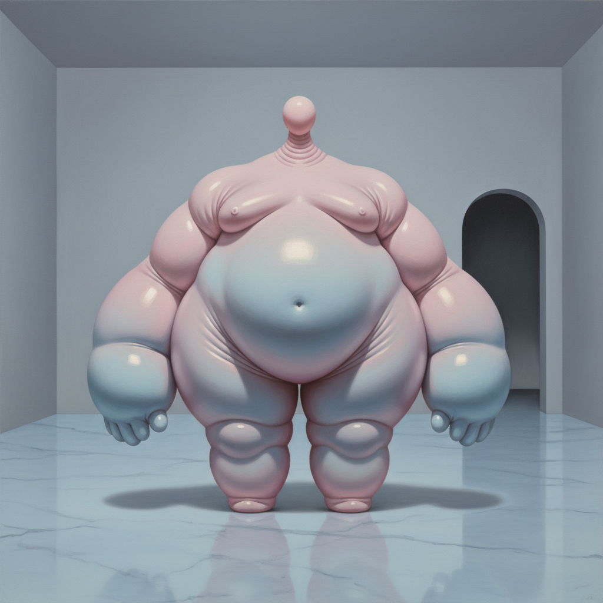

# Louise Bonnet 路易丝·博内

> **时期：** 1970–至今  
> **关键词：** 身体膨胀、超现实具象、粉彩怪诞、瑞士裔美国

## 概述

Louise Bonnet 是瑞士裔美国当代画家，以描绘膨胀变形的人体形象闻名。她的作品将身体夸张到荒诞的程度——巨大的臀部、肿胀的四肢、微小的头部——用柔和的粉彩色调包裹令人不安的身体焦虑，创造出介于幽默与恐惧之间的超现实世界。

## 风格特征

- **身体膨胀**：人物的某些部位被极度放大，比例完全脱离现实
- **粉彩色调**：以柔和的粉色、淡蓝、奶油白为主，与怪诞内容形成反差
- **光滑表面**：颜料均匀平滑，如同充气玩具的表面质感
- **简洁构图**：通常单一人物置于空旷空间中，强调孤立感
- **身体液体**：汗水、泪水等体液的描绘增加了生理不适感

## 代表作品

- *Pisser*（2020）
- *The Crawler*（2019）
- *Interior with Seated Figure*（2019）
- *Celeste Bartos Mural*（2022，纽约公共图书馆）

## 历史意义

Bonnet 将身体焦虑和羞耻感转化为视觉语言，她的作品在"身体积极"话语泛滥的时代提供了一种更诚实的身体经验——不是庆祝，而是承认身体带来的不适和荒诞。

## 概念图

