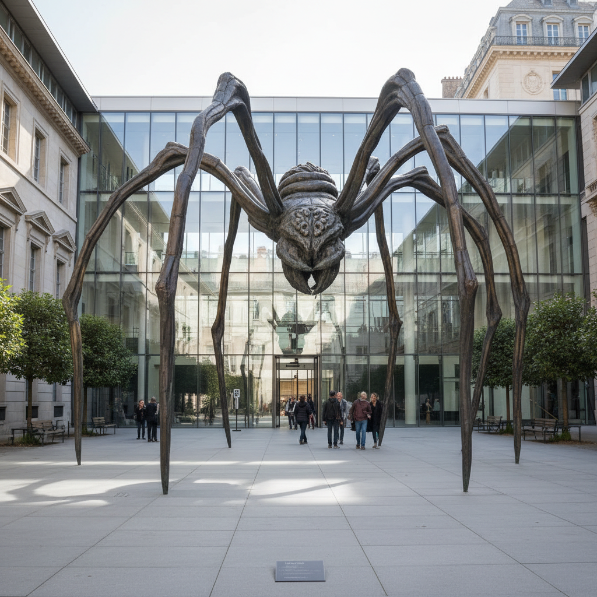

# Louise Bourgeois 路易丝·布尔乔亚

> **流派**: 超现实主义 · 女性主义艺术 · 当代雕塑  
> **时期**: 1911–2010 法国/美国  
> **关键词**: 巨型蜘蛛、心理雕塑、童年创伤、身体隐喻

## 概述

路易丝·布尔乔亚是20世纪最重要的女性艺术家之一。她的作品深深植根于童年记忆和心理创伤，用雕塑、装置和织物创造出充满情感力量的形象。她最著名的巨型蜘蛛雕塑《妈妈》已成为当代艺术的标志性图像。

## 视觉特征

- **巨型蜘蛛**: 高达9米的青铜蜘蛛，象征母亲的保护与威胁
- **有机形态**: 球体、螺旋、细胞等生物形态
- **织物与缝合**: 用旧衣物和布料创作的软雕塑
- **牢笼结构**: 铁笼中放置记忆物品的"细胞"装置
- **身体碎片**: 孤立的手、眼睛、躯干等身体部位

## 代表作品

- 《妈妈》(1999)
- 《细胞》系列 (1989–2008)
- 《拱形的歇斯底里》(1993)
- 《我做，我撤销，我重做》(1999–2000)

## 历史影响

布尔乔亚证明了个人记忆和心理体验可以成为最有力的艺术素材。她为后来的女性主义艺术和自传性创作开辟了道路。

## 相关风格

- [Surrealism 超现实主义](surrealism.md)
- [Yayoi Kusama 草间弥生](yayoi-kusama.md)
- [Marina Abramović 玛丽娜·阿布拉莫维奇](marina-abramovic.md)
