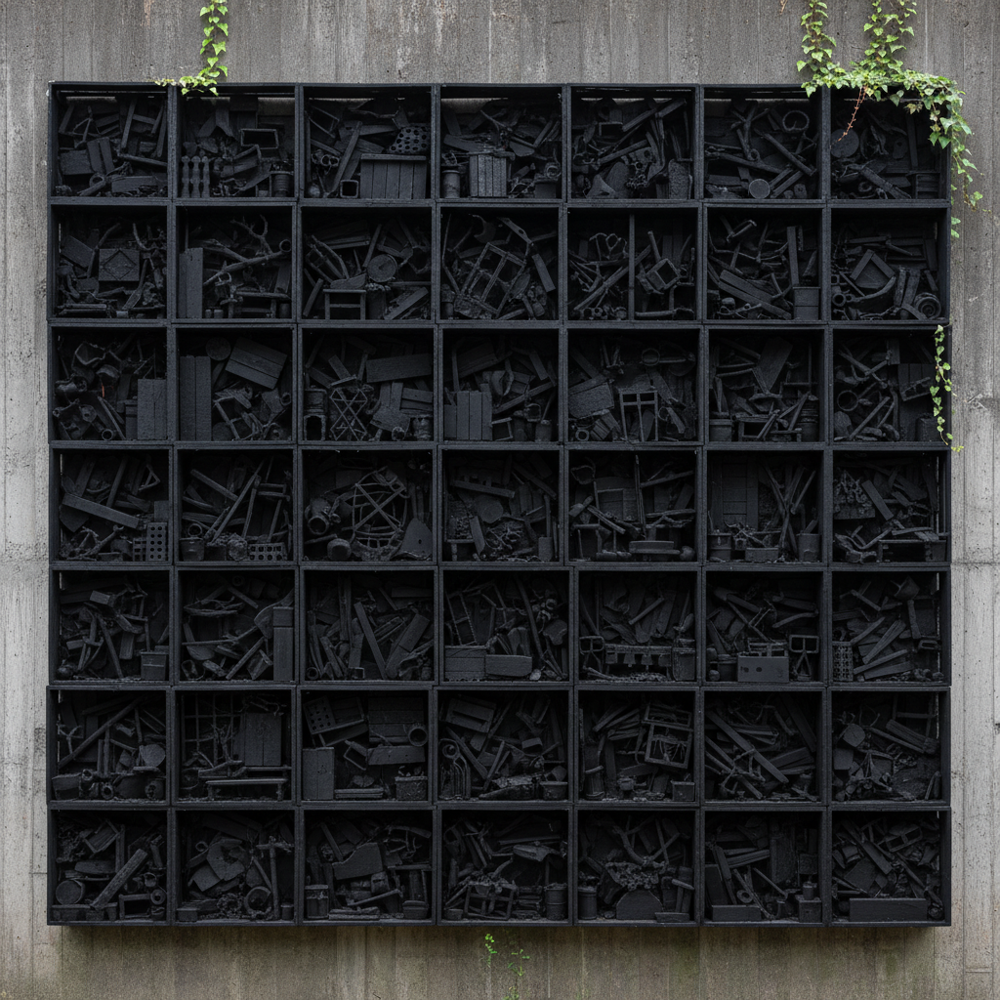

# Louise Nevelson 路易丝·内维尔森

> **时期：** 1899–1988  
> **关键词：** 黑色集合墙、木质装配雕塑、环境雕塑、单色统一

## 概述

Louise Nevelson 是美国雕塑家，以大型木质集合墙雕塑闻名。她将回收的木质碎片——椅腿、栏杆、门框、木箱——组装在格子状的木箱中，再统一喷涂为哑光黑色（后期也用白色和金色），创造出如同神秘教堂祭坛般的环境性装置。

## 风格特征

- **单色统一**：所有元素被统一的黑色（或白/金）消除个体差异，成为整体
- **格子结构**：木箱作为基本单元，如同建筑的窗格或图书馆的书架
- **回收材料**：城市废弃木材被赋予新的精神生命
- **环境规模**：作品常占据整面墙壁，创造沉浸式的空间体验
- **阴影戏剧**：深色表面和复杂的内部结构创造出丰富的阴影层次

## 代表作品

- *Sky Cathedral*（1958）
- *Royal Tide I*（1960）
- *Dawn's Wedding Feast*（1959）
- *Mrs. N's Palace*（1964–1977）

## 历史意义

Nevelson 是20世纪最重要的雕塑家之一，她将"垃圾"转化为崇高的艺术，预示了后来的装置艺术和环境艺术。她的单色策略影响了极简主义，而她的集合方法影响了后来的回收艺术。

## 概念图

