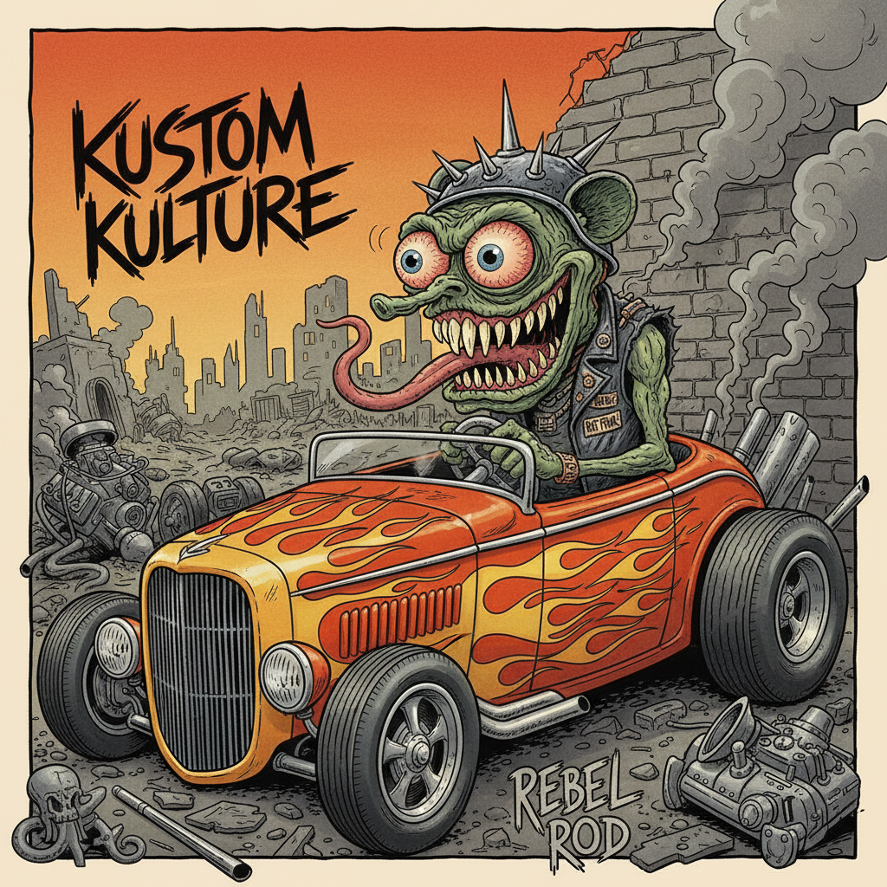

# Lowbrow Art 低俗艺术



> **"热棒车、怪物、裸女、地下漫画——画廊不要的，我们自己办展。"**

## 概述

| 维度 | 描述 |
|------|------|
| 时期 | 1970s–至今 |
| 别名 | Lowbrow, Kustom Kulture, Underground Art |
| 核心色彩 | 热棒色（火焰红/橙/金）、怪物绿、骷髅白、皮革黑 |
| 关键元素 | 热棒车文化、怪物角色、地下漫画、冲浪/滑板、反学院 |
| 代表人物 | Robert Williams, Ed "Big Daddy" Roth, Von Dutch, Coop |
| 关联风格 | Pop Surrealism, Tiki, Punk, Hot Rod, Tattoo Art |

---

## 历史脉络

| 年份 | 事件 |
|------|------|
| 1950s | Ed Roth "Rat Fink"——热棒怪物文化 |
| 1960s | 地下漫画(Underground Comix)——R. Crumb |
| 1970s | Robert Williams——"Lowbrow"一词的来源 |
| 1994 | 《Juxtapoz》杂志创刊——运动正式命名 |
| 2000s | Lowbrow 进入画廊——从地下到主流 |
| 2010s | 与街头艺术、潮玩的融合 |
| 2020s | 作为"美国视觉亚文化史"的核心 |

### 核心哲学

Lowbrow的精神是**"画廊说这不是艺术？那我们自己定义什么是艺术"**：
- 反学院 = 自由（"不需要MFA学位——需要的是态度"）
- 亚文化 = 根基（"热棒车、冲浪、滑板、朋克——这些才是我们的美术馆"）
- 技艺 = 尊重（"我们画得比学院派好——只是题材不'高雅'"）
- 幽默 = 武器（"用笑声对抗精英主义"）
- "Lowbrow 证明了：'低俗'只是精英的偏见"

---

## 视觉语法

### 色彩系统

```
主色：
  火焰红 (#FF2400) — 热棒、速度
  怪物绿 (#00FF00) — 变异、恐怖
  金属金 (#FFD700) — 改装、闪耀
  骷髅白 (#F5F5DC) — 死亡、幽默

辅色：
  皮革黑 (#1C1C1C) — 叛逆
  天蓝 (#87CEEB) — 冲浪、加州
  紫色 (#800080) — 怪异

规则：
  - 高饱和、高对比
  - 金属漆质感
  - 火焰渐变
  - "越夸张越好"

质感：
  金属漆 — 热棒车
  喷枪 — 光滑渐变
  墨线 — 漫画
  纹身 — 粗线条
```

### 标志性元素

| 类别 | 元素 |
|------|------|
| 角色 | 怪物、恶魔、pin-up女郎、骷髅 |
| 物品 | 热棒车、冲浪板、滑板、摩托车 |
| 风格 | 漫画线条、喷枪渲染、夸张变形 |
| 题材 | 速度、死亡、性、幽默、反叛 |
| 文化 | 加州、亚文化、DIY、地下 |
| 态度 | 反精英、幽默、技艺精湛、亚文化自豪 |

---

## 与千禧怀旧的关系

### 从地下到潮流
- Lowbrow → 街头品牌 → 潮玩 → 主流时尚
- Supreme, Stüssy——Lowbrow DNA的商业化
- "曾经的'低俗'现在是'潮流'"
- 纹身文化的主流化 = Lowbrow美学的胜利

### 与Pop Surrealism的分化
- Lowbrow = 更粗犷、更街头、更幽默
- Pop Surrealism = 更精细、更画廊、更暗黑
- 两者共享《Juxtapoz》但走向不同方向

---

## 中国语境

- 中国潮流品牌中的Lowbrow影响
- 中国纹身文化中的Lowbrow元素
- 中国滑板/街头文化的视觉
- 与中国"国潮"中的叛逆元素交叉

---

## 设计应用

| 场景 | 应用方式 |
|------|----------|
| 潮牌 | 街头+叛逆+怪物+热棒+亚文化 |
| 纹身 | 传统美式+怪物+pin-up+骷髅 |
| 滑板 | 板面图案+贴纸+品牌+街头 |
| 潮玩 | 怪物+变形+限量+收藏 |

---

## 相关风格

← [Pop Surrealism 波普超现实主义](pop-surrealism.md) | [Punk 朋克](punk.md) →

↑ [返回千禧怀旧目录](README.md) | [返回总目录](../README.md)
