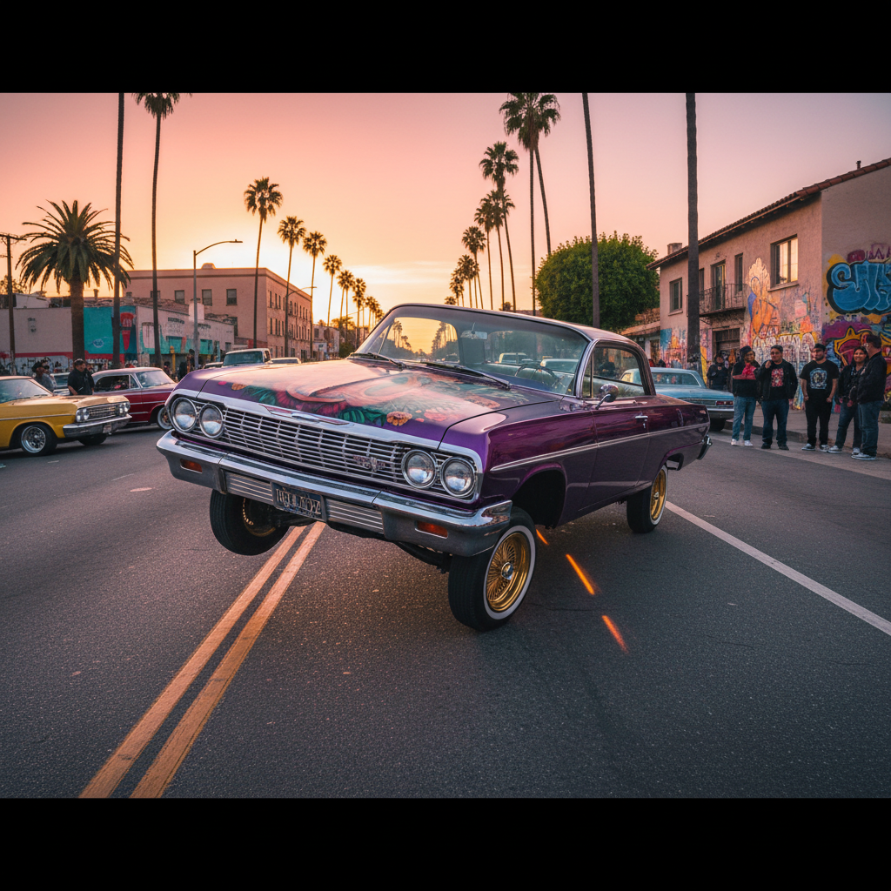

# Lowrider 低趴文化



> **"液压弹跳、金属漆面、Chicano 骄傲——慢慢开，让全世界看见。"**

## 概述

| 维度 | 描述 |
|------|------|
| 时期 | 1940s–至今 |
| 别名 | Lowrider, Low Rider, Chicano Car Culture |
| 核心色彩 | 金属漆（糖果色）、金色、铬银、黑色 |
| 关键元素 | 液压悬挂、糖果漆面、金丝轮毂、壁画 |
| 代表人物 | East LA 社区、Lowrider Magazine |
| 关联风格 | Chicano Art, Cholo, Hip-Hop, Custom Car |

---

## 历史脉络

| 年份 | 事件 |
|------|------|
| 1940s | 墨西哥裔美国人开始改装汽车——Lowrider 诞生 |
| 1950s | Pachuco/Zoot Suit 文化——Lowrider 的精神前身 |
| 1960s | 液压悬挂技术引入——"弹跳"成为可能 |
| 1977 | Lowrider Magazine 创刊 |
| 1990s | 与 Hip-Hop 文化深度融合 |
| 2000s | 全球传播——日本、欧洲的 Lowrider 社区 |

### 核心哲学

Lowrider 的精神是**"Low and Slow——慢慢开，让所有人看见你的骄傲"**：
- 慢 = 骄傲（"我不需要快——我需要被看见"）
- 低 = 态度（"越低越酷"）
- 手工 = 艺术（每辆车都是独一无二的艺术品）
- 社区 = 家庭（"Car Club = 家族"）
- "我的车就是我的画布——我的身份——我的骄傲"

---

## 视觉语法

### 色彩系统

```
主色：
  糖果红 (#CC0000) — 经典漆面
  糖果蓝 (#0066CC) — 经典漆面
  糖果紫 (#660099) — 经典漆面
  金色 (#FFD700) — 轮毂、装饰
  铬银 (#C0C0C0) — 保险杠、配件

辅色：
  黑色 (#000000) — 内饰、轮胎
  白色 (#FFFFFF) — 白墙轮胎
  绿色 (#006400) — 糖果漆面

规则：
  - 金属漆面（糖果色/珍珠色）
  - 越闪越好
  - 铬 = 必须
  - 壁画 = 故事

质感：
  金属漆 — 车身（多层、深度）
  铬 — 所有金属件
  天鹅绒 — 内饰
  皮革 — 内饰
  金丝 — 轮毂
```

### 标志性元素

| 类别 | 元素 |
|------|------|
| 汽车 | 液压弹跳、糖果漆面、金丝轮毂、白墙胎 |
| 壁画 | Chicano 壁画、宗教图像、Aztec 元素 |
| 服装 | Dickies、Pendleton 格子衬衫、Converse |
| 音乐 | Oldies、Chicano Rap、G-Funk |
| 活动 | Car Show、Cruise Night、Hop Contest |
| 态度 | 骄傲、社区、手工、慢、展示 |

---

## 与千禧怀旧的关系

### Hip-Hop 黄金时代的视觉符号
- Dr. Dre "Nuthin' but a 'G' Thang" MV = Lowrider
- Snoop Dogg = Lowrider 文化大使
- GTA: San Andreas = 让全球认识 Lowrider
- "90s West Coast Hip-Hop 的视觉 = Lowrider"

### 作为艺术形式
- 每辆 Lowrider = 移动的艺术品
- 壁画传统 = Chicano 社区的视觉叙事
- 与 Street Art/Graffiti 的交叉
- "Lowrider 是穷人的法拉利——但比法拉利更有灵魂"

---

## 中国语境

- 改装车文化在中国的兴起
- 与中国"姿态"（Stance）文化的交叉
- GTA 游戏在中国的文化影响
- 中国 Hip-Hop 文化中的 Lowrider 元素

---

## 设计应用

| 场景 | 应用方式 |
|------|----------|
| 汽车 | 液压+糖果漆+金丝轮毂+壁画 |
| 品牌 | 社区+骄傲+手工+展示+文化 |
| 平面 | 金属漆质感+Chicano字体+壁画风 |
| 音乐 | West Coast+G-Funk+Oldies 视觉 |

---

## 相关风格

← [Hip-Hop 嘻哈](hip-hop.md) | [Chicano Art](afrofuturism.md) →

↑ [返回千禧怀旧目录](README.md) | [返回总目录](../README.md)
